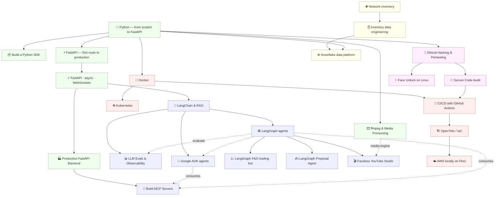

# 📚 Hands-on Engineering Guides

A collection of **practical, beginner-friendly courses** on the tools and techniques of modern backend, AI, and data engineering — written to be *read in order, typed out, and actually run*. Each guide takes you from "what is this even?" to building a real, working project.

> **Philosophy:** every course is hands-on. Concepts are explained with analogies and diagrams, code is meant to be typed and executed (not just read), and each module ends with a **recap, a self-check, and exercises with worked solutions**. The flagship guides are **version-pinned and verified** — every code sample was actually run in a stated environment and the real output is shown.

---

## 🚀 Start here

New to all of this? Follow the natural progression:

**[Python](python_complete/) → [FastAPI](fastapi_async_websockets/) → [LangChain & RAG](langchain_rag/) → [LangGraph](langgraph/)**

📊 **Track your progress** across every course in the **[Learning Tracker](LEARNING_TRACKER.md)** — a checkable to-do with a recommended job-ready path.

🎯 **Interviewing?** [132 interview questions](INTERVIEW_QUESTIONS.md) with key points — scenario-based, calibrated for a GenAI/backend role.

⚡ **Quick reference:** [CHEATSHEET.md](CHEATSHEET.md) — FastAPI · Flask · LangChain RAG · Redis · AWS · OpenTofu, in code snippets.

📦 **Tooling:** [uv in one hour](UV_GUIDE.md) — the modern replacement for pip/venv/pyenv. Optional; it's a speed win, not a résumé line.

Already comfortable with Python? Jump straight to whatever you need below.



---

## 🐍 Python & Backend

| Guide | Level | Size | What you'll build | Verified |
|-------|-------|------|-------------------|:--------:|
| **[Python — From Scratch to FastAPI](python_complete/)** | Beginner | 9 sections + capstone | Core Python from "what is a variable" to a tested async web API, with a deep dive on exceptions & errors | ✅ |
| **[Building a Python SDK](python_sdk/)** | Intermediate | 9 sections + capstone | A real, installable, typed API client library (`pokesdk`) — sync + async, retries, pagination, tests, published to PyPI with CI | ✅ |
| **[FastAPI — from first route to production](fastapi_complete/)** | Beginner → Job-ready | 11 sections + capstone | **linkbox**, one app grown from first route to shipped service: Pydantic v2, forms + validated image uploads + PDF/DOCX parsing, DI + app factory, async SQLAlchemy 2.0 + Alembic on Postgres, clean architecture (routers→services→repositories), JWT/OAuth2 + refresh rotation + RBAC, Redis caching/rate-limiting/sessions, Arq jobs, pytest with transaction-rollback fixtures, structlog + RFC 9457 errors, Docker Compose + GitHub Actions. Every section gated by a test task; ends with the **DevBoard** capstone spec you build solo | — |
| **[FastAPI · Async · WebSockets](fastapi_async_websockets/)** | Beginner → Intermediate | 7 sections + 2 projects | A real-time AI chatbot that streams an LLM's answer token-by-token over a WebSocket — then **scaled** with Redis (caching, rate limiting, cross-worker pub/sub, background jobs) and provisioned with OpenTofu | ✅ |
| **[Production FastAPI Backend](fastapi_production_backend/)** | Intermediate | 9 sections + capstone | **TaskFlow**, a real task/project API: layered architecture, async SQLAlchemy 2.0 + Alembic, JWT/OAuth2 auth + roles, pagination, error handling, full pytest suite, Redis caching/rate-limit, arq jobs, logging/metrics/health, and a Docker Compose stack. Runs offline (SQLite); Postgres/Redis via Docker | ✅ |

## 🤖 AI / LLM

| Guide | Level | Size | What you'll build | Verified |
|-------|-------|------|-------------------|:--------:|
| **[LangChain & RAG](langchain_rag/)** | Beginner | 5 sections + project | A "chat with your documents" assistant — embeddings, vector stores (**pgvector**, **Qdrant**, FAISS/Chroma + a production decision guide and HNSW/IVF indexing), hybrid retrieval + reranking, conversational RAG, evaluation, **GraphRAG over a knowledge graph (Neo4j)**, tool calling & agentic RAG (core path runs offline, no API key) | ✅ |
| **[LLM Evals & Observability](llm_evals_observability/)** | Intermediate → Advanced | 8 sections + capstone | **EvalKit**: prove your AI works — golden datasets, deterministic + RAG metrics, LLM-as-judge (with bias control and human-agreement validation), tracing with token/cost/latency, guardrails (PII/injection/grounding), and a **CI gate that blocks merges on regression**. Runs fully offline, stdlib-only; 22 tests | ✅ |
| **[LangGraph](langgraph/)** | Beginner → Intermediate | 10 sections + capstone | Stateful LLM agents with graphs — state/nodes/edges, `Send` map-reduce, subgraphs, multi-agent handoffs, time-travel, the functional API, **MCP tool integration**, and the LangGraph Platform; culminating in an offline research-assistant capstone. Runs offline (fake/Ollama), version-pinned & verified | ✅ |
| **[Google ADK (Agent Development Kit)](google_adk/)** | Beginner → Intermediate | 8 sections + capstone | Multi-agent systems with Google's ADK — LlmAgent, Sequential/Parallel/Loop workflows, tools (function/OpenAPI/MCP), sessions/memory, evaluation, deployment & A2A; runs fully offline via LiteLLM→Ollama (no Gemini/Vertex key), version-pinned & verified | ✅ |
| **[Build MCP Servers](mcp_servers/)** | Beginner → Job-ready | 7 sections + capstone | **notevault**: build the integration layer between models and real systems. Author MCP servers with **FastMCP** — tools/resources/prompts, async DB backends, the **2026-07-28 stateless streamable-HTTP** transport, **OAuth 2.1** resource-server auth, defense-in-depth against prompt injection/SSRF/destructive-tool abuse (HITL gates), in-memory tests, Docker, and a live agent consuming it. The build-side complement to ADK's consume-side MCP | — |
| **LangGraph F&O Trading Bot** *(planned — not yet in the repo)* | Beginner | 9 lessons | An algorithmic Futures & Options (F&O) trading bot: market data → strategy → risk → orders → backtest | — |
| **[LangGraph Proposal Agent](langgraph_proposal_agent/)** | Beginner | 5 sections + capstone | A 4-agent state machine that turns any job posting into a personalised proposal — CLI + FastAPI + Streamlit, runs offline | ✅ |
| **[Faceless YouTube Studio](faceless_youtube_agent/)** | Beginner | 5 sections + capstone | A 6-node LangGraph pipeline that turns a topic into a finished video (research → script → voiceover → slides → mp4 → SEO) with a human review gate — opens with a LangGraph vs Google ADK comparison; runs offline, produces a real .mp4 | ✅ |
| **[ffmpeg & Media Processing](ffmpeg_media_processing/)** | Beginner → Intermediate | 6 sections + capstone | **mediakit**: the media engine under every video product. Containers/codecs, ffprobe, frame-accurate cutting, filtergraphs, 9:16 reframing, SRT generation + burned-in captions, CRF/preset tuning with measured numbers, and driving it all from Python. Capstone turns a long video into a captioned vertical clip in one command; free local transcription via faster-whisper. 23 tests on real media | ✅ |

## 🔐 Security

| Guide | Level | Size | What you'll build | Verified |
|-------|-------|------|-------------------|:--------:|
| **[Ethical Hacking & Pentesting](ethical_hacking/)** | Beginner | 6 sections + capstone | Network fundamentals → Linux → tools → methodology → web app attacks — all inside an isolated Docker lab with DVWA + a custom vulnerable Flask app | ✅ |
| **[Secure Code Audit & Vulnerability Detection](secure_code_audit/)** | Beginner | 5 sections + capstone | Find vulns by *reading source*: manual review → build a stdlib-`ast` SAST tool → drive bandit/semgrep/pip-audit → LLM triage & CI. Ships a real, dependency-free auditor (runs offline) | ✅ |
| **[Face Unlock on Linux](face_unlock_linux/)** | Beginner → Intermediate | 6 sections + capstone | Build face auth from scratch (OpenCV detect → LBPH enroll/verify) and wire it into **PAM** for `sudo` safely, then harden **Howdy** — with an honest threat model. Software core runs offline; live-camera/PAM steps on your machine | — |

## 🐳 Infrastructure / DevOps

| Guide | Level | Size | What you'll build | Verified |
|-------|-------|------|-------------------|:--------:|
| **[Docker](docker/)** | Beginner | 8 lessons | Containerization from first principles to a Dockerized FastAPI app with CI/CD, security scanning & multi-stage builds | — |
| **[Kubernetes](kubernetes/)** | Intermediate | 4 sections + capstone | Deploy an app to a real (local, kind) cluster: Deployments, Services, ConfigMaps, probes, scaling, rollouts, Helm, GitOps. Verified end to end | ✅ |
| **[CI/CD with GitHub Actions](cicd_github_actions/)** | Beginner → Intermediate | 5 sections + capstone | A full pipeline for a real app: lint → test matrix → SAST/SCA → Docker build → GHCR → staging → approval → production, plus releases. Every stage runs locally via `make ci` | ✅ |
| **[Infrastructure as Code with OpenTofu](opentofu_iac/)** | Beginner → Intermediate | 4 sections + capstone | Declarative infra with OpenTofu (the open Terraform fork): providers, HCL, state, modules, remote state, CI. Capstone provisions the CI/CD app's container via the Docker provider — runs locally, no cloud account | ✅ |
| **[AWS Locally with Floci](aws_localstack/)** | Beginner → Intermediate | 8 sections + capstone | Learn AWS hands-on against Floci — a free AWS emulator in a container (the successor to LocalStack Community). **IAM/access first** (roles, trust + least-privilege policies per service), then S3, DynamoDB, SQS/SNS, Lambda, Secrets Manager, SSM, EventBridge, Step Functions, **KMS**, **CloudWatch/Logs**, **VPC/security groups/EC2**, and **Bedrock** (bridges to the LangChain/LangGraph courses). Provision with OpenTofu, exercise with boto3, test in CI. No cloud account needed except for the Bedrock module | ✅ |

## 🗄️ Data & Domain (Telecom / Inventory)

| Guide | Level | Size | What you'll build | Verified |
|-------|-------|------|-------------------|:--------:|
| **[Snowflake — the cloud data platform](snowflake_data_platform/)** | Beginner → Intermediate | 6 sections + capstone | **linkstash analytics**: a real warehouse — architecture (storage/compute split), stages + `COPY INTO`, semi-structured `VARIANT`/`FLATTEN`, **Python connector + Snowpark**, **RBAC** with future grants, pruning/caching/**cost guardrails**, and an automated **Snowpipe → stream → task** pipeline with Time Travel & zero-copy clones. ⚠️ **Needs a real trial account** (30 d / $400 credits) — no emulator exists | — |
| **[Network Inventory Management](network_inventory/)** | Beginner | 5 lessons | The fundamentals of network inventory, data models, and TMF standards (TMF 633/634/638/639) | — |
| **[Inventory Data Engineering & Analytics](inventory_data_engineering/)** | Intermediate | 8 lessons | A full inventory data pipeline: relational modeling → APIs → ETL → graph databases → ML/analytics | — |

> **✅ Verified** means the guide carries a version-pinned header and every code sample was executed in that environment with real output shown. The other guides are hands-on and runnable but not version-locked.

---

## 🧭 How these guides are built

Every guide follows the same conventions, so once you've done one you know how to navigate them all:

- **Numbered, in order.** Files/sections are prefixed `00_`, `01_`, … Read top to bottom.
- **`00_introduction`** opens each guide — what you'll build and why it matters.
- **`99_project…`** closes it — a complete, runnable capstone that ties everything together.
- **Larger guides use folders** (`01_foundations/`, `02_…/`) each with their own `README.md`; smaller guides are flat numbered files.
- **Every module ends with** a recap, a self-check question, and exercises with **collapsible worked solutions**.
- **Diagrams** use [Mermaid](https://mermaid.js.org/) (rendered automatically by GitHub).

## ▶️ How to use a guide

1. Open the guide's folder and start at its `README.md` (or `00_introduction.md`).
2. Go in order — each module builds on the previous.
3. **Type the code yourself and run it.** Reading isn't learning here.
4. Attempt each exercise before opening its solution.
5. For guides with a runnable project, set up a fresh virtual environment:

   ```bash
   uv venv && source .venv/bin/activate   # Windows: .venv\Scripts\activate
   uv pip install -r requirements.txt                      # where provided
   ```

## 🗂️ Repository layout

```
.
├── python_complete/              # 🐍 Python from scratch → FastAPI (+ capstone)
├── python_sdk/                   # 📦 Build & publish a typed API client library
├── fastapi_complete/             # ⚡ FastAPI 0→job-ready: Pydantic v2, SQLAlchemy+Alembic, JWT/RBAC, Redis, tests, Docker+CI
├── fastapi_async_websockets/     # ⚡ Async, WebSockets, streaming AI chat
├── fastapi_production_backend/   # 🏭 TaskFlow: layered API, SQLAlchemy+Alembic, JWT, tests, Docker
├── llm_evals_observability/      # 📊 Evals, LLM-as-judge, tracing, cost, guardrails, CI gates
├── langchain_rag/                # 🔎 LangChain + RAG document assistant
├── langgraph/                    # 🕸️ Stateful LLM agents with graphs (offline, verified)
├── google_adk/                   # 🧩 Google Agent Development Kit — agents, tools, A2A (offline via Ollama)
├── mcp_servers/                  # 🔌 Build MCP servers: FastMCP, stateless HTTP, OAuth 2.1, security → notevault
├── langgraph_fo_trading_bot/     # 📈 LangGraph F&O trading bot
├── langgraph_proposal_agent/     # ✍️ Multi-agent proposal generator (4 agents, revision loop, 3 frontends)
├── faceless_youtube_agent/       # 🎬 LangGraph video pipeline: topic → script → voice → slides → mp4 → SEO
├── ffmpeg_media_processing/      # 🎞️ ffmpeg: codecs, cutting, filters, captions, encoding → mediakit toolkit
├── ethical_hacking/              # 🔐 Networking → Linux → tools → web attacks → Docker pentest lab
├── secure_code_audit/            # 🔎 Read source for vulns → build a SAST tool → bandit/semgrep/SCA → CI
├── face_unlock_linux/            # 🙂 Face auth from scratch (OpenCV + LBPH) → PAM/sudo safely → Howdy
├── docker/                       # 🐳 Docker → Dockerized FastAPI + CI/CD
├── kubernetes/                   # ☸️ Deploy to a real (kind) cluster: Deployments, Services, probes, Helm, GitOps
├── cicd_github_actions/          # 🚦 Full GitHub Actions pipeline: lint→test→scan→build→deploy (+ local Makefile)
├── opentofu_iac/                 # 🏗️ Infrastructure as Code with OpenTofu → provisions the CI/CD app locally
├── aws_localstack/               # ☁️ Learn AWS locally on Floci (S3/DynamoDB/SQS/Lambda) + OpenTofu + CI
├── snowflake_data_platform/      # ❄️ Snowflake: warehouses, COPY/VARIANT, Snowpark, RBAC, cost, pipelines
├── network_inventory/            # 🌐 Network inventory, data models, TMF
└── inventory_data_engineering/   # 🗄️ Relational → graph → ML data pipeline
```

## 📝 Notes & conventions

- **Dates & versions** are stated inside each guide. Library ecosystems move fast — if an import differs from what's pinned, check your installed version first (the LangChain guide, for example, is built for **LangChain 1.x** and flags the old removed APIs).
- **No secrets in the repo.** Examples that need an API key read it from an environment variable; the `.gitignore` excludes `.env` files.
- **Runnable projects** ship with their own `requirements.txt` and tests where applicable.

## 📄 License

No license has been set yet. Until one is added, these materials are **all rights reserved** by the author. If you intend to share or reuse them, add a license file (e.g. [MIT](https://choosealicense.com/licenses/mit/) for permissive reuse, or [CC BY 4.0](https://creativecommons.org/licenses/by/4.0/) for documentation) — happy to add one on request.

---

*Built as a personal learning archive — clear, correct, and meant to be run. Contributions and corrections welcome via issues/PRs.*
