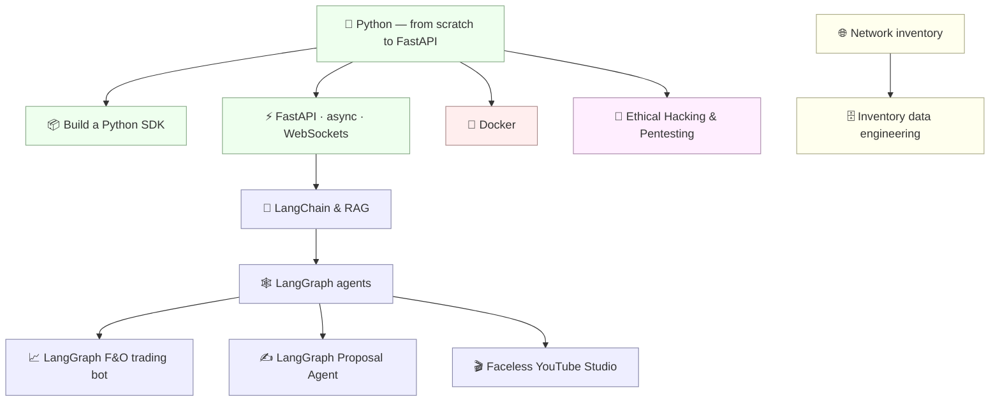

# 📚 Hands-on Engineering Guides

A collection of **practical, beginner-friendly courses** on the tools and techniques of modern backend, AI, and data engineering — written to be *read in order, typed out, and actually run*. Each guide takes you from "what is this even?" to building a real, working project.

> **Philosophy:** every course is hands-on. Concepts are explained with analogies and diagrams, code is meant to be typed and executed (not just read), and each module ends with a **recap, a self-check, and exercises with worked solutions**. The flagship guides are **version-pinned and verified** — every code sample was actually run in a stated environment and the real output is shown.

---

## 🚀 Start here

New to all of this? Follow the natural progression:

**[Python](python_complete/) → [FastAPI](fastapi_async_websockets/) → [LangChain & RAG](langchain_rag/) → [LangGraph](langgraph/)**

Already comfortable with Python? Jump straight to whatever you need below.



---

## 🐍 Python & Backend

| Guide | Level | Size | What you'll build | Verified |
|-------|-------|------|-------------------|:--------:|
| **[Python — From Scratch to FastAPI](python_complete/)** | Beginner | 9 sections + capstone | Core Python from "what is a variable" to a tested async web API, with a deep dive on exceptions & errors | ✅ |
| **[Building a Python SDK](python_sdk/)** | Intermediate | 9 sections + capstone | A real, installable, typed API client library (`pokesdk`) — sync + async, retries, pagination, tests, published to PyPI with CI | ✅ |
| **[FastAPI · Async · WebSockets](fastapi_async_websockets/)** | Beginner → Intermediate | 5 sections + project | A real-time AI chatbot that streams an LLM's answer token-by-token over a WebSocket | ✅ |

## 🤖 AI / LLM

| Guide | Level | Size | What you'll build | Verified |
|-------|-------|------|-------------------|:--------:|
| **[LangChain & RAG](langchain_rag/)** | Beginner | 4 sections + project | A "chat with your documents" assistant — embeddings, vector store, retrieval, grounded answers (runs offline, no API key) | ✅ |
| **[LangGraph](langgraph/)** | Beginner | 8 lessons | Stateful LLM agents with graphs — culminating in a research-assistant agent | — |
| **[LangGraph F&O Trading Bot](langgraph_fo_trading_bot/)** | Beginner | 9 lessons | An algorithmic Futures & Options (F&O) trading bot: market data → strategy → risk → orders → backtest | — |
| **[LangGraph Proposal Agent](langgraph_proposal_agent/)** | Beginner | 5 sections + capstone | A 4-agent state machine that turns any job posting into a personalised proposal — CLI + FastAPI + Streamlit, runs offline | ✅ |
| **[Faceless YouTube Studio](faceless_youtube_agent/)** | Beginner | 5 sections + capstone | A 6-node LangGraph pipeline that turns a topic into a finished video (research → script → voiceover → slides → mp4 → SEO) with a human review gate — opens with a LangGraph vs Google ADK comparison; runs offline, produces a real .mp4 | ✅ |

## 🔐 Security

| Guide | Level | Size | What you'll build | Verified |
|-------|-------|------|-------------------|:--------:|
| **[Ethical Hacking & Pentesting](ethical_hacking/)** | Beginner | 6 sections + capstone | Network fundamentals → Linux → tools → methodology → web app attacks — all inside an isolated Docker lab with DVWA + a custom vulnerable Flask app | ✅ |

## 🐳 Infrastructure / DevOps

| Guide | Level | Size | What you'll build | Verified |
|-------|-------|------|-------------------|:--------:|
| **[Docker](docker/)** | Beginner | 8 lessons | Containerization from first principles to a Dockerized FastAPI app with CI/CD, security scanning & multi-stage builds | — |

## 🗄️ Data & Domain (Telecom / Inventory)

| Guide | Level | Size | What you'll build | Verified |
|-------|-------|------|-------------------|:--------:|
| **[Network Inventory Management](network_inventory/)** | Beginner | 5 lessons | The fundamentals of network inventory, data models, and TMF standards (TMF 633/634/638/639) | — |
| **[Inventory Data Engineering & Analytics](inventory_data_engineering/)** | Intermediate | 8 lessons | A full inventory data pipeline: relational modeling → APIs → ETL → graph databases → ML/analytics | — |

> **✅ Verified** means the guide carries a version-pinned header and every code sample was executed in that environment with real output shown. The other guides are hands-on and runnable but not version-locked.

---

## 🧭 How these guides are built

Every guide follows the same conventions, so once you've done one you know how to navigate them all:

- **Numbered, in order.** Files/sections are prefixed `00_`, `01_`, … Read top to bottom.
- **`00_introduction`** opens each guide — what you'll build and why it matters.
- **`99_project…`** closes it — a complete, runnable capstone that ties everything together.
- **Larger guides use folders** (`01_foundations/`, `02_…/`) each with their own `README.md`; smaller guides are flat numbered files.
- **Every module ends with** a recap, a self-check question, and exercises with **collapsible worked solutions**.
- **Diagrams** use [Mermaid](https://mermaid.js.org/) (rendered automatically by GitHub).

## ▶️ How to use a guide

1. Open the guide's folder and start at its `README.md` (or `00_introduction.md`).
2. Go in order — each module builds on the previous.
3. **Type the code yourself and run it.** Reading isn't learning here.
4. Attempt each exercise before opening its solution.
5. For guides with a runnable project, set up a fresh virtual environment:

   ```bash
   python -m venv .venv && source .venv/bin/activate   # Windows: .venv\Scripts\activate
   pip install -r requirements.txt                      # where provided
   ```

## 🗂️ Repository layout

```
.
├── python_complete/              # 🐍 Python from scratch → FastAPI (+ capstone)
├── python_sdk/                   # 📦 Build & publish a typed API client library
├── fastapi_async_websockets/     # ⚡ Async, WebSockets, streaming AI chat
├── langchain_rag/                # 🔎 LangChain + RAG document assistant
├── langgraph/                    # 🕸️ Stateful LLM agents with graphs
├── langgraph_fo_trading_bot/     # 📈 LangGraph F&O trading bot
├── langgraph_proposal_agent/     # ✍️ Multi-agent proposal generator (4 agents, revision loop, 3 frontends)
├── faceless_youtube_agent/       # 🎬 LangGraph video pipeline: topic → script → voice → slides → mp4 → SEO
├── ethical_hacking/              # 🔐 Networking → Linux → tools → web attacks → Docker pentest lab
├── docker/                       # 🐳 Docker → Dockerized FastAPI + CI/CD
├── network_inventory/            # 🌐 Network inventory, data models, TMF
└── inventory_data_engineering/   # 🗄️ Relational → graph → ML data pipeline
```

## 📝 Notes & conventions

- **Dates & versions** are stated inside each guide. Library ecosystems move fast — if an import differs from what's pinned, check your installed version first (the LangChain guide, for example, is built for **LangChain 1.x** and flags the old removed APIs).
- **No secrets in the repo.** Examples that need an API key read it from an environment variable; the `.gitignore` excludes `.env` files.
- **Runnable projects** ship with their own `requirements.txt` and tests where applicable.

## 📄 License

No license has been set yet. Until one is added, these materials are **all rights reserved** by the author. If you intend to share or reuse them, add a license file (e.g. [MIT](https://choosealicense.com/licenses/mit/) for permissive reuse, or [CC BY 4.0](https://creativecommons.org/licenses/by/4.0/) for documentation) — happy to add one on request.

---

*Built as a personal learning archive — clear, correct, and meant to be run. Contributions and corrections welcome via issues/PRs.*
