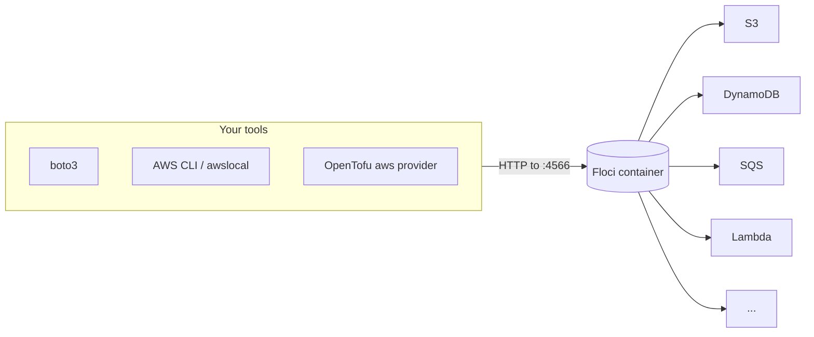

# 01-1 · What is an AWS emulator?

> **Level:** Beginner · **Prerequisites:** [00 Introduction](../00_introduction.md)
> **Time:** 20 min · **Verified:** 2026-09-01 (Floci latest)

**Floci** is a **cloud-service emulator**: a single container that answers AWS API
calls locally. Your tools think they're talking to AWS; really they're talking to
`localhost:4566`.

---

## The architecture

One container, one port (`4566`), many services behind it. It implements the real
AWS wire protocols, so anything that speaks AWS — SDKs, the CLI, Terraform/OpenTofu,
the CDK — works against it unchanged except for the endpoint.

---

## What it is and isn't

| It **is** | It **isn't** |
|---|---|
| A faithful local emulator of AWS APIs | A byte-perfect replica of AWS |
| Great for dev, tests, CI, learning | A production hosting platform |
| Free (MIT), all services unlocked | A full clone of every AWS service/feature |
| Ephemeral by default (state gone on restart) | Durable storage (unless you enable persistence) |

Emulation is close but not identical — occasionally behaviour differs from real
AWS (IAM enforcement is looser, some edge cases vary). So an emulator is for
**building and testing fast**; you still validate against real AWS before you rely
on production. [05-3](../05_testing_and_ci/03_gotchas_and_pro.md) covers the seams.

---

## The 2026 emulator landscape — Floci and the LocalStack story

**LocalStack** (2017, ~65k GitHub stars) invented this category, split into a free
Community edition and a paid Pro tier — then, on **March 23, 2026, sunset the free
edition**: the unified image now requires an account and a `LOCALSTACK_AUTH_TOKEN`,
the open-source repo was archived, and the last token-free images (like `3.8.1`)
receive no updates or security patches.

**Floci** filled the gap: an MIT-licensed, actively maintained drop-in replacement.

| | Floci | LocalStack (2026+) |
|---|---|---|
| License / cost | MIT, free forever, no account | free *Hobby* tier (non-commercial, token) or paid |
| Services | ~100, all unlocked (some niche ones are stubs) | larger catalog, deeper on paid tiers |
| Compatibility | same `:4566`, `/_localstack/health`, env-var translation, init scripts | — |
| Extras | real engines (Postgres/Redis/Kafka) behind RDS/ElastiCache/MSK; real Docker Lambda | cloud pods, web UI, IAM enforcement (paid) |

This course runs on **Floci**; because it's wire-compatible, everything transfers
1:1 if your team licenses LocalStack. Both names are worth knowing in interviews —
"emulate AWS locally for dev/test/CI" is the skill, not the vendor.

---

## When to reach for it

- **Learning AWS** without a bill or fear of breaking something.
- **Local development** of an app that uses AWS services.
- **Integration tests** — real SDK calls against ephemeral infra ([05-1](../05_testing_and_ci/01_testing_with_floci.md)).
- **CI** — spin up AWS-in-a-container per pipeline run ([05-2](../05_testing_and_ci/02_floci_in_ci.md)).

Not for: production, load testing, or verifying AWS-specific IAM/quota behaviour —
use real AWS there.

---

## Recap & next

- ✅ Floci is **one container** emulating AWS APIs on **`:4566`**; any
  AWS-speaking tool works against it via the endpoint.
- ✅ It's **faithful, not identical** — for dev/test/CI/learning, not production;
  validate against real AWS before relying on it.
- ✅ Floci is the **free, MIT-licensed** successor to LocalStack's sunset Community
  edition — drop-in compatible, all services unlocked.

**Self-check:** Your boto3 code works perfectly against the emulator. Does that
guarantee it works against real AWS?

Answer

**No — mostly, but not guaranteed.** Floci emulates the APIs faithfully, so the
happy path almost always transfers. But emulation differs in edge cases (notably
IAM permission enforcement, some service quirks), so before depending on it in
production you still run against real AWS. The emulator makes you *fast and cheap*;
it doesn't replace a real-AWS check.

**→ Next: [01-2 · Setup & your first service](02_setup_and_first_service.md)**
