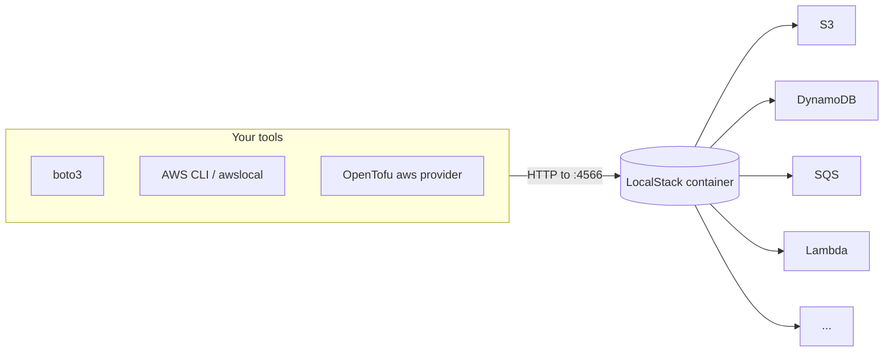

# 01-1 · What is LocalStack?

> **Level:** Beginner · **Prerequisites:** [00 Introduction](../00_introduction.md)
> **Time:** 20 min · **Verified:** 2026-07-16 (LocalStack 3.8.1)

LocalStack is a **cloud-service emulator**: a single container that answers AWS API
calls locally. Your tools think they're talking to AWS; really they're talking to
`localhost:4566`.

---

## The architecture

One container, one port (`4566`), many services behind it. It implements the real
AWS wire protocols, so anything that speaks AWS — SDKs, the CLI, Terraform/OpenTofu,
the CDK — works against it unchanged except for the endpoint.

---

## What it is and isn't

| It **is** | It **isn't** |
|---|---|
| A faithful local emulator of AWS APIs | A byte-perfect replica of AWS |
| Great for dev, tests, CI, learning | A production hosting platform |
| Free (Community) for core services | A full clone of every AWS service/feature |
| Ephemeral by default (state gone on restart) | Durable storage (unless you enable persistence) |

Emulation is close but not identical — occasionally behaviour differs from real
AWS (IAM enforcement is looser, some edge cases vary). So LocalStack is for
**building and testing fast**; you still validate against real AWS before you rely
on production. [04-3](../04_testing_and_ci/03_gotchas_and_pro.md) covers the seams.

---

## Community vs Pro

| | Community (free) | Pro (paid) |
|---|---|---|
| Core services | ✅ S3, DynamoDB, SQS, SNS, Lambda, Kinesis, API Gateway, CloudFormation, IAM, STS, Secrets Manager, CloudWatch | all of Community |
| Extra services | — | RDS, ECS, EKS, Cognito, AppSync, and many more |
| Advanced | — | persistence, cloud pods, IAM enforcement, a web UI |

This course uses **only Community services**. LocalStack's 100+ service catalog is
mostly Pro; the free core is more than enough to learn AWS fundamentals and build
the capstone.

---

## When to reach for it

- **Learning AWS** without a bill or fear of breaking something.
- **Local development** of an app that uses AWS services.
- **Integration tests** — real SDK calls against ephemeral infra ([04-1](../04_testing_and_ci/01_testing_with_localstack.md)).
- **CI** — spin up AWS-in-a-container per pipeline run ([04-2](../04_testing_and_ci/02_localstack_in_ci.md)).

Not for: production, load testing, or verifying AWS-specific IAM/quota behaviour —
use real AWS there.

---

## Recap & next

- ✅ LocalStack is **one container** emulating AWS APIs on **`:4566`**; any
  AWS-speaking tool works against it via the endpoint.
- ✅ It's **faithful, not identical** — for dev/test/CI/learning, not production;
  validate against real AWS before relying on it.
- ✅ **Community (free)** covers the core services this course uses; **Pro** adds
  more services + persistence/UI.

**Self-check:** Your boto3 code works perfectly against LocalStack. Does that
guarantee it works against real AWS?

Answer

**No — mostly, but not guaranteed.** LocalStack emulates the APIs faithfully, so the
happy path almost always transfers. But emulation differs in edge cases (notably
IAM permission enforcement, some service quirks), so before depending on it in
production you still run against real AWS. LocalStack makes you *fast and cheap*;
it doesn't replace a real-AWS check.

**→ Next: [01-2 · Setup & your first service](02_setup_and_first_service.md)**
