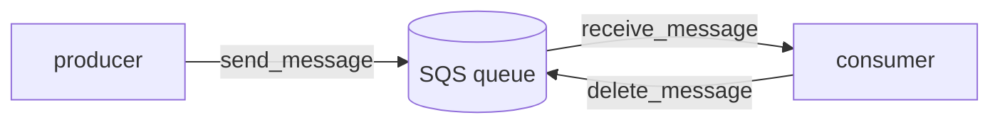

# 02-3 · SQS & SNS (messaging)

> **Level:** Beginner · **Prerequisites:** [02-2 DynamoDB](02_dynamodb.md)
> **Time:** 25 min · **Verified:** 2026-07-16 (SQS on LocalStack 3.8.1)

Messaging decouples parts of a system: one component emits an event and moves on;
another processes it later. **SQS** is a queue (point-to-point); **SNS** is
pub/sub (fan-out). The capstone emits a link event to SQS on every `put`.

---

## SQS: a queue

A producer **sends** messages; a consumer **receives** and then **deletes** them.
Nothing is lost if the consumer is down — messages wait in the queue.



The capstone's producer + consumer ([`storage.py`](../99_project_linkstash_cloud/app/storage.py)):

```python
def _emit(self, message):                     # producer — on every put()
    q = self.sqs.get_queue_url(QueueName=QUEUE)["QueueUrl"]
    self.sqs.send_message(QueueUrl=q, MessageBody=message)

def drain_events(self):                        # consumer
    q = self.sqs.get_queue_url(QueueName=QUEUE)["QueueUrl"]
    out = []
    resp = self.sqs.receive_message(QueueUrl=q, MaxNumberOfMessages=10, WaitTimeSeconds=1)
    for m in resp.get("Messages", []):
        out.append(m["Body"])
        self.sqs.delete_message(QueueUrl=q, ReceiptHandle=m["ReceiptHandle"])  # ← must delete!
    return out
```

Verified end to end (a `put` emitted an event; `drain_events` received it):

```
events:  ['created:abc123']
```

```
$ awslocal sqs list-queues
{"QueueUrls": ["http://sqs.us-east-1.localhost.localstack.cloud:4566/000000000000/linkstash-events"]}
```

---

## The delete-after-receive rule

The one thing beginners miss: **receiving a message doesn't remove it.** It becomes
*invisible* for a visibility-timeout window; if you don't `delete_message`, it
reappears for redelivery. That's a feature (a crashed consumer doesn't lose the
message), but forget the delete and you'll process the same message forever. The
capstone deletes each message after handling it.

---

## SNS: pub/sub fan-out

**SNS** sends one published message to *many* subscribers — including SQS queues:

```bash
awslocal sns create-topic --name link-events
# subscribe an SQS queue to the topic, then:
awslocal sns publish --topic-arn <arn> --message "created:abc123"
```

The common pattern is **SNS → multiple SQS queues** ("fan-out"): publish once, and
an analytics queue, an audit queue, and a cache-invalidation queue each get a copy.
Use **SQS** when one consumer handles the work; **SNS** when many need the event.

---

## Recap & next

- ✅ **SQS** = a durable queue (send → receive → **delete**); **SNS** = pub/sub
  fan-out to many subscribers.
- ✅ You **must `delete_message`** after handling, or it reappears — verified with
  the capstone's `drain_events`.
- ✅ SNS→SQS fan-out delivers one publish to many queues; pick SQS for single-consumer
  work, SNS for broadcast.

## Exercise

The capstone processes events synchronously in `drain_events`. Sketch how you'd run
a separate worker process that long-polls the queue forever and, say, writes each
event to a log. What stops it from reprocessing the same message?

<details>
<summary>Solution</summary>

A loop calling `receive_message(WaitTimeSeconds=20)` (long poll), handling each
message, then `delete_message` on success. Reprocessing is prevented by the
**delete after successful handling** plus the **visibility timeout**: while a
message is being processed it's invisible to other receives, and once deleted it's
gone. If the worker crashes before deleting, the message reappears after the
timeout and is retried — at-least-once delivery.

</details>

**→ Next: [02-4 · Lambda & API Gateway](04_lambda_apigateway.md)**
