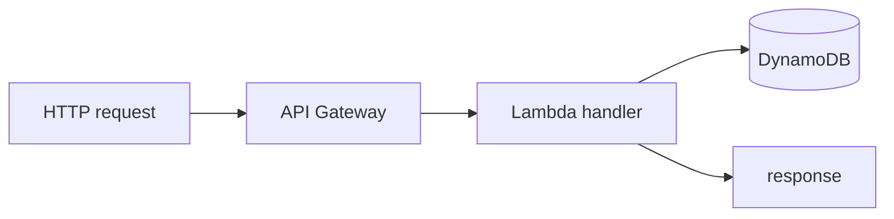

# 02-4 · Lambda & API Gateway

> **Level:** Intermediate · **Prerequisites:** [02-3 SQS & SNS](03_sqs_sns.md)
> **Time:** 30 min · **Verified:** 2026-07-16 (S3/DynamoDB/SQS verified; Lambda commands are standard — see note)

**Lambda** runs your code without servers, in response to events; **API Gateway**
puts an HTTP endpoint in front of it. Together they're the classic serverless
duo — and both are in LocalStack Community.

> **Note on verification:** the S3/DynamoDB/SQS examples in this section's siblings
> were executed against LocalStack 3.8.1. **Lambda runs each function in its own
> Docker container**, which needs the LocalStack container to reach the Docker
> socket — not available in this course's sandbox, so the Lambda commands below are
> standard usage rather than captured output. They work on a normal Docker host.

---

## A Lambda function

A function is a handler plus a trigger. A minimal Python handler:

```python
# handler.py
def handler(event, context):
    name = event.get("queryStringParameters", {}).get("name", "world")
    return {"statusCode": 200, "body": f"hello {name}"}
```

Package and deploy with `awslocal`:

```bash
zip function.zip handler.py
awslocal lambda create-function \
  --function-name hello \
  --runtime python3.11 \
  --handler handler.handler \
  --role arn:aws:iam::000000000000:role/lambda-role \
  --zip-file fileb://function.zip

awslocal lambda invoke --function-name hello --payload '{}' out.json
cat out.json     # {"statusCode": 200, "body": "hello world"}
```

(The `role` ARN is a dummy — LocalStack doesn't enforce IAM in Community.)

---

## Front it with API Gateway

API Gateway maps an HTTP route to the Lambda:

```bash
# create a REST API, a resource + method, wire it to the function, deploy a stage
awslocal apigateway create-rest-api --name links-api
# ... create-resource / put-method / put-integration (lambda proxy) / create-deployment ...
```

Then LocalStack serves it at a URL like:

```
http://localhost:4566/restapis/<api-id>/prod/_user_request_/hello?name=you
```

The multi-step wiring is verbose by hand — which is exactly why you do it with
**OpenTofu or the CDK** instead ([03](../03_iac_with_opentofu/)). The point here is
to understand the pieces: **route → integration → function**.

---

## Where this fits the capstone (stretch)

The capstone keeps its logic in a normal process for simplicity. A serverless
version would be: **API Gateway** route `/{slug}` → **Lambda** that looks the slug
up in **DynamoDB** and returns a 302 redirect. Same DynamoDB table, different
compute. Building that is the stretch exercise below — a great way to feel why IaC
matters once more than two services are involved.

---

## The serverless mental model



No servers to run or patch; you pay per invocation; it scales to zero. The
trade-offs (cold starts, execution limits, harder local debugging) are why
LocalStack is so useful here — you iterate on serverless code locally instead of
deploying to AWS every time.

---

## Recap & next

- ✅ **Lambda** runs event-driven functions; **API Gateway** gives them an HTTP
  front door — both in Community.
- ✅ Deploy with `awslocal lambda create-function` / `invoke`; dummy IAM role ARNs
  are fine on LocalStack.
- ✅ Wiring API Gateway by hand is verbose — **use IaC** ([03](../03_iac_with_opentofu/));
  Lambda executes in its own container (needs Docker access).

## Exercise (stretch)

Design the serverless `linkstash` redirect: an API Gateway route `/{slug}` → a
Lambda that reads the slug from the `links` DynamoDB table and returns a 302 to the
stored URL. What does the Lambda need in `event` to find the slug, and what status
code/headers make a redirect?

<details>
<summary>Solution</summary>

The Lambda reads `event["pathParameters"]["slug"]` (proxy integration passes path
params), does `table.get_item(Key={"slug": slug})`, and returns
`{"statusCode": 302, "headers": {"Location": item["url"]}, "body": ""}`. A missing
slug returns `{"statusCode": 404, ...}`. Provisioning the API+Lambda+table+
permissions by hand is painful — which is the lesson that sends you to OpenTofu.

</details>

**→ Next: [03-1 · The aws provider against LocalStack](../03_iac_with_opentofu/01_aws_provider_against_localstack.md)**
