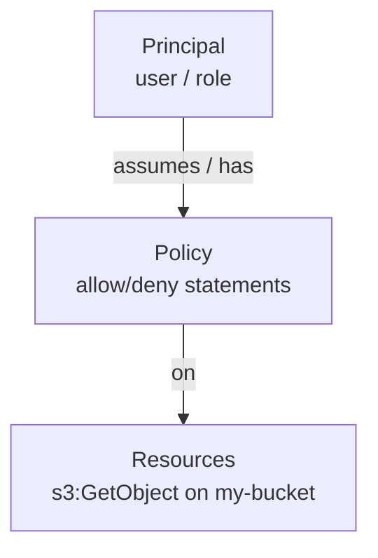

# 02-1 · Identity: IAM & STS

> **Level:** Intermediate · **Prerequisites:** [01-3 Endpoints & credentials](../01_foundations/03_endpoints_and_credentials.md)
> **Time:** 20 min · **Verified:** 2026-09-01 (Floci latest) — with a big caveat

**IAM** (Identity and Access Management) is how AWS decides *who can do what*. Every
service you're about to touch — S3, DynamoDB, SQS, Lambda — is gated by it, which is
why it comes *before* the services rather than after: you can't reason about a bucket
or a table without knowing who's allowed to call it. It's also the one service where
an emulator differs most from real AWS, so this module is as much about the
caveat as the API.

---

## The model in four nouns



| Term | Is |
|---|---|
| **User** | a long-lived identity (a person or app) |
| **Role** | an identity you *assume* temporarily (services, cross-account, federated) |
| **Policy** | a JSON document of `Allow`/`Deny` statements (action + resource) |
| **STS** | issues the temporary credentials when a role is assumed |

Modern AWS favours **roles** over users — short-lived assumed credentials (the same
idea behind OIDC in the [CI/CD course](../../cicd_github_actions/04_delivery_and_deployment/01_environments_secrets_oidc.md)).

---

## Create a role and a policy

```bash
awslocal iam create-role --role-name demo-role \
  --assume-role-policy-document '{"Version":"2012-10-17","Statement":[]}'
awslocal iam list-roles --query 'Roles[].RoleName' --output text
```

Verified:

```
arn:aws:iam::000000000000:role/demo-role
demo-role
```

A permissions policy attached to that role:

```json
{
  "Version": "2012-10-17",
  "Statement": [{
    "Effect": "Allow",
    "Action": ["dynamodb:GetItem", "dynamodb:PutItem"],
    "Resource": "arn:aws:dynamodb:*:*:table/links"
  }]
}
```

`awslocal iam create-policy --policy-name links-rw --policy-document file://policy.json`
then `attach-role-policy`. This is exactly the least-privilege thinking from the
security courses — grant only the actions on only the resources needed.

---

## ⚠️ The caveat: Floci doesn't *enforce* IAM

You can **create** users, roles, and policies on Floci — but it
**does not enforce them**. Every call is allowed regardless of policy. So:

- ✅ Good for: learning the IAM *model*, authoring policies, testing that your IaC
  *creates* the right roles/policies.
- ❌ Not good for: verifying that a policy actually **grants/denies** correctly —
  Floci will happily let a call through that real AWS would reject with
  `AccessDenied`.

This is the #1 fidelity gap ([05-3](../05_testing_and_ci/03_gotchas_and_pro.md)):
**the emulator doesn't enforce IAM** (Floci ships opt-in enforcement only for S3,
via `FLOCI_SERVICES_S3_ENFORCE_AUTH`). Test permission *behaviour* against
real AWS. It's why an app can be green on the emulator and then hit
`AccessDenied` in production — the emulator never checked.

**Verify this yourself before trusting it either way** — don't take a course's
word (or a tool's marketing) for a security claim you can check in two commands:

```bash
awslocal iam create-user --user-name denied-user
awslocal iam put-user-policy --user-name denied-user --policy-name deny-ddb \
  --policy-document '{"Version":"2012-10-17","Statement":[{"Effect":"Deny","Action":"dynamodb:*","Resource":"*"}]}'
KEY=$(awslocal iam create-access-key --user-name denied-user)
# ...export that key's AccessKeyId/SecretAccessKey, then:
awslocal dynamodb list-tables    # ← runs and returns data, despite the explicit Deny
```

Verified 2026-09-01 against Floci: the call **succeeded** (`{"TableNames": []}`)
even though the user's policy explicitly denies all `dynamodb:*` — confirming the
gap above is still real, not fixed by switching emulators.

## Test policy *logic* without leaving your laptop: `simulate-principal-policy`

There's a middle ground between "no enforcement at all" and "must deploy to real
AWS to find out": IAM's **policy simulator** evaluates a policy document against
a hypothetical call *without actually making it* — and this one **does** give a
correct answer locally:

```bash
awslocal iam simulate-principal-policy \
  --policy-source-arn arn:aws:iam::000000000000:user/denied-user \
  --action-names dynamodb:ListTables
```

```json
{"EvaluationResults": [{"EvalActionName": "dynamodb:ListTables", "EvalDecision": "explicitDeny", ...}]}
```

Correctly reports `explicitDeny` — the simulator reasons about the policy JSON
itself, which is provider-independent logic, unlike the live call path which
the emulator never checks. Use it to **sanity-check a policy's logic** while
authoring IaC; still confirm the *live* behavior on real AWS, because the
simulator can't catch things like a mistyped resource ARN that happens to not
match what your code actually calls.

---

## STS: who am I?

STS issues temporary credentials and answers "who is this caller?":

```bash
awslocal sts get-caller-identity
# {"Account": "000000000000", "Arn": "arn:aws:iam::000000000000:root", ...}
```

On Floci the account is always `000000000000`. On real AWS, `get-caller-identity`
is the quickest check of *which* identity/role your code is actually running as —
invaluable when a deploy uses the wrong role.

---

## Recap & next

- ✅ IAM = **principals (users/roles)** + **policies** (allow/deny actions on
  resources); prefer **roles** (temporary creds via **STS**).
- ✅ Floci lets you **create** IAM objects but **doesn't enforce**
  them — great for the model and IaC, not for permission behaviour.
- ✅ **Validate real permissions on real AWS**; `sts get-caller-identity`
  tells you who you are.

## Exercise

Your OpenTofu creates an IAM role + policy for the linkstash app and `tofu apply`
succeeds on Floci. What have you actually verified, and what have you *not*?

<details>
<summary>Answer</summary>

You've verified the **IaC is correct** — the role and policy are created with the
intended documents (you can `get-role`/`get-policy` and diff them). You have **not**
verified the policy actually **permits/denies** the right calls, because the emulator
doesn't enforce IAM — every call passes regardless. Confirm enforcement against real
AWS before relying on it.

</details>

**→ Next: [02-2 · IAM in practice: roles & policies per service](02_roles_and_policies_per_service.md)** —
the concrete per-service roles and policies you attach in real AWS.
