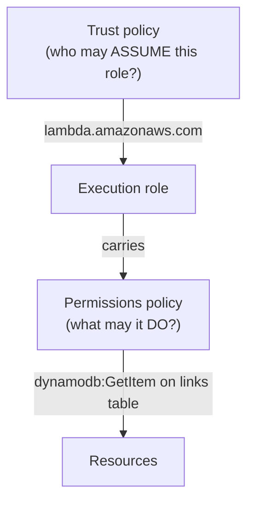

# 02-2 · IAM in practice: roles & policies per service

> **Level:** Intermediate · **Prerequisites:** [02-1 Identity: IAM & STS](01_access_model_iam_sts.md)
> **Time:** 30 min · **Verified:** 2026-08-21 — the IAM documents here are real-AWS-accurate; Floci *creates* them but doesn't *enforce* (see [02-1](01_access_model_iam_sts.md))

02-1 gave you the IAM *model*. But in a real system you almost never write IAM in the
abstract — you write the **specific role each service assumes** and the **least-privilege
policy** it carries. This is the part interviews actually probe ("how does your Lambda get
permission to read that table?"). Here's the real thing, for the linkstash stack you'll
build in [section 03](../03_core_services/README.md) — come back to this page as you wire
each service up.

---

## The Lambda execution role: two policies, don't confuse them

The single most common IAM pattern in AWS — and the #1 thing people get wrong — is that a
Lambda's role needs **two different policies that answer two different questions**:



**1 — Trust policy** (the `assume-role-policy-document`): *who* is allowed to assume the role.
For a Lambda execution role, that's the Lambda service itself:

```json
{
  "Version": "2012-10-17",
  "Statement": [{
    "Effect": "Allow",
    "Principal": { "Service": "lambda.amazonaws.com" },
    "Action": "sts:AssumeRole"
  }]
}
```

**2 — Permissions policy** (attached to the role): *what* the role may do — scoped to the
exact resources, never `"Resource": "*"`:

```json
{
  "Version": "2012-10-17",
  "Statement": [
    { "Effect": "Allow",
      "Action": ["dynamodb:GetItem", "dynamodb:PutItem", "dynamodb:Query"],
      "Resource": "arn:aws:dynamodb:*:*:table/links" },
    { "Effect": "Allow",
      "Action": ["logs:CreateLogGroup", "logs:CreateLogStream", "logs:PutLogEvents"],
      "Resource": "arn:aws:logs:*:*:*" }
  ]
}
```

Create it and wire it to the function:

```bash
awslocal iam create-role --role-name linkstash-lambda \
  --assume-role-policy-document file://trust.json
awslocal iam put-role-policy --role-name linkstash-lambda \
  --policy-name linkstash-perms --policy-document file://perms.json
awslocal lambda create-function --function-name shorten \
  --role arn:aws:iam::000000000000:role/linkstash-lambda ...   # a REAL role now, not a dummy
```

The `logs:*` block is not optional in real AWS — without it your Lambda runs but its logs
never reach CloudWatch, and you're debugging blind. That's a classic "works locally, silent
in prod" trap.

---

## Identity-based vs resource-based policies

Two places a policy can live — know which is which:

| | Attached to | Answers | Example |
|---|---|---|---|
| **Identity-based** | a principal (user/**role**) | "what can *this identity* do?" | the Lambda permissions policy above |
| **Resource-based** | the resource itself | "who can touch *this thing*?" | an **S3 bucket policy**, SQS queue policy, SNS topic policy, Secrets Manager resource policy |

An S3 bucket policy (resource-based) — e.g. allow only the linkstash role to read objects:

```json
{
  "Version": "2012-10-17",
  "Statement": [{
    "Effect": "Allow",
    "Principal": { "AWS": "arn:aws:iam::000000000000:role/linkstash-lambda" },
    "Action": "s3:GetObject",
    "Resource": "arn:aws:s3:::linkstash-assets/*"
  }]
}
```

`awslocal s3api put-bucket-policy --bucket linkstash-assets --policy file://bucket.json`.
Cross-account access and "let this *other* service write to my queue" are resource-based —
that's why they exist alongside identity policies.

---

## Least privilege, per service (the linkstash stack)

The whole discipline: grant only these actions, on only these resource ARNs.

| Service | Minimal actions the app needs | Scoped to |
|---|---|---|
| DynamoDB | `GetItem`, `PutItem`, `Query` | `table/links` (not `*`) |
| S3 | `GetObject`, `PutObject` | `linkstash-assets/*` |
| Secrets Manager | `GetSecretValue` | the one secret's ARN |
| SQS | `SendMessage` | the specific queue ARN |
| SNS | `Publish` | the specific topic ARN |
| CloudWatch Logs | `CreateLogStream`, `PutLogEvents` | the function's log group |

If you can't name the resource ARN, you're probably granting too much. `"Resource": "*"` on a
review is an automatic "why?".

---

## Wire it in OpenTofu (where it actually lives)

You won't hand-run `create-role` in production — it's IaC ([section 04](../04_iac_with_opentofu/README.md)):

```hcl
resource "aws_iam_role" "lambda" {
  name               = "linkstash-lambda"
  assume_role_policy = data.aws_iam_policy_document.trust.json     # the trust policy
}
resource "aws_iam_role_policy" "perms" {
  role   = aws_iam_role.lambda.id
  policy = data.aws_iam_policy_document.perms.json                 # least-privilege
}
resource "aws_lambda_function" "shorten" {
  role = aws_iam_role.lambda.arn                                   # <- the real wiring
  # ...
}
```

Against Floci this `tofu apply`s cleanly and you can `get-role`/`get-role-policy` to diff
the documents — so you've verified your **IaC produces the right IAM**.

---

## The honest loop (don't forget 02-1's caveat)

What you just did is fully learnable on Floci: author the trust + permissions policies, apply
them, confirm the objects exist. What Floci **won't** tell you is whether they *work* — it
doesn't enforce, so a missing `dynamodb:PutItem` sails through locally and only explodes with
`AccessDenied` in production. **Author here; validate allow/deny on real AWS or Pro.** That's the
[02-1](01_access_model_iam_sts.md#️-the-caveat-community-doesnt-enforce-iam) rule, and per-service policies
are exactly where it bites.

---

## Recap & next

- ✅ A service role needs **two** policies: a **trust policy** (who may assume it —
  `lambda.amazonaws.com`) and a **permissions policy** (what it may do, scoped to ARNs).
- ✅ **Identity-based** policies attach to the principal; **resource-based** (bucket/queue/topic
  policies) attach to the resource — you often need both.
- ✅ **Least privilege = named actions on named ARNs**; `"Resource": "*"` is a smell.
- ✅ IAM lives in **IaC** (`aws_iam_role` + policy + `role = ...arn`); Floci verifies you
  *create* it right, real AWS verifies it *enforces* right.

## Exercise

Your Lambda reads the `links` table fine on Floci, you ship it, and in production every
write returns `AccessDenied` — even though nothing changed. What happened, and what's the exact
fix?

<details>
<summary>Answer</summary>

The permissions policy granted `dynamodb:GetItem`/`Query` but **not `dynamodb:PutItem`** on the
table. Floci never enforces IAM, so the write "passed" locally — real AWS checks
and denies it. Fix: add `"dynamodb:PutItem"` (and `UpdateItem`/`DeleteItem` if used) to the
`Action` list, still scoped to `arn:aws:dynamodb:*:*:table/links`. The deeper lesson: permission
*behaviour* must be validated on real AWS, never on the emulator.

</details>

**→ Next: [03 · Core services](../03_core_services/README.md)**
