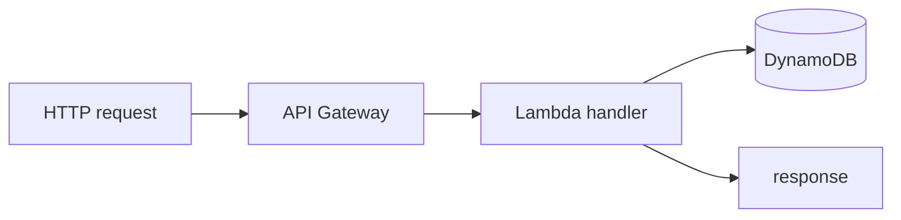

# 03-4 · Lambda & API Gateway

> **Level:** Intermediate · **Prerequisites:** [03-3 SQS & SNS](03_sqs_sns.md)
> **Time:** 40 min · **Verified:** 2026-09-01 (Lambda create + invoke, plus SQS-triggered event source mapping, executed on Floci — see note)

**Lambda** runs your code without servers, in response to events; **API Gateway**
puts an HTTP endpoint in front of it. Together they're the classic serverless
duo — and both are free in Floci.

> **Note on verification:** Floci runs each function in a **real Docker container**
> (the official `public.ecr.aws/lambda/<runtime>` images), so it needs the Docker
> socket mounted:
>
> ```bash
> docker run -d --name floci -p 4566:4566 \
>   -v /var/run/docker.sock:/var/run/docker.sock floci/floci:latest
> ```
>
> Verified here 2026-09-01: `create-function` + `invoke` of a Python 3.12 handler
> returned `StatusCode 200` with the function's real return value, and `docker ps`
> showed the `public.ecr.aws/lambda/python:3.12` runtime container running it.

---

## A Lambda function

A function is a handler plus a trigger. A minimal Python handler:

```python
# handler.py
def handler(event, context):
    name = event.get("queryStringParameters", {}).get("name", "world")
    return {"statusCode": 200, "body": f"hello {name}"}
```

Package and deploy with `awslocal`:

```bash
zip function.zip handler.py
awslocal lambda create-function \
  --function-name hello \
  --runtime python3.11 \
  --handler handler.handler \
  --role arn:aws:iam::000000000000:role/lambda-role \
  --zip-file fileb://function.zip

awslocal lambda invoke --function-name hello --payload '{}' out.json
cat out.json     # {"statusCode": 200, "body": "hello world"}
```

(The `role` ARN is a dummy — Floci doesn't enforce IAM.)

---

## Front it with API Gateway

API Gateway maps an HTTP route to the Lambda:

```bash
# create a REST API, a resource + method, wire it to the function, deploy a stage
awslocal apigateway create-rest-api --name links-api
# ... create-resource / put-method / put-integration (lambda proxy) / create-deployment ...
```

Then Floci serves it at a URL like:

```
http://localhost:4566/restapis/<api-id>/prod/_user_request_/hello?name=you
```

The multi-step wiring is verbose by hand — which is exactly why you do it with
**OpenTofu or the CDK** instead ([03](../04_iac_with_opentofu/)). The point here is
to understand the pieces: **route → integration → function**.

---

## Where this fits the capstone (stretch)

The capstone keeps its logic in a normal process for simplicity. A serverless
version would be: **API Gateway** route `/{slug}` → **Lambda** that looks the slug
up in **DynamoDB** and returns a 302 redirect. Same DynamoDB table, different
compute. Building that is the stretch exercise below — a great way to feel why IaC
matters once more than two services are involved.

---

## The serverless mental model



No servers to run or patch; you pay per invocation; it scales to zero. The
trade-offs (cold starts, execution limits, harder local debugging) are why
Floci is so useful here — you iterate on serverless code locally instead of
deploying to AWS every time.

---

## Triggering Lambda from a queue, not just HTTP

API Gateway is one trigger. The far more common "real backend" pattern:
**Lambda consuming a queue automatically** — no polling code, no cron, SQS
calls your function for you as messages arrive:

```python
# handler.py
def handler(event, context):
    for record in event["Records"]:
        print("got sqs message:", record["body"])
    return {"ok": True}
```

```bash
awslocal lambda create-event-source-mapping \
  --function-name sqs-consumer --event-source-arn $QUEUE_ARN --batch-size 1
```

Verified end to end: sending one message to the queue triggered the function
**automatically** — its CloudWatch log shows `got sqs message: hello from
sqs` with zero polling code anywhere. This is the piece that turns "SQS" and
"Lambda" from two separate lessons into one real pipeline: `03-3`'s DLQ
pattern applies here too — if `handler.py` raises, SQS redelivers per its
normal visibility-timeout rules, and a poison message still ends up in the
DLQ after `maxReceiveCount`, this time driven by Lambda failures instead of a
manual consumer forgetting to delete.

## What happens when the function itself fails

Two different failure stories depending on how Lambda was invoked:

- **Synchronous** (API Gateway, direct `invoke`) — the caller sees the error
  immediately; retry logic (if any) is the *caller's* job.
- **Asynchronous** (SQS, S3 events, EventBridge) — Lambda retries automatically
  (twice, by default), then sends the failed event to an **on-failure
  destination** you configure (another SQS queue, SNS topic, or EventBridge
  bus) — the async-invoke equivalent of a DLQ, separate from any DLQ the
  *source* queue itself has.

## Cold starts, for real

"Cold starts" gets name-dropped everywhere; the concrete mechanism: a Lambda
with no warm execution environment has to *start a new container*, load your
runtime and code, before it can run your handler — hundreds of milliseconds
to a few seconds depending on runtime and package size, only on the **first**
request after idle (or during a burst that needs more concurrent
environments than are already warm). Two real mitigations, not just "know the
term": **provisioned concurrency** (pay to keep N environments warm
permanently — trades cost for guaranteed latency) and **smaller deployment
packages** (less to load = faster cold start) — reach for the first only once
you've measured that cold starts actually matter for your traffic pattern.

---

## Access & IAM

That dummy role ARN above is real in production: a Lambda needs an **execution role** with
**two** policies — a **trust policy** (only `lambda.amazonaws.com` may assume it) and a
**permissions policy** (least-privilege actions on named ARNs, incl. `logs:*` or the function
logs nothing). API Gateway → Lambda also needs an invoke permission. **Floci ignores all
of this**; author it correctly and verify on real AWS. Full treatment:
[05-4 · IAM in practice](../02_iam_and_access/02_roles_and_policies_per_service.md).

---

## Recap & next

- ✅ **Lambda** runs event-driven functions; **API Gateway** gives them an HTTP
  front door — both free in Floci.
- ✅ Deploy with `awslocal lambda create-function` / `invoke`; dummy IAM role ARNs
  are fine on Floci.
- ✅ Wiring API Gateway by hand is verbose — **use IaC** ([03](../04_iac_with_opentofu/));
  Lambda executes in its own container (needs Docker access).
- ✅ **Event source mappings** trigger Lambda from a queue with zero polling code
  (verified); async invokes retry then go to an **on-failure destination**, separate
  from the source queue's own DLQ; **provisioned concurrency** is the real fix for
  cold starts, once you've measured they matter.

## Exercise (stretch)

Design the serverless `linkstash` redirect: an API Gateway route `/{slug}` → a
Lambda that reads the slug from the `links` DynamoDB table and returns a 302 to the
stored URL. What does the Lambda need in `event` to find the slug, and what status
code/headers make a redirect?

<details>
<summary>Solution</summary>

The Lambda reads `event["pathParameters"]["slug"]` (proxy integration passes path
params), does `table.get_item(Key={"slug": slug})`, and returns
`{"statusCode": 302, "headers": {"Location": item["url"]}, "body": ""}`. A missing
slug returns `{"statusCode": 404, ...}`. Provisioning the API+Lambda+table+
permissions by hand is painful — which is the lesson that sends you to OpenTofu.

</details>

**→ Next: [04-1 · The aws provider against Floci](../04_iac_with_opentofu/01_aws_provider_against_floci.md)**
