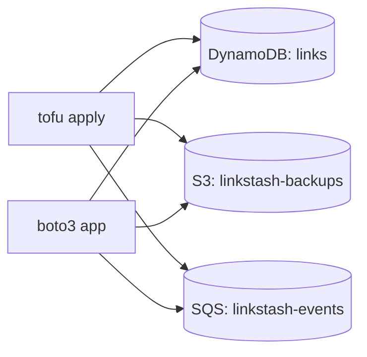

# 03-2 · The linkstash-cloud stack

> **Level:** Intermediate · **Prerequisites:** [03-1 The aws provider against LocalStack](01_aws_provider_against_localstack.md)
> **Time:** 25 min · **Verified:** 2026-07-16 (applied end to end)

Everything assembled: provision the three AWS services, then run the boto3 app
against them — the full loop from `tofu apply` to a working cloud-backed app, all
local.

---

## The stack



OpenTofu declares the infrastructure; the app ([`app/storage.py`](../99_project_linkstash_cloud/app/storage.py))
uses it. The app never creates resources — that's IaC's job — it just reads/writes.
Clean separation: **infra in `.tf`, behaviour in the app.**

---

## The whole loop — verified

```bash
docker run -d --name localstack_main -p 4566:4566 localstack/localstack:3.8.1   # up
export AWS_ENDPOINT_URL=http://localhost:4566 AWS_ACCESS_KEY_ID=test AWS_SECRET_ACCESS_KEY=test AWS_DEFAULT_REGION=us-east-1

cd infra && tofu init && tofu apply -auto-approve && cd ..   # provision
python -m app.demo                                            # use it
```

Verified `app.demo` output against the provisioned stack:

```
put:     abc123 -> https://example.com
get:     abc123 -> https://example.com
backup:  s3 key links/abc123.txt
events:  ['created:abc123']
OK
```

One `put()` touched all three services: wrote the item to **DynamoDB**, and
emitted an event to **SQS**; `backup()` wrote to **S3**; `drain_events()` consumed
the SQS message. Confirm with `awslocal`:

```
$ awslocal dynamodb list-tables      → {"TableNames": ["links"]}
$ awslocal s3 ls                      → linkstash-backups
$ awslocal sqs list-queues            → linkstash-events
```

---

## Tear it down

```bash
cd infra && tofu destroy -auto-approve      # remove the AWS resources
docker rm -f localstack_main                # stop LocalStack (state is ephemeral anyway)
```

`tofu destroy` removes what it created; stopping the container wipes everything.
Cheap to stand up, cheap to throw away — the whole appeal for dev and tests.

---

## The `make` shortcuts

The capstone [`Makefile`](../99_project_linkstash_cloud/Makefile) wraps this so you
don't retype env vars:

```bash
make up && make apply && make seed && make verify && make test && make down
```

It exports the `AWS_*` + endpoint env once and runs each step — the same
local-mirror idea as the CI/CD course's `make ci`.

---

## Recap & next

- ✅ OpenTofu **declares** the DynamoDB/S3/SQS infra; the boto3 app **uses** it —
  infra and behaviour cleanly separated.
- ✅ Verified full loop: `up → apply → seed` with one `put()` exercising all three
  services; `destroy`/`down` tears it down.
- ✅ The **`Makefile`** wraps the env + steps (mirrors the CI/CD course's `make ci`).

## Exercise

Add an `aws_s3_bucket_versioning` resource to `infra/main.tf` so the backups bucket
keeps object versions, then `tofu apply` and confirm with
`awslocal s3api get-bucket-versioning --bucket linkstash-backups`.

<details>
<summary>Solution</summary>

```hcl
resource "aws_s3_bucket_versioning" "backups" {
  bucket = aws_s3_bucket.backups.id
  versioning_configuration { status = "Enabled" }
}
```

`tofu apply` shows `1 to add`; then `get-bucket-versioning` returns
`{"Status": "Enabled"}`. Because you referenced `aws_s3_bucket.backups.id`,
OpenTofu orders it after the bucket automatically ([OpenTofu course 02-3](../../opentofu_iac/02_core_workflow/03_dependencies_and_lifecycle.md)).

</details>

**→ Next: [04-1 · Testing with LocalStack](../04_testing_and_ci/01_testing_with_localstack.md)**
