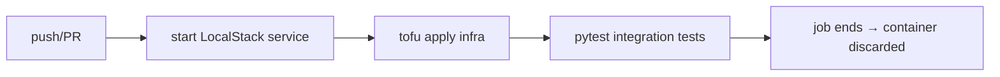

# 04-2 · LocalStack in CI

> **Level:** Intermediate · **Prerequisites:** [04-1 Testing with LocalStack](01_testing_with_localstack.md), [CI/CD course](../../cicd_github_actions/)
> **Time:** 20 min · **Verified:** 2026-07-16 (workflow syntax)

Ephemeral AWS-in-a-container is perfect for CI: every pipeline run gets a clean AWS,
runs your integration tests, and throws it away. This uses the GitHub Actions
skills from the [CI/CD course](../../cicd_github_actions/).

---

## Run LocalStack as a service container

GitHub Actions can start LocalStack alongside your job with `services:` — it's up
before your steps run:

```yaml
name: integration
on: [push, pull_request]

jobs:
  test:
    runs-on: ubuntu-latest
    services:
      localstack:
        image: localstack/localstack:3.8.1     # pinned = token-free community
        ports: ["4566:4566"]
        options: >-
          --health-cmd "curl -f http://localhost:4566/_localstack/health || exit 1"
          --health-interval 10s --health-timeout 5s --health-retries 10
    env:
      AWS_ENDPOINT_URL: http://localhost:4566
      AWS_ACCESS_KEY_ID: test
      AWS_SECRET_ACCESS_KEY: test
      AWS_DEFAULT_REGION: us-east-1
    steps:
      - uses: actions/checkout@v4
      - uses: actions/setup-python@v5
        with: { python-version: "3.11", cache: pip }
      - uses: opentofu/setup-opentofu@v1
      - run: pip install -r requirements.txt
      # provision the infra, then run the integration tests against LocalStack
      - run: cd infra && tofu init && tofu apply -auto-approve
      - run: python -m pytest -q
```

The `--health-cmd` gate ensures LocalStack is ready before `tofu apply` runs — the
same "wait for healthy" you did locally, expressed as a container health check.

---

## The pattern



Every run: fresh AWS, provision, test, discard. No shared state between runs, no
cloud bill, no credentials to manage — a clean slate each time is *why* LocalStack
shines in CI.

---

## The auth-token option (latest LocalStack)

To use LocalStack's **latest** image in CI (instead of the pinned `3.8.1`), you need
a free auth token as a secret:

```yaml
    services:
      localstack:
        image: localstack/localstack:latest
        env:
          LOCALSTACK_AUTH_TOKEN: ${{ secrets.LOCALSTACK_AUTH_TOKEN }}
        ports: ["4566:4566"]
```

Pinning `3.8.1` keeps CI dependency-free and reproducible; the token unlocks the
newest features/services. Choose per project — [04-3](03_gotchas_and_pro.md) covers
the trade-off. LocalStack also publishes a `setup-localstack` action if you prefer
the CLI over a service container.

---

## Recap & next

- ✅ Run LocalStack as a **`services:` container** with a **health check** so it's
  ready before your steps.
- ✅ Set the `AWS_*` + endpoint env at the job level, then **`tofu apply` +
  `pytest`** — fresh AWS every run, discarded after.
- ✅ **Pin `3.8.1`** for token-free reproducible CI, or use `latest` +
  `LOCALSTACK_AUTH_TOKEN` secret for the newest features.

**Self-check:** Why is the `--health-cmd`/`--health-retries` option essential when
LocalStack is a CI service container?

<details>
<summary>Answer</summary>

Without a health gate, your steps could run **before LocalStack finishes booting**,
so `tofu apply`/tests would hit a not-yet-ready endpoint and fail flakily. The
health check makes the job wait until `/_localstack/health` responds, so the first
AWS call always lands on a ready emulator — the CI equivalent of the local
"wait for healthy" loop.

</details>

**→ Next: [04-3 · Gotchas, persistence & Pro](03_gotchas_and_pro.md)**
