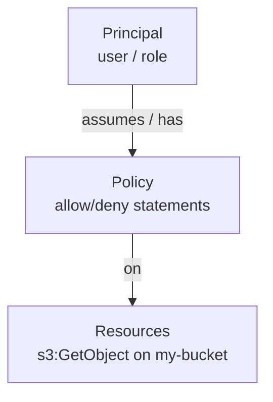

# 05-3 · Identity: IAM & STS

> **Level:** Intermediate · **Prerequisites:** [05-2 Events & orchestration](02_eventbridge_and_stepfunctions.md)
> **Time:** 20 min · **Verified:** 2026-07-16 (LocalStack 3.8.1) — with a big caveat

**IAM** (Identity and Access Management) is how AWS decides *who can do what*. It's
the backbone of AWS security — and the one service where LocalStack Community
differs most from real AWS, so this module is as much about the caveat as the API.

---

## The model in four nouns



| Term | Is |
|---|---|
| **User** | a long-lived identity (a person or app) |
| **Role** | an identity you *assume* temporarily (services, cross-account, federated) |
| **Policy** | a JSON document of `Allow`/`Deny` statements (action + resource) |
| **STS** | issues the temporary credentials when a role is assumed |

Modern AWS favours **roles** over users — short-lived assumed credentials (the same
idea behind OIDC in the [CI/CD course](../../cicd_github_actions/04_delivery_and_deployment/01_environments_secrets_oidc.md)).

---

## Create a role and a policy

```bash
awslocal iam create-role --role-name demo-role \
  --assume-role-policy-document '{"Version":"2012-10-17","Statement":[]}'
awslocal iam list-roles --query 'Roles[].RoleName' --output text
```

Verified:

```
arn:aws:iam::000000000000:role/demo-role
demo-role
```

A permissions policy attached to that role:

```json
{
  "Version": "2012-10-17",
  "Statement": [{
    "Effect": "Allow",
    "Action": ["dynamodb:GetItem", "dynamodb:PutItem"],
    "Resource": "arn:aws:dynamodb:*:*:table/links"
  }]
}
```

`awslocal iam create-policy --policy-name links-rw --policy-document file://policy.json`
then `attach-role-policy`. This is exactly the least-privilege thinking from the
security courses — grant only the actions on only the resources needed.

---

## ⚠️ The caveat: Community doesn't *enforce* IAM

You can **create** users, roles, and policies on LocalStack Community — but it
**does not enforce them**. Every call is allowed regardless of policy. So:

- ✅ Good for: learning the IAM *model*, authoring policies, testing that your IaC
  *creates* the right roles/policies.
- ❌ Not good for: verifying that a policy actually **grants/denies** correctly —
  Community will happily let a call through that real AWS would reject with
  `AccessDenied`.

This is the #1 fidelity gap ([04-3](../04_testing_and_ci/03_gotchas_and_pro.md)):
**IAM enforcement is a LocalStack Pro feature.** Test permission *behaviour* against
real AWS (or Pro). It's why an app can be green on LocalStack and then hit
`AccessDenied` in production — the emulator never checked.

---

## STS: who am I?

STS issues temporary credentials and answers "who is this caller?":

```bash
awslocal sts get-caller-identity
# {"Account": "000000000000", "Arn": "arn:aws:iam::000000000000:root", ...}
```

On LocalStack the account is always `000000000000`. On real AWS, `get-caller-identity`
is the quickest check of *which* identity/role your code is actually running as —
invaluable when a deploy uses the wrong role.

---

## Recap & next

- ✅ IAM = **principals (users/roles)** + **policies** (allow/deny actions on
  resources); prefer **roles** (temporary creds via **STS**).
- ✅ LocalStack Community lets you **create** IAM objects but **doesn't enforce**
  them — great for the model and IaC, not for permission behaviour.
- ✅ **Validate real permissions on real AWS** (or Pro); `sts get-caller-identity`
  tells you who you are.

## Exercise

Your OpenTofu creates an IAM role + policy for the linkstash app and `tofu apply`
succeeds on LocalStack. What have you actually verified, and what have you *not*?

<details>
<summary>Answer</summary>

You've verified the **IaC is correct** — the role and policy are created with the
intended documents (you can `get-role`/`get-policy` and diff them). You have **not**
verified the policy actually **permits/denies** the right calls, because Community
doesn't enforce IAM — every call passes regardless. Confirm enforcement against real
AWS or LocalStack Pro before relying on it.

</details>

**Section complete.** → Back to the [capstone](../99_project_linkstash_cloud/README.md),
now enriched with Secrets Manager + SSM, or the [course README](../README.md).
