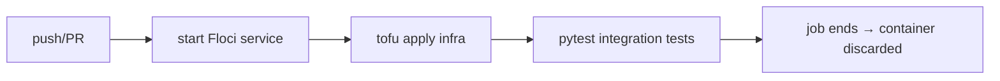

# 05-2 · Floci in CI

> **Level:** Intermediate · **Prerequisites:** [05-1 Testing with Floci](01_testing_with_floci.md), [CI/CD course](../../cicd_github_actions/)
> **Time:** 20 min · **Verified:** 2026-09-01 (workflow syntax)

Ephemeral AWS-in-a-container is perfect for CI: every pipeline run gets a clean AWS,
runs your integration tests, and throws it away. This uses the GitHub Actions
skills from the [CI/CD course](../../cicd_github_actions/).

---

## Run Floci as a service container

GitHub Actions can start Floci alongside your job with `services:` — it's up
before your steps run:

```yaml
name: integration
on: [push, pull_request]

jobs:
  test:
    runs-on: ubuntu-latest
    services:
      floci:
        image: floci/floci:latest     # pin a version tag in real projects
        ports: ["4566:4566"]
        options: >-
          --health-cmd "curl -f http://localhost:4566/_localstack/health || exit 1"
          --health-interval 10s --health-timeout 5s --health-retries 10
    env:
      AWS_ENDPOINT_URL: http://localhost:4566
      AWS_ACCESS_KEY_ID: test
      AWS_SECRET_ACCESS_KEY: test
      AWS_DEFAULT_REGION: us-east-1
    steps:
      - uses: actions/checkout@v4
      - uses: actions/setup-python@v5
        with: { python-version: "3.11", cache: pip }
      - uses: opentofu/setup-opentofu@v1
      - run: pip install -r requirements.txt
      # provision the infra, then run the integration tests against LocalStack
      - run: cd infra && tofu init && tofu apply -auto-approve
      - run: python -m pytest -q
```

The `--health-cmd` gate ensures Floci is ready before `tofu apply` runs — the
same "wait for healthy" you did locally, expressed as a container health check.

---

## The pattern



Every run: fresh AWS, provision, test, discard. No shared state between runs, no
cloud bill, no credentials to manage — a clean slate each time is *why* an
emulator shines in CI.

---

## If your team uses LocalStack instead

Licensed LocalStack works the same way — swap the image and add the auth token as
a secret:

```yaml
    services:
      localstack:
        image: localstack/localstack:latest
        env:
          LOCALSTACK_AUTH_TOKEN: ${{ secrets.LOCALSTACK_AUTH_TOKEN }}
        ports: ["4566:4566"]
```

Same port, same health endpoint, same env — the pipeline is otherwise identical.
That drop-in symmetry is deliberate ([05-3](03_gotchas_and_pro.md)).

---

## Recap & next

- ✅ Run Floci as a **`services:` container** with a **health check** so it's
  ready before your steps.
- ✅ Set the `AWS_*` + endpoint env at the job level, then **`tofu apply` +
  `pytest`** — fresh AWS every run, discarded after.
- ✅ **Pin a version tag** for reproducible CI; a licensed LocalStack drops in with
  one image swap + token secret.

**Self-check:** Why is the `--health-cmd`/`--health-retries` option essential when
the emulator is a CI service container?

<details>
<summary>Answer</summary>

Without a health gate, your steps could run **before the emulator finishes booting**,
so `tofu apply`/tests would hit a not-yet-ready endpoint and fail flakily. The
health check makes the job wait until `/_localstack/health` responds, so the first
AWS call always lands on a ready emulator — the CI equivalent of the local
"wait for healthy" loop.

</details>

**→ Next: [05-3 · Gotchas, persistence & fidelity](03_gotchas_and_pro.md)**
