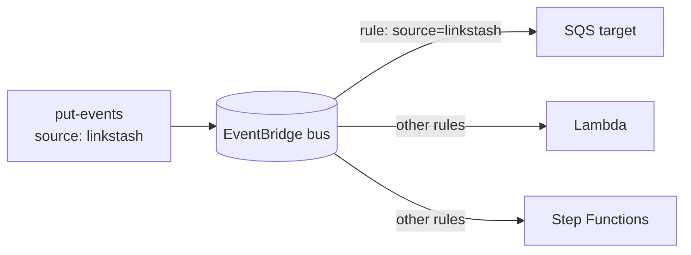

# 06-2 · Events & orchestration — EventBridge & Step Functions

> **Level:** Intermediate · **Prerequisites:** [03-3 SQS & SNS](../03_core_services/03_sqs_sns.md)
> **Time:** 25 min · **Verified:** 2026-07-16 (LocalStack 3.8.1; runs unchanged on Floci)

SQS/SNS move messages; **EventBridge** routes *events* by content to many targets,
and **Step Functions** orchestrates *multi-step workflows*. Together they're how
serverless systems coordinate without glue code.

---

## EventBridge: a content-routed event bus

Producers `put-events`; **rules** match events by pattern and forward them to
**targets** (SQS, Lambda, Step Functions, …). One event can fan out to many
targets, and consumers never know about producers.



Verified end to end — route a `linkstash` event to an SQS queue:

```bash
# target queue ARN
QARN=arn:aws:sqs:us-east-1:000000000000:eb-target
awslocal events put-rule --name link-created --event-pattern '{"source":["linkstash"]}'
awslocal events put-targets --rule link-created --targets "Id=1,Arn=$QARN"
awslocal events put-events --entries '[{"Source":"linkstash","DetailType":"created","Detail":"{\"slug\":\"abc\"}"}]'
awslocal sqs receive-message --queue-url <eb-target-url>
```

Verified output:

```
put-rule   → arn:aws:events:us-east-1:000000000000:rule/link-created
put-targets → FailedEntryCount: 0
put-events  → FailedEntryCount: 0
receive     → {"version":"0","detail-type":"created","source":"linkstash", ... "detail":{"slug":"abc"}}
```

The message that lands in SQS is the full **EventBridge envelope** (source,
detail-type, detail) — that structure is how consumers filter and react.

**EventBridge vs SNS:** both fan out, but EventBridge routes by **event content**
(rich patterns on any field) and integrates with dozens of AWS targets; SNS is
simpler topic-based pub/sub. Use EventBridge when routing logic matters.

---

## Step Functions: orchestrate a workflow

A **state machine** (defined in Amazon States Language, JSON) coordinates steps —
sequencing, branching, retries, parallelism, waits — so your Lambdas stay small and
the *flow* lives in one declarative place.

Verified with a minimal machine:

```bash
awslocal stepfunctions create-state-machine --name demo-sm \
  --role-arn arn:aws:iam::000000000000:role/sfn \
  --definition '{"StartAt":"Hello","States":{"Hello":{"Type":"Pass","Result":"done","End":true}}}'
# → arn:aws:states:us-east-1:000000000000:stateMachine:demo-sm

awslocal stepfunctions start-execution --state-machine-arn <arn>
awslocal stepfunctions describe-execution --execution-arn <exec-arn> --query status
# → SUCCEEDED
```

The states you'll actually use:

| State | Does |
|---|---|
| `Task` | run a Lambda / call a service |
| `Choice` | branch on data |
| `Parallel` / `Map` | run branches / iterate concurrently |
| `Wait` | pause (seconds or until a timestamp) |
| `Pass` / `Succeed` / `Fail` | move/annotate data; end |

A real linkstash workflow might be: **validate URL → store in DynamoDB → back up
to S3 → publish event**, as `Task` states with retry/catch — visible, debuggable,
and no orchestration code in your functions.

---

## How they'd extend the capstone

The capstone emits events to SQS directly. A more AWS-native version: the app
`put-events` to **EventBridge**, a rule routes to the SQS queue (exactly the
verified flow above), and a **Step Functions** machine handles the
store→backup→notify sequence. Same outcome, decoupled and orchestrated — the
natural next refactor once more than a couple of services are involved.

---

## Recap & next

- ✅ **EventBridge** routes events by **content pattern** to many targets (verified
  event → SQS); richer than SNS topic pub/sub.
- ✅ **Step Functions** orchestrate multi-step workflows in declarative JSON
  (verified execution → `SUCCEEDED`); keeps flow out of your functions.
- ✅ Together they decouple producers/consumers and coordinate work — the serverless
  "glue."

## Exercise

Write an event pattern that matches only `linkstash` events whose `detail-type` is
`deleted` (not `created`). Why is content-based routing like this hard to do with
plain SNS topics?

<details>
<summary>Solution</summary>

```json
{"source": ["linkstash"], "detail-type": ["deleted"]}
```

EventBridge matches on **any field of the event**, so one bus + different rules
route `created` vs `deleted` to different targets. With SNS you'd need a **separate
topic per event type** (or message-attribute filter policies) and wire every
producer/consumer to the right topics — EventBridge centralises that routing in
rules instead.

</details>

**→ Next: [06-3 · Encryption at rest: KMS](03_kms.md)**
