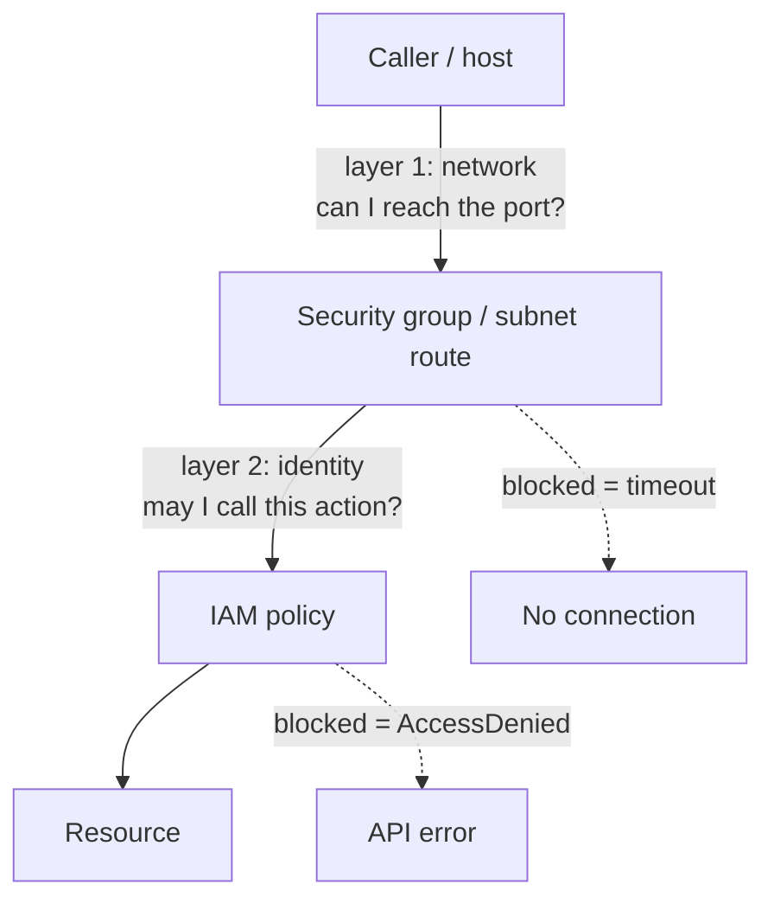

# 07-1 · VPC, subnets & security groups

> **Level:** Intermediate · **Prerequisites:** [02-2 IAM in practice](../02_iam_and_access/02_roles_and_policies_per_service.md)
> **Time:** 30 min · **Verified:** 2026-08-21 (LocalStack 3.8.1; runs unchanged on Floci) — resources are created; network rules are **NOT** enforced (see the caveat)

Everything so far secured AWS at the **API level**: IAM decides whether a principal may
call `PutItem`. But a database doesn't only need "may this identity query me?" — it needs
"can this host even open a TCP connection to port 5432?" That second question is the
**VPC**, and it's the half of AWS access control the course hasn't touched yet.

---

## The two layers of access control



| Layer | Asks | Enforced by | Failure looks like |
|---|---|---|---|
| **Network** | "can this host reach that port?" | VPC routing, security groups, NACLs | connection timeout / refused |
| **Identity** | "may this principal call this action?" | IAM ([02-1](../02_iam_and_access/01_access_model_iam_sts.md)) | `AccessDenied` |

Defense in depth means both. A stolen credential is far less useful if the network won't
let the attacker's host talk to the database in the first place — and a wide-open network
is survivable if IAM is tight. Neither one alone is a security posture.

---

## VPC concepts, in the order you build them

| Thing | Is |
|---|---|
| **VPC** | your private network in a region, defined by a **CIDR block** (`10.0.0.0/16` ≈ 65k addresses) |
| **Subnet** | a slice of that CIDR pinned to **one availability zone** (`10.0.1.0/24` ≈ 251 usable) |
| **Internet gateway (IGW)** | the VPC's door to the internet — one per VPC |
| **Route table** | where traffic goes; a subnet is **public** because its route table sends `0.0.0.0/0` to the IGW |
| **NAT gateway** | lets **private** subnets make *outbound* calls without being reachable inbound |

**Public vs private is not a checkbox** — it's entirely about the route table. A public
subnet has a default route to the IGW (that's where a load balancer or a bastion lives). A
private subnet has none, so nothing on the internet can initiate a connection to it — which
is exactly where your **database** belongs. Standard shape: public subnet for the
load balancer, private subnets for app and data tiers.

> **NAT gateways cost real money on AWS** — roughly $30–40/month each *plus* per-GB data
> processing, and you want one per AZ for high availability. It's one of the most common
> surprise lines on an AWS bill. On Floci it's free, which is exactly why it's easy to
> forget it isn't.

---

## Build it with awslocal

```bash
# 1 — the VPC itself
awslocal ec2 create-vpc --cidr-block 10.0.0.0/16 \
  --tag-specifications 'ResourceType=vpc,Tags=[{Key=Name,Value=linkstash}]'

# 2 — one public, one private subnet (different AZs in real AWS)
awslocal ec2 create-subnet --vpc-id vpc-1a2b3c4d --cidr-block 10.0.1.0/24 \
  --availability-zone us-east-1a          # → public (we'll route it to the IGW)
awslocal ec2 create-subnet --vpc-id vpc-1a2b3c4d --cidr-block 10.0.2.0/24 \
  --availability-zone us-east-1b          # → private (no IGW route: the DB tier)
```

Verified:

```
create-vpc    → VpcId: vpc-1a2b3c4d   CidrBlock: 10.0.0.0/16   OwnerId: 000000000000
create-subnet → SubnetId: subnet-0aa11bb22   AvailableIpAddressCount: 251
create-subnet → SubnetId: subnet-0cc33dd44   AvailableIpAddressCount: 251
```

Now make the first subnet actually public:

```bash
IGW=$(awslocal ec2 create-internet-gateway --query 'InternetGateway.InternetGatewayId' --output text)
awslocal ec2 attach-internet-gateway --vpc-id vpc-1a2b3c4d --internet-gateway-id "$IGW"

RTB=$(awslocal ec2 create-route-table --vpc-id vpc-1a2b3c4d --query 'RouteTable.RouteTableId' --output text)
awslocal ec2 create-route --route-table-id "$RTB" \
  --destination-cidr-block 0.0.0.0/0 --gateway-id "$IGW"   # ← THIS is what "public" means
awslocal ec2 associate-route-table --route-table-id "$RTB" --subnet-id subnet-0aa11bb22
```

Verified:

```
create-internet-gateway → igw-0fe12ab34
attach-internet-gateway → (no output, exit 0)
create-route-table      → rtb-0567cd89e
create-route            → Return: true
associate-route-table   → AssociationId: rtbassoc-0a9b8c7d6
```

The private subnet is private simply because we never associated it with that route
table — it keeps the VPC's main route table, which only knows the local `10.0.0.0/16`
route.

---

## Security groups: a stateful firewall on the resource

A **security group** is a virtual firewall attached to a *resource* (instance, RDS
database, Lambda ENI, load balancer), not to a subnet. Two properties matter:

- **Stateful** — allow inbound 443 and the *response* traffic is automatically allowed
  back out. You never write return rules.
- **Allow-only** — there is **no deny rule**. A packet matching any allow rule is
  permitted; everything else is dropped by default. Default SG behaviour is *deny all
  inbound, allow all outbound*.

```bash
API_SG=$(awslocal ec2 create-security-group --group-name linkstash-api \
  --description "linkstash API tier" --vpc-id vpc-1a2b3c4d \
  --query GroupId --output text)

# public HTTPS: fine to open to the world
awslocal ec2 authorize-security-group-ingress --group-id "$API_SG" \
  --protocol tcp --port 443 --cidr 0.0.0.0/0
```

Verified:

```
create-security-group → GroupId: sg-0abc12345
authorize-...-ingress → Return: true
```

Now the pattern that actually matters — the DB tier accepts Postgres **only from the API
tier's security group**, never from a CIDR:

```bash
DB_SG=$(awslocal ec2 create-security-group --group-name linkstash-db \
  --description "linkstash data tier" --vpc-id vpc-1a2b3c4d \
  --query GroupId --output text)

# --source-group, not --cidr: "whoever is in the API SG", whatever their IP
awslocal ec2 authorize-security-group-ingress --group-id "$DB_SG" \
  --protocol tcp --port 5432 --source-group "$API_SG"
```

Referencing a **group instead of an IP range** is the whole idea. Autoscaling replaces
instances and IPs churn; group membership doesn't. This is least privilege for networking
— the identical thinking as scoping an IAM policy to one table ARN instead of `*`.

**NACLs** are the other knob: **stateless** (you must allow return traffic explicitly),
attached to a **subnet**, and they **do support deny** rules. Use them for coarse subnet-wide
blocks (e.g. blackhole an abusive CIDR); do your real work in security groups.

---

## The interview-grade pattern: tiers referencing tiers

| Security group | Allows inbound | From | Why |
|---|---|---|---|
| `linkstash-alb` | 443 | `0.0.0.0/0` | the public entry point, and only TLS |
| `linkstash-api` | 8080 | `linkstash-alb` SG | app is unreachable except through the load balancer |
| `linkstash-db` | 5432 | `linkstash-api` SG | database unreachable except from the app tier |

Read it bottom-up: there is **no path** from the internet to port 5432. Even inside the
VPC, a compromised unrelated instance can't reach the database, because it isn't a member
of `linkstash-api`. That chain — each tier's SG naming the tier above it — is the answer
interviewers are listening for.

---

## ⚠️ The caveat: Floci *creates* but doesn't *enforce* networking

Floci implements the EC2/VPC APIs. You can create VPCs, subnets, route
tables, IGWs and security groups, attach SGs to resources, and read it all back with
`describe-*` — using the same CLI and the same Terraform as real AWS. What it does **not**
do is emulate the network:

- Security-group rules are **stored, never applied**. Nothing is filtered. A port you
  never opened still answers.
- **Subnets aren't isolated.** "Private" is metadata here; there's no routing boundary.
- EC2 instances are **Docker containers**, not VMs ([07-2](02_ec2_and_service_in_a_vpc.md)).

So:

- ✅ Good for: learning the model, authoring the topology, and testing that your **IaC
  creates the right resources and wiring** — right CIDRs, right subnet associations, the
  DB SG's ingress really does reference the API SG.
- ❌ Not good for: verifying a rule actually **blocks or allows** traffic. A connectivity
  test that passes locally proves nothing about production.

This is the **same create-vs-enforce gap as IAM**
([02-1](../02_iam_and_access/01_access_model_iam_sts.md)): the emulator records your
intent and never checks it. Validate enforcement — reachability, isolation — against real
AWS. See [05-3 gotchas & Pro](../05_testing_and_ci/03_gotchas_and_pro.md) for the full
fidelity picture.

---

## In OpenTofu, where networking actually lives

Nobody clicks a VPC together by hand twice. The `--source-group` pattern above becomes a
resource reference, which is where it gets genuinely nice — Tofu wires the IDs for you:

```hcl
resource "aws_vpc" "main" {
  cidr_block = "10.0.0.0/16"
  tags       = { Name = "linkstash" }
}

resource "aws_subnet" "private" {
  vpc_id            = aws_vpc.main.id
  cidr_block        = "10.0.2.0/24"
  availability_zone = "us-east-1b"       # no IGW route → private
}

resource "aws_security_group" "db" {
  name   = "linkstash-db"
  vpc_id = aws_vpc.main.id
  ingress {
    from_port       = 5432
    to_port         = 5432
    protocol        = "tcp"
    security_groups = [aws_security_group.api.id]   # the tier reference, not a CIDR
  }
}
```

Same provider block as [04-1](../04_iac_with_opentofu/01_aws_provider_against_floci.md)
— delete the `endpoints`/`skip_*` lines and this builds a real VPC.

---

## Recap & next

- ✅ Two layers of access control: **IAM** = may this principal call the action;
  **VPC/SGs** = can this host reach the port. You need both.
- ✅ A subnet is **public** only because its route table sends `0.0.0.0/0` to an **IGW**;
  private subnets use a **NAT gateway** for outbound (and cost real money).
- ✅ Security groups are **stateful** and **allow-only**, attached to resources; **NACLs**
  are stateless, subnet-level, and support deny.
- ✅ Least-privilege networking = each tier's SG allows traffic **from the SG above it**,
  not from a CIDR.
- ✅ Floci **creates** all of this but **enforces none of it** — verify
  topology locally, enforcement on real AWS.

## Exercise

Make the linkstash database reachable **only** from the app tier. Write the two security
groups and their rules. Then: your OpenTofu applies green on Floci — what has that
proven, and what has it not?

<details>
<summary>Answer</summary>

```hcl
resource "aws_security_group" "api" {          # note: no DB port here at all
  name   = "linkstash-api"
  vpc_id = aws_vpc.main.id
  ingress {
    from_port = 8080
    to_port   = 8080
    protocol  = "tcp"
    security_groups = [aws_security_group.alb.id]
  }
}

resource "aws_security_group" "db" {
  name   = "linkstash-db"
  vpc_id = aws_vpc.main.id
  ingress {
    from_port = 5432
    to_port   = 5432
    protocol  = "tcp"
    security_groups = [aws_security_group.api.id]   # the tier above, not a CIDR
  }
}
```

Key points: the DB SG references the **API SG**, not a CIDR (IPs churn; membership
doesn't), it opens **only** 5432, and the DB instance sits in a **private subnet** so no
IGW route exists even if a rule were wrong. Belt and braces.

**Proven by a green apply:** the resources exist with the intended CIDRs, the subnet
associations are right, and the DB SG's ingress really does reference the API SG — you can
`describe-security-groups` and diff it. That's real value: it catches typos, bad
references, and wrong CIDRs.

**Not proven:** that anything is actually *blocked*. Floci stores SG rules without
filtering traffic and doesn't isolate subnets, so a connectivity test here is meaningless
— the same reason a green IAM apply doesn't prove a policy denies anything
([02-1](../02_iam_and_access/01_access_model_iam_sts.md)). Confirm reachability and
isolation on real AWS.

</details>

**→ Next: [07-2 · EC2 & putting a service in a VPC](02_ec2_and_service_in_a_vpc.md)**
