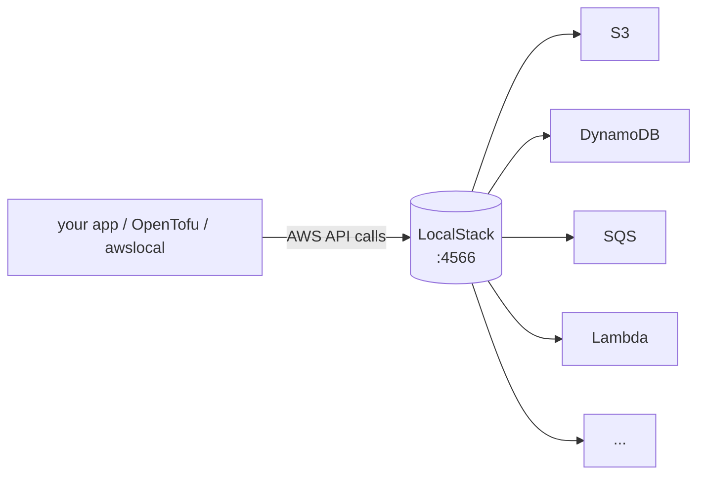
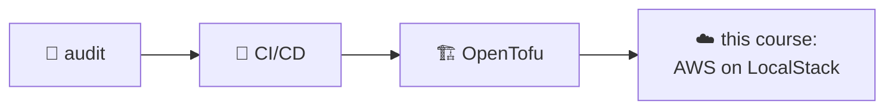

# AWS Locally with LocalStack

> **What you build:** the cloud-native storage layer for the `linkstash` app from
> the [CI/CD](../cicd_github_actions/) & [OpenTofu](../opentofu_iac/) courses —
> links in **DynamoDB**, backups in **S3**, events on **SQS** — running entirely
> on **LocalStack** (an AWS emulator in a container). Real AWS SDK code, real
> OpenTofu `aws` provider, **zero cloud account, zero bill**.

> **Verified:** 2026-07-16 with **LocalStack 3.8.1** (community), **Docker
> 29.6.1**, **boto3**, **awscli-local**, **OpenTofu v1.12.4**. The capstone was
> run end to end in this environment — `tofu apply` created the DynamoDB table +
> S3 bucket + SQS queue against LocalStack, the boto3 demo put/got a link and
> drained an event, and the pytest suite passed. Real output is shown throughout.
>
> ⚠️ **Version note (important):** LocalStack's **2026 releases require a free
> account / `LOCALSTACK_AUTH_TOKEN`** to start. This course pins the token-free
> **community image `localstack:3.8.1`** so everything runs with no signup. To use
> the latest version, create a free account and set the token — covered in
> [04-3](04_testing_and_ci/03_gotchas_and_pro.md).

---

## What LocalStack is

A **cloud-service emulator that runs in one Docker container**. It answers AWS API
calls locally, so you develop and test against S3, DynamoDB, Lambda, SQS, etc.
without touching real AWS. The mental model is one endpoint:



Point any AWS tool at `http://localhost:4566` with dummy credentials and it just
works — the *same code* that runs against real AWS.

| | Real AWS | LocalStack |
|---|---|---|
| Cost | 💸 per use | free |
| Account | required | none (with pinned community image) |
| Speed | network round-trips | local, instant |
| Blast radius | production! | a throwaway container |
| Use for | production | dev, tests, CI, learning |

---

## Community (free) vs Pro

The free **Community** edition covers the core services this course uses:
**S3, DynamoDB, SQS, SNS, Lambda, Kinesis, API Gateway, CloudFormation,
CloudWatch, IAM, STS, Secrets Manager**. **Pro** adds more services (RDS, ECS,
EKS, …) and advanced features. Everything here runs on Community.

---

## Where it fits in the collection

This completes the DevOps track: you've **audited** code, **shipped** it (CI/CD),
and **provisioned** infra (OpenTofu). Now you provision *AWS* infra — locally and
free — using the same OpenTofu workflow, and back the `linkstash` app with cloud
services:



---

## Course map

| # | Module | Time |
|---|---|---|
| 00 | [Introduction](00_introduction.md) | 15 min |
| **01** | **Foundations** | |
| 01-1 | [What is LocalStack?](01_foundations/01_what_is_localstack.md) | 20 min |
| 01-2 | [Setup & your first service](01_foundations/02_setup_and_first_service.md) | 25 min |
| 01-3 | [Endpoints & credentials](01_foundations/03_endpoints_and_credentials.md) | 20 min |
| **02** | **Core services** | |
| 02-1 | [S3 (object storage)](02_core_services/01_s3.md) | 25 min |
| 02-2 | [DynamoDB (NoSQL)](02_core_services/02_dynamodb.md) | 25 min |
| 02-3 | [SQS & SNS (messaging)](02_core_services/03_sqs_sns.md) | 25 min |
| 02-4 | [Lambda & API Gateway](02_core_services/04_lambda_apigateway.md) | 30 min |
| **03** | **Infrastructure as Code** | |
| 03-1 | [The aws provider against LocalStack](03_iac_with_opentofu/01_aws_provider_against_localstack.md) | 25 min |
| 03-2 | [The linkstash-cloud stack](03_iac_with_opentofu/02_the_capstone_stack.md) | 25 min |
| **04** | **Testing & CI** | |
| 04-1 | [Testing with LocalStack](04_testing_and_ci/01_testing_with_localstack.md) | 25 min |
| 04-2 | [LocalStack in CI](04_testing_and_ci/02_localstack_in_ci.md) | 20 min |
| 04-3 | [Gotchas, persistence & Pro](04_testing_and_ci/03_gotchas_and_pro.md) | 20 min |
| **05** | **More AWS services** | |
| 05-1 | [Config & secrets (Secrets Manager, SSM)](05_more_services/01_secrets_and_ssm.md) | 25 min |
| 05-2 | [Events & orchestration (EventBridge, Step Functions)](05_more_services/02_eventbridge_and_stepfunctions.md) | 25 min |
| 05-3 | [Identity: IAM & STS](05_more_services/03_iam_and_sts.md) | 20 min |
| **99** | [Capstone: linkstash-cloud](99_project_linkstash_cloud/README.md) | — |

**Total: ~6.5 hours** | Prerequisites: Python + a little Docker; the
[OpenTofu course](../opentofu_iac/) for Section 03.

---

## Quick start (free, offline after the image pull)

```bash
cd 99_project_linkstash_cloud
make install                 # boto3, localstack, awslocal, awscli
make up                      # start LocalStack (community image)
make apply                   # OpenTofu → DynamoDB + S3 + SQS on LocalStack
make seed                    # boto3 demo: put/get a link, back up, drain events
make verify                  # awslocal lists the created resources
make test                    # pytest integration tests
make down
```

---

## Related guides

- [OpenTofu / IaC](../opentofu_iac/) — the provisioning workflow, here aimed at AWS
- [CI/CD with GitHub Actions](../cicd_github_actions/) — run these integration tests in CI (04-2)
- [Docker](../docker/) — LocalStack *is* a container

→ Start here: **[00 · Introduction](00_introduction.md)**
