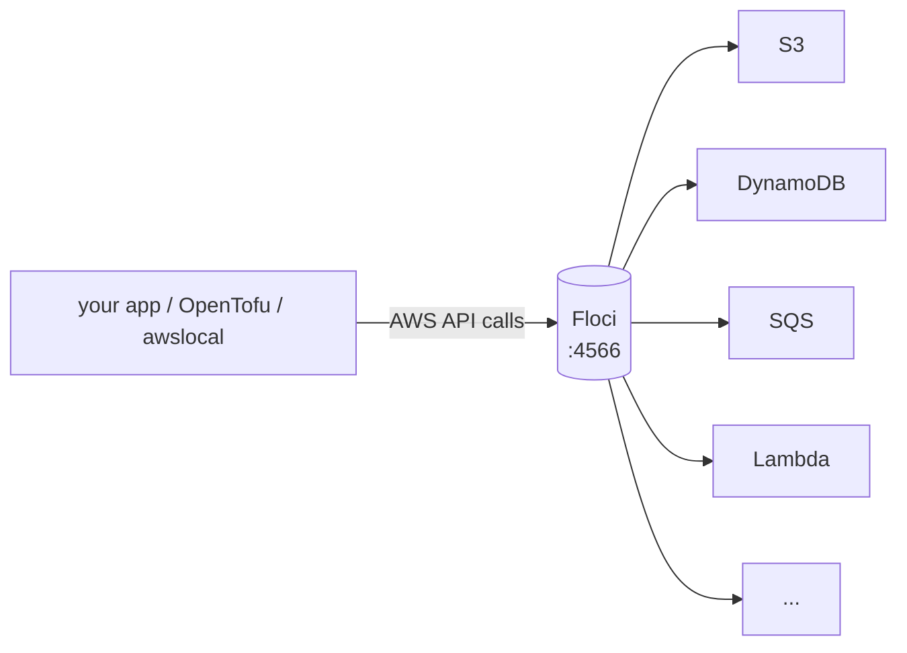
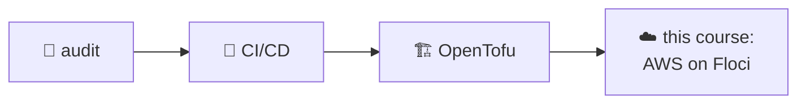

# AWS Locally with Floci

> **What you build:** the cloud-native storage layer for the `linkstash` app from
> the [CI/CD](../cicd_github_actions/) & [OpenTofu](../opentofu_iac/) courses —
> links in **DynamoDB**, backups in **S3**, events on **SQS** — running entirely
> on **Floci** (a free, MIT-licensed AWS emulator in a container). Real AWS SDK code, real
> OpenTofu `aws` provider, **zero cloud account, zero bill**.

> **Verified:** 2026-09-01 with **Floci latest** (`floci/floci`), **Docker
> 29.7.2**, **boto3**, **awscli-local**, **OpenTofu v1.12.4**. The capstone was
> run end to end in this environment — `tofu apply` created all 6 resources
> against Floci, the boto3 demo put/got a link and drained an event, and the
> pytest suite passed **7/7**. Real output is shown throughout.
>
> ⚠️ **Why not LocalStack?** LocalStack sunset its free Community edition in
> **March 2026** — the image now needs an account + `LOCALSTACK_AUTH_TOKEN`, and
> the archived OSS images get no patches. **Floci is a drop-in replacement**:
> same port, same health endpoint, same workflow, MIT-licensed and free. The full
> story (worth knowing for interviews): [05-3](05_testing_and_ci/03_gotchas_and_pro.md).

---

## What Floci is

A **cloud-service emulator that runs in one Docker container**. It answers AWS API
calls locally, so you develop and test against S3, DynamoDB, Lambda, SQS, etc.
without touching real AWS. The mental model is one endpoint:



Point any AWS tool at `http://localhost:4566` with dummy credentials and it just
works — the *same code* that runs against real AWS.

| | Real AWS | Floci |
|---|---|---|
| Cost | 💸 per use | free |
| Account | required | none |
| Speed | network round-trips | local, instant |
| Blast radius | production! | a throwaway container |
| Use for | production | dev, tests, CI, learning |

---

## Free, fully unlocked

Floci has **one tier: free**. All ~100 emulated services — S3, DynamoDB, SQS, SNS,
Lambda, API Gateway, CloudFormation, IAM, STS, KMS, Secrets Manager, EC2/VPC,
Step Functions, and the rest — with no account, token, or feature gates. A few
niche services are stubs (canned responses, e.g. Bedrock Runtime, Textract);
[06-7](06_more_services/07_every_other_service.md) shows how to check what's real.

---

## Where it fits in the collection

This completes the DevOps track: you've **audited** code, **shipped** it (CI/CD),
and **provisioned** infra (OpenTofu). Now you provision *AWS* infra — locally and
free — using the same OpenTofu workflow, and back the `linkstash` app with cloud
services:



---

## Course map

| # | Module | Time |
|---|---|---|
| 00 | [Introduction](00_introduction.md) | 15 min |
| **01** | **Foundations** | |
| 01-1 | [What is an AWS emulator?](01_foundations/01_what_is_an_aws_emulator.md) | 20 min |
| 01-2 | [Setup & your first service](01_foundations/02_setup_and_first_service.md) | 25 min |
| 01-3 | [Endpoints & credentials](01_foundations/03_endpoints_and_credentials.md) | 20 min |
| **02** | **IAM & access** — *every service depends on this* | |
| 02-1 | [Identity: IAM & STS](02_iam_and_access/01_access_model_iam_sts.md) | 20 min |
| 02-2 | [IAM in practice: roles & policies per service](02_iam_and_access/02_roles_and_policies_per_service.md) | 30 min |
| **03** | **Core services** | |
| 03-1 | [S3 (object storage)](03_core_services/01_s3.md) | 25 min |
| 03-2 | [DynamoDB (NoSQL)](03_core_services/02_dynamodb.md) | 25 min |
| 03-3 | [SQS & SNS (messaging)](03_core_services/03_sqs_sns.md) | 25 min |
| 03-4 | [Lambda & API Gateway](03_core_services/04_lambda_apigateway.md) | 30 min |
| **04** | **Infrastructure as Code** | |
| 04-1 | [The aws provider against Floci](04_iac_with_opentofu/01_aws_provider_against_floci.md) | 25 min |
| 04-2 | [The linkstash-cloud stack](04_iac_with_opentofu/02_the_capstone_stack.md) | 25 min |
| **05** | **Testing & CI** | |
| 05-1 | [Testing with Floci](05_testing_and_ci/01_testing_with_floci.md) | 25 min |
| 05-2 | [Floci in CI](05_testing_and_ci/02_floci_in_ci.md) | 20 min |
| 05-3 | [Gotchas, persistence & fidelity](05_testing_and_ci/03_gotchas_and_pro.md) | 20 min |
| **06** | **More AWS services** | |
| 06-1 | [Config & secrets (Secrets Manager, SSM)](06_more_services/01_secrets_and_ssm.md) | 25 min |
| 06-2 | [Events & orchestration (EventBridge, Step Functions)](06_more_services/02_eventbridge_and_stepfunctions.md) | 25 min |
| 06-3 | [Encryption at rest: KMS](06_more_services/03_kms.md) | 25 min |
| 06-4 | [Observability: CloudWatch & Logs](06_more_services/04_cloudwatch_logs.md) | 25 min |
| 06-5 | [RDS: a real relational database](06_more_services/05_rds.md) | 25 min |
| 06-6 | [ElastiCache: caching](06_more_services/06_elasticache.md) | 25 min |
| 06-7 | [The pattern scales: every other service](06_more_services/07_every_other_service.md) | 25 min |
| 06-8 | [Cost & the Well-Architected Framework](06_more_services/08_cost_and_well_architected.md) | 20 min |
| **07** | **Networking & compute** | |
| 07-1 | [VPC, subnets & security groups](07_networking_and_compute/01_vpc_subnets_security_groups.md) | 30 min |
| 07-2 | [EC2 & putting a service in a VPC](07_networking_and_compute/02_ec2_and_service_in_a_vpc.md) | 25 min |
| **08** | **Bedrock & GenAI** — *bridges to the LangChain/LangGraph courses* | |
| 08-1 | [Bedrock for RAG & agents](08_bedrock_and_genai/01_bedrock_for_rag_agents.md) | 30 min |
| **99** | [Capstone: linkstash-cloud](99_project_linkstash_cloud/README.md) | — |

**Total: ~10 hours** | Prerequisites: Python + a little Docker; the
[OpenTofu course](../opentofu_iac/) for Section 04. Section 08 needs a real AWS
account (a few cents) — everything else is free.

> **Why IAM comes second:** every AWS call is an authorization decision before it's
> anything else, so the access model lands before the services it gates. The honest
> counterpart runs through the whole course — the emulator **creates** IAM
> policies, KMS keys, and security groups but **doesn't enforce** them, so you author
> and verify *configuration* locally and validate *enforcement* on real AWS.

---

## Quick start (free, offline after the image pull)

```bash
cd 99_project_linkstash_cloud
make install                 # boto3, awslocal, awscli
make up                      # start Floci (docker)
make apply                   # OpenTofu → DynamoDB + S3 + SQS on Floci
make seed                    # boto3 demo: put/get a link, back up, drain events
make verify                  # awslocal lists the created resources
make test                    # pytest integration tests
make down
```

---

## Related guides

- [OpenTofu / IaC](../opentofu_iac/) — the provisioning workflow, here aimed at AWS
- [CI/CD with GitHub Actions](../cicd_github_actions/) — run these integration tests in CI (05-2)
- [Docker](../docker/) — the emulator *is* a container

→ Start here: **[00 · Introduction](00_introduction.md)**
