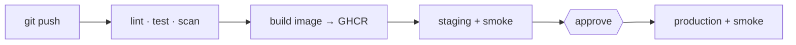
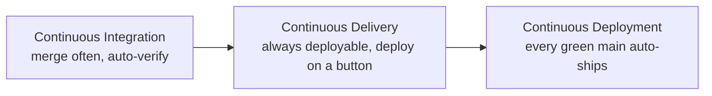

# 00 · Introduction

> **Level:** Beginner → Intermediate · **Time:** 15 min · **Verified:** 2026-07-16

CI/CD turns "I hope this works in production" into "the pipeline proved it does."
This course builds one — a real, gated pipeline for a small Python web app — and
crucially makes **every stage runnable on your laptop**, so CI stops being a
mysterious cloud thing and becomes commands you already understand.

---

## What you'll build

A pipeline for **`linkstash`**, a tiny link-shortener API:



By the end you'll have `.github/workflows/` with **CI**, **CD**, and **Release**
workflows, plus a `Makefile` that runs the same checks locally. You verified the
local half already if you ran the quick start:

```
$ make ci
All checks passed!            # ruff
8 passed in 0.16s              # pytest
TOTAL   51   1   98%           # coverage gate ≥80%
No known vulnerabilities found # pip-audit
✅ CI passed locally
```

> ☝️ Real output from this course's verified environment.

---

## The vocabulary (used precisely)



- **Continuous Integration (CI)** — every change is automatically built and tested
  on merge, so problems surface in minutes, not at release.
- **Continuous Delivery (CD)** — main is *always deployable*; releasing is a
  decision (a click), not an ordeal.
- **Continuous Deployment (CD)** — the stricter cousin: every green commit to main
  ships to production automatically, no human in the loop.

This course does CI + Continuous **Delivery** (with a manual production gate) —
the right default for most teams. Flipping to full Continuous Deployment is then
one removed approval.

---

## Why bother?

- **Fast feedback** — a broken test or a vulnerable dependency is caught on the PR,
  not in production.
- **Repeatability** — the same steps every time; no "it worked when *I* ran it."
- **Safety to ship often** — small, frequent, verified releases are far less risky
  than big rare ones. (This is what the **DORA** metrics measure — [01-1](01_foundations/01_what_is_cicd.md).)
- **A living audit trail** — every deploy is a logged, reproducible run.

---

## How this course reuses the others

This isn't isolated — it's the glue:

| From | Used here as |
|---|---|
| [Docker course](../docker/) | the multi-stage image the **build** stage produces |
| [Secure Code Audit](../secure_code_audit/) | the **security** stage (bandit SAST + pip-audit SCA) |
| OpenTofu (next) | provisions the infra the **deploy** stage targets |

---

## What you need

- **Git** and a **GitHub** account (Actions is free for public repos).
- **Python 3.10+** and **Make**; **Docker** for the build stage.
- Comfort running commands in a terminal. No prior CI experience assumed.

---

**Next → [01-1 · What is CI/CD?](01_foundations/01_what_is_cicd.md)**
