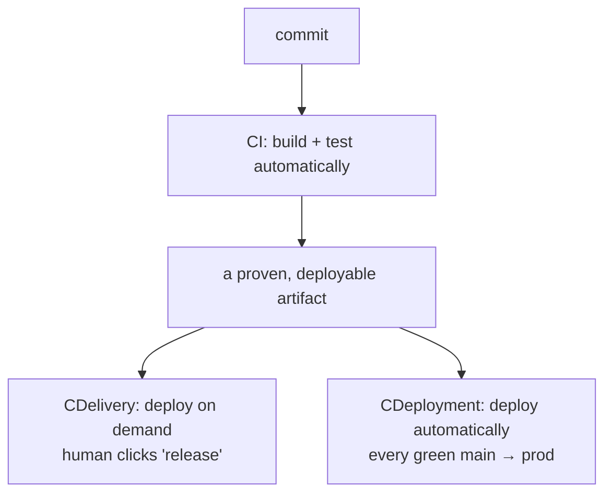
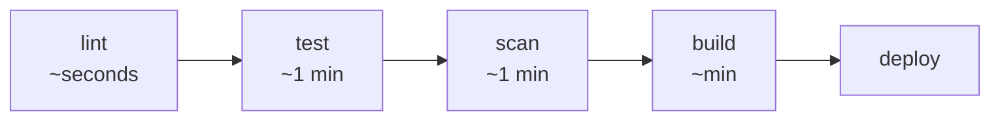

# 01-1 · What is CI/CD?

> **Level:** Beginner · **Prerequisites:** [00 Introduction](../00_introduction.md)
> **Time:** 20 min · **Verified:** 2026-07-16

Let's pin the concepts precisely — the terms get used loosely, and the distinctions
actually matter when you design a pipeline.

---

## The three terms

| Term | Promise | Human in the loop? |
|---|---|---|
| **Continuous Integration** | Every merge is auto-built and tested | — |
| **Continuous Delivery** | Main is *always* releasable; deploy is a decision | **Yes** — approves the release |
| **Continuous Deployment** | Every green commit auto-ships to prod | No |

The artifact is the hinge: CI produces something *proven*; delivery/deployment is
about *how* it reaches production. This course does CI + **Delivery** (a manual
prod gate) — safest default; removing the approval turns it into Deployment.

---

## A pipeline is stages that fail fast

A pipeline is an ordered set of **stages**; a failure in any stage stops the line
and reports back. Order them **cheap-and-fast first** so feedback is quick:

Lint before test before build isn't arbitrary: a formatting error should fail in
5 seconds, not after a 4-minute Docker build. **Order stages by cost.**

---

## Why it pays off: the DORA metrics

The research program **DORA** (DevOps Research and Assessment) found four metrics
that predict software delivery performance — and mature CI/CD moves all four:

| Metric | What it measures | CI/CD's effect |
|---|---|---|
| **Deployment frequency** | How often you ship | ↑ (small, safe, frequent) |
| **Lead time for changes** | Commit → production | ↓ (automation removes waiting) |
| **Change failure rate** | % of deploys causing incidents | ↓ (gates catch bad changes) |
| **Time to restore** | How fast you recover | ↓ (fast pipeline = fast rollback) |

The counterintuitive finding: **deploying more often makes you more stable**, not
less — because each change is small and verified. That's the whole argument for
CI/CD in one sentence.

---

## Recap & next

- ✅ **CI** = auto build+test on merge; **Delivery** = always-deployable + manual
  release; **Deployment** = auto-ship every green commit.
- ✅ A pipeline is **fail-fast stages ordered by cost** — lint before build before
  deploy.
- ✅ CI/CD improves all four **DORA** metrics; shipping *smaller and more often* is
  what makes you *more* stable.

**Self-check:** Your team wants every merged PR to reach production automatically,
with no human click. Which of the three terms is that, and what's the one thing
you'd better have rock-solid first?

Answer

That's **Continuous Deployment**. Before enabling it you need a **thorough,
trustworthy automated test/scan suite plus fast rollback** — with no human gate,
your pipeline's checks are the *only* thing between a commit and production.

**→ Next: [01-2 · Triggers, branches & Git flow](02_triggers_and_git_flow.md)**
