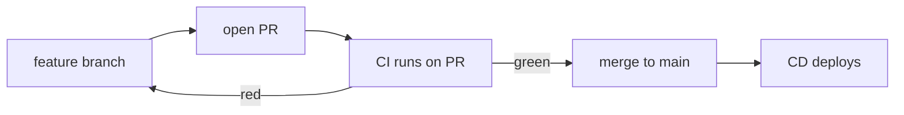

# 01-2 · Triggers, branches & Git flow

> **Level:** Beginner · **Prerequisites:** [01-1 What is CI/CD?](01_what_is_cicd.md)
> **Time:** 20 min · **Verified:** 2026-07-16

A pipeline runs in response to an **event**. Choosing the right events — and the
right branching model — is half of designing good CI/CD.

---

## Events that trigger a workflow

GitHub Actions workflows declare their triggers in `on:`. The ones you'll use most:

```yaml
on:
  push:
    branches: [main]        # run when main moves
  pull_request:             # run on every PR (against any base)
  workflow_dispatch:        # a manual "Run workflow" button
  schedule:
    - cron: "0 6 * * *"     # nightly at 06:00 UTC
  release:
    types: [published]      # when you publish a GitHub Release
  push:
    tags: ["v*"]            # when a version tag is pushed
```

The capstone uses three: **`pull_request` + `push: main`** for CI, **`workflow_run`**
(after CI succeeds) for CD, and **`push: tags v*`** for releases.

| Trigger | Use it for |
|---|---|
| `pull_request` | Gate every PR — the workhorse of CI |
| `push: [main]` | Verify main after merge; kick off delivery |
| `workflow_dispatch` | Manual runs (ad-hoc deploy, one-off jobs) |
| `schedule` | Nightly scans, dependency audits, cleanups |
| `release` / `tags` | Cut a versioned build + GitHub Release |

---

## PR-based CI is the core loop

The single most valuable trigger is `pull_request`: it runs your checks on the
proposed change *before* it merges, and (with branch protection — [05-2](../05_advanced_and_shipping/02_hardening_gates_and_dora.md))
**blocks the merge** until they pass.



That loop — branch → PR → automated checks → merge — is where CI earns its keep.

---

## Branching models

Your branching model shapes your triggers. Two common ones:

| Model | How it works | Fits |
|---|---|---|
| **Trunk-based** | Short-lived branches, merge to `main` many times/day; main always shippable | CI/CD, most teams |
| **GitFlow** | Long-lived `develop`/`release`/`hotfix` branches | Scheduled/versioned releases, slower cadence |

This course assumes **trunk-based development** — it's what CI/CD is optimised for:
small changes, merged often, each verified by the PR pipeline. GitFlow works but
adds branches (and pipeline complexity) that most web apps don't need.

---

## Don't waste runner minutes

Two knobs keep the pipeline lean (detailed in [02-3](../02_continuous_integration/03_caching_and_speed.md)):

- **`concurrency`** — cancel an in-progress run when you push again to the same PR:
  ```yaml
  concurrency:
    group: ci-${{ github.ref }}
    cancel-in-progress: true
  ```
- **`paths`** filters — skip the pipeline when only docs changed:
  ```yaml
  on:
    pull_request:
      paths-ignore: ["**.md", "docs/**"]
  ```

---

## Recap & next

- ✅ Workflows run on **events**: `pull_request`, `push`, `workflow_dispatch`,
  `schedule`, `release`/tags.
- ✅ **PR-based CI** (`pull_request` + branch protection) is the core loop — checks
  gate the merge.
- ✅ Prefer **trunk-based development**; use `concurrency` + `paths` to avoid wasted
  runs.

**Self-check:** Why run CI on `pull_request` rather than only on `push: [main]`?

<details>
<summary>Answer</summary>

`pull_request` runs the checks on the proposed change **before it merges**, so a
broken change never reaches `main`. Running only on `push: [main]` tests it
*after* it's already merged — too late to block it, and now main is red for
everyone.

</details>

**→ Next: [01-3 · GitHub Actions anatomy](03_github_actions_anatomy.md)**
