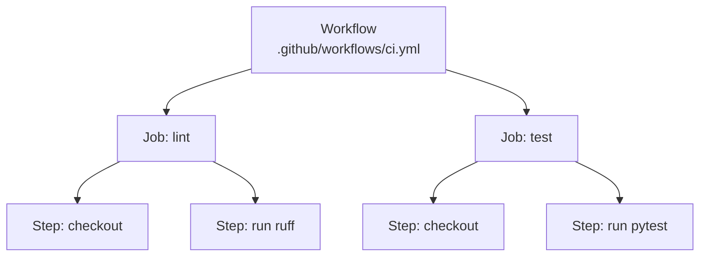

# 01-3 · GitHub Actions anatomy

> **Level:** Beginner · **Prerequisites:** [01-2 Triggers & Git flow](02_triggers_and_git_flow.md)
> **Time:** 25 min · **Verified:** 2026-07-16

Five nouns and you can read any workflow: **workflow → job → step → action**, all
running on a **runner**. Learn them once here.

---

## The hierarchy



| Thing | Is | Key fact |
|---|---|---|
| **Workflow** | one `.yml` file in `.github/workflows/` | triggered by `on:` |
| **Job** | a named group of steps | runs on its **own fresh runner**; jobs run **in parallel** by default |
| **Step** | one command (`run:`) or one action (`uses:`) | steps in a job run **in order**, share the filesystem |
| **Action** | a reusable unit (`uses: owner/name@ref`) | e.g. `actions/checkout@v4` |
| **Runner** | the VM the job runs on | `runs-on: ubuntu-latest` |

---

## A minimal workflow, annotated

```yaml
name: CI                       # shows in the Actions tab
on: [push, pull_request]       # when to run

jobs:
  test:                        # a job id
    runs-on: ubuntu-latest     # the runner
    steps:
      - uses: actions/checkout@v4         # ACTION: clone the repo
      - uses: actions/setup-python@v5     # ACTION: install Python
        with: { python-version: "3.11" } #   inputs to the action
      - run: pip install -r requirements-dev.txt   # STEP: a shell command
      - run: pytest                                 # STEP: another command
```

- **`uses:`** runs a prebuilt action; **`run:`** runs a shell command.
- **`with:`** passes inputs to an action.
- Each job starts on a **clean runner** — nothing persists between jobs unless you
  pass it via artifacts ([03-1](../03_build_and_artifacts/01_artifacts_and_versioning.md)) or a cache.

---

## Jobs are parallel; steps are sequential

By default all jobs start at once (great — lint, test, and security run
simultaneously). To **order** jobs, use `needs:`:

```yaml
jobs:
  build:
    needs: [lint, test]      # build waits until lint AND test succeed
    runs-on: ubuntu-latest
    steps: [...]
```

Steps within a job always run top-to-bottom and stop at the first failure. So:
*parallelise independent jobs, sequence dependent ones with `needs`.*

---

## Context, expressions & variables

Workflows read dynamic values via `${{ }}` expressions:

```yaml
- run: echo "commit ${{ github.sha }} on ${{ github.ref }}"
- run: echo "the secret is masked ${{ secrets.API_TOKEN }}"
- run: echo "an env var ${{ vars.STAGING_URL }}"
```

| Source | Example | What |
|---|---|---|
| `github.*` | `github.sha`, `github.ref`, `github.actor` | event/repo context |
| `secrets.*` | `secrets.GITHUB_TOKEN` | encrypted secrets (masked in logs) |
| `vars.*` | `vars.STAGING_URL` | non-secret config |
| `matrix.*` | `matrix.python-version` | current matrix value ([02-2](../02_continuous_integration/02_testing_and_coverage.md)) |

`secrets.GITHUB_TOKEN` is special — GitHub injects it automatically for each run;
you scope its power with `permissions:` ([05-2](../05_advanced_and_shipping/02_hardening_gates_and_dora.md)).

---

## Pin your actions

`uses: actions/checkout@v4` pins to a major version. For third-party actions,
pinning to a **full commit SHA** is the hardened choice (a moved tag can't slip in
new code) — covered in [05-2](../05_advanced_and_shipping/02_hardening_gates_and_dora.md). Never use an unpinned `@main`.

---

## Recap & next

- ✅ **Workflow → jobs → steps → actions**, on a **runner**. Jobs are **parallel**;
  steps are **sequential**.
- ✅ `uses:` = an action, `run:` = a command, `with:` = inputs; order jobs with
  **`needs:`**.
- ✅ `${{ }}` reads **context/secrets/vars/matrix**; **pin actions** (SHA for
  third-party).

**Self-check:** Two jobs, `test` and `deploy`. You want `deploy` to run only after
`test` passes. What do you add, and to which job?

<details>
<summary>Answer</summary>

Add **`needs: [test]`** to the `deploy` job. Without it, both jobs start in
parallel on separate runners and you could deploy a broken build.

</details>

**→ Next: [01-4 · The sample app & local Makefile](04_sample_app_and_makefile.md)**
