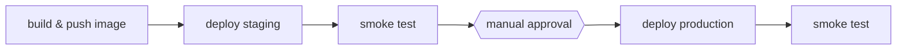

# 04-2 · Deployment strategies

> **Level:** Intermediate · **Prerequisites:** [04-1 Environments, secrets & OIDC](01_environments_secrets_oidc.md)
> **Time:** 25 min · **Verified:** 2026-07-16 (smoke test verified against the container)

How the new version actually replaces the old one — safely, verifiably, and
reversibly. This is the shape of [`cd.yml`](../99_project_cicd_pipeline/.github/workflows/cd.yml).

---

## The pipeline: staging → gate → production



```yaml
  deploy-staging:
    needs: build-and-push
    environment: staging
    steps:
      - run: ./scripts/deploy.sh staging "${{ needs.build-and-push.outputs.image }}"
      - run: ./scripts/smoke_test.sh "${{ vars.STAGING_URL }}"

  deploy-production:
    needs: [build-and-push, deploy-staging]     # only after staging is green
    environment: production                       # required-reviewer gate lives here
    steps:
      - run: ./scripts/deploy.sh production "${{ needs.build-and-push.outputs.image }}"
      - run: ./scripts/smoke_test.sh "${{ vars.PRODUCTION_URL }}"
```

Staging deploys automatically and is smoke-tested; production `needs` staging and
waits on the environment's **required reviewer** before it runs. Same image
(`build-and-push.outputs.image`) flows to both — **build once, deploy many**.

---

## Smoke tests: prove it actually serves

A deploy that "succeeded" but serves 500s isn't a success. A **smoke test** hits
the running app right after deploy. [`scripts/smoke_test.sh`](../99_project_cicd_pipeline/scripts/smoke_test.sh)
checks health *and* the core flow — verified against the real container:

```bash
$ ./scripts/smoke_test.sh http://127.0.0.1:8011
Smoke-testing http://127.0.0.1:8011 ...
✅ smoke test passed        # /health ok AND shorten→follow returns 302
```

This is the check that caught the `127.0.0.1`-vs-`0.0.0.0` bind bug in
[03-2](../03_build_and_artifacts/02_docker_build_and_registry.md). If the smoke
test fails, the job fails — and you roll back.

---

## The strategies

How you cut over from old to new:

| Strategy | How | Trade-off |
|---|---|---|
| **Recreate** | stop old, start new | simplest; brief downtime |
| **Rolling** | replace instances a few at a time | no downtime; both versions run briefly |
| **Blue-green** | run new (green) alongside old (blue), flip traffic | instant switch + instant rollback; 2× resources during cutover |
| **Canary** | send new version a small % of traffic, watch, then ramp | catches problems on few users; needs traffic-splitting + metrics |

Most teams start with **rolling** (what Kubernetes does by default) and adopt
blue-green/canary as stakes rise. The *pipeline* barely changes — only the
`deploy.sh` implementation does.

---

## Rollback is a first-class feature

Because every image is tagged by commit SHA ([03-1](../03_build_and_artifacts/01_artifacts_and_versioning.md)),
rollback is just "deploy the previous SHA":

```bash
./scripts/deploy.sh production ghcr.io/org/linkstash:<previous-sha>
```

Blue-green makes it instant (flip traffic back). Either way, **plan rollback before
you need it** — the DORA "time to restore" metric is won or lost here.

---

## Recap & next

- ✅ **Staging → smoke → manual approval → production → smoke**, deploying the *same*
  built image to both.
- ✅ **Smoke tests** prove the app actually serves (they caught a real bind bug);
  failure triggers rollback.
- ✅ Know **recreate / rolling / blue-green / canary**; start rolling. **Rollback =
  deploy the previous SHA** — design it in advance.

**Self-check:** Why deploy to staging and smoke-test it *before* the production
approval, rather than approving straight to prod?

<details>
<summary>Answer</summary>

Staging exercises the *exact image* in a prod-like environment and the smoke test
confirms it actually serves — so the human approving production is approving
something already proven to run, not gambling. It catches deploy-time problems
(config, bind address, migrations) that unit tests can't.

</details>

**→ Next: [04-3 · Releases & versioning](03_release_and_versioning.md)**
