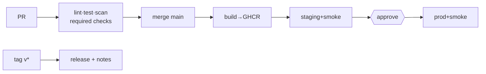

# 05-2 · Hardening, gates & DORA

> **Level:** Advanced · **Prerequisites:** [05-1 Reusable workflows](01_reusable_workflows.md)
> **Time:** 20 min · **Verified:** 2026-07-16

A pipeline is also an attack surface and a source of data. This closing module
locks it down (a CI/CD pipeline has powerful credentials) and measures whether it's
actually making you ship better.

---

## Branch protection makes the gate real

CI that *can* be ignored isn't a gate. Turn on **branch protection** (Settings →
Branches, or a ruleset) for `main`:

- ✅ **Require status checks to pass** — select the CI jobs; a red pipeline blocks
  merge.
- ✅ **Require a pull request review** — no direct pushes to `main`.
- ✅ **Require branches up to date** — re-run CI against the latest main.
- ✅ **Include administrators** — the rules apply to everyone.

Without this, `ci.yml` is a suggestion. With it, the pipeline is enforced.

---

## Harden the workflows themselves

Your pipeline holds credentials that can push images and deploy to prod — treat it
as sensitive:

| Risk | Hardening |
|---|---|
| Over-powerful token | Set `permissions:` to least privilege — default `contents: read`, add `packages: write`/`id-token: write` only on the job that needs it |
| Supply-chain (a tag moved to malicious code) | **Pin third-party actions to a full commit SHA**, not `@v3`/`@main` |
| Stored cloud keys leaking | Use **OIDC** ([04-1](../04_delivery_and_deployment/01_environments_secrets_oidc.md)), not long-lived secrets |
| Untrusted PR code stealing secrets | Don't expose secrets to `pull_request` from forks; use `pull_request_target` carefully |
| Secret in logs | Never `echo` secrets; rely on masking but don't test it |

The capstone workflows already show the first two: top-level `permissions:
contents: read`, elevated only where needed, and versioned actions.

```yaml
permissions:
  contents: read          # least privilege by default
# ...then per-job:
    permissions:
      contents: read
      packages: write      # only the push job gets this
```

---

## Measure with DORA

You met the four **DORA** metrics in [01-1](../01_foundations/01_what_is_cicd.md).
Now instrument them — the pipeline is where the data lives:

| Metric | Where to get it |
|---|---|
| **Deployment frequency** | count successful `deploy-production` runs |
| **Lead time for changes** | commit timestamp → its production deploy timestamp |
| **Change failure rate** | % of prod deploys followed by a rollback/hotfix |
| **Time to restore** | incident start → the restoring deploy |

Watch the trend, not the absolute number. If lead time is creeping up, your
pipeline is slowing down (add caching, split slow tests). Metrics turn "the
pipeline feels slow" into something you can fix.

---

## The finished pipeline

You've built and hardened all of it:



---

## Recap & next

- ✅ **Branch protection** (required checks + PR review) makes CI an enforced gate,
  not a suggestion.
- ✅ **Harden**: least-privilege `permissions:`, **SHA-pin** third-party actions,
  **OIDC** over stored keys, guard fork-PR secrets.
- ✅ **Instrument DORA** from pipeline data and watch the trend.

**Self-check:** Why pin a third-party action to a commit SHA (`@a1b2c3…`) instead of
a tag (`@v3`)?

<details>
<summary>Answer</summary>

A tag is **mutable** — the author (or an attacker who compromises the repo) can
move `v3` to point at new code, which your pipeline would then run *with its
credentials*. A **commit SHA is immutable**, so you always run the exact reviewed
code. It's a supply-chain safeguard for the powerful context your pipeline runs in.

</details>

**Course complete.** → Assemble it all in the
**[99 · Capstone: the linkstash pipeline](../99_project_cicd_pipeline/README.md)**,
then continue to the **OpenTofu course** to provision the infrastructure this
pipeline deploys to.
