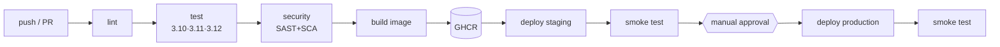

# CI/CD with GitHub Actions (in depth)

> **What you build:** a complete, production-shaped pipeline for a real Python web
> app — **lint → test (matrix) → security scan → build a Docker image → publish →
> deploy to staging → manual approval → production**, with releases and rollbacks.
> Every CI stage also runs **locally** through a `Makefile`, so "works on my
> machine" and "works in CI" run the *same commands*.

> **Verified:** 2026-07-16 against **Python 3.10.12 / 3.11**, **ruff**, **pytest**,
> **coverage 98%**, **bandit**, **pip-audit**, **Docker 29.6.1**, **GNU Make 4.3**.
> The capstone's whole CI stage was executed here — `make ci` passes (lint, **8
> tests**, **98% coverage**, SAST + SCA clean), the **Docker image builds**, and a
> container **passes the smoke test**. Real output is shown throughout. The GitHub
> Actions workflows are standard, validated YAML (they run on GitHub's runners).

---

## Why this course

The [Docker course](../docker/) has one lesson on CI/CD; the
[Secure Code Audit](../secure_code_audit/) course ends by asking to wire scanning
into CI. This course is the deep, dedicated treatment they point to — and it
**reuses both**: the security stage runs the SAST/SCA tools from the audit course,
and the build stage uses a multi-stage Docker image.

CI/CD is the backbone of modern delivery. The mental model is small; the value is
enormous: every push is automatically proven safe to ship, and shipping becomes a
non-event instead of a Friday-night ritual.

---

## The pipeline you build



| Stage | Tool | Gate? |
|---|---|---|
| Lint / format | ruff | ✅ blocks |
| Test (matrix) | pytest + coverage (≥80%) | ✅ blocks |
| SAST | bandit → SARIF | informational |
| SCA | pip-audit | ✅ blocks on a known CVE |
| Build & publish | Docker → GHCR | ✅ blocks |
| Deploy staging | script + smoke test | auto |
| Deploy production | environment + **required reviewer** | 🔒 manual approval |
| Release | tag → image + GitHub Release | on `v*` tag |

---

## Course map

| # | Module | Time |
|---|---|---|
| 00 | [Introduction](00_introduction.md) | 15 min |
| **01** | **Foundations** | |
| 01-1 | [What is CI/CD?](01_foundations/01_what_is_cicd.md) | 20 min |
| 01-2 | [Triggers, branches & Git flow](01_foundations/02_triggers_and_git_flow.md) | 20 min |
| 01-3 | [GitHub Actions anatomy](01_foundations/03_github_actions_anatomy.md) | 25 min |
| 01-4 | [The sample app & local Makefile](01_foundations/04_sample_app_and_makefile.md) | 20 min |
| **02** | **Continuous Integration** | |
| 02-1 | [Lint & format](02_continuous_integration/01_lint_and_format.md) | 20 min |
| 02-2 | [Testing & coverage (matrix)](02_continuous_integration/02_testing_and_coverage.md) | 25 min |
| 02-3 | [Caching & speed](02_continuous_integration/03_caching_and_speed.md) | 20 min |
| 02-4 | [Security gates (SAST + SCA)](02_continuous_integration/04_security_gates.md) | 25 min |
| **03** | **Build & artifacts** | |
| 03-1 | [Artifacts & versioning](03_build_and_artifacts/01_artifacts_and_versioning.md) | 20 min |
| 03-2 | [Docker build & registry](03_build_and_artifacts/02_docker_build_and_registry.md) | 25 min |
| **04** | **Delivery & deployment** | |
| 04-1 | [Environments, secrets & OIDC](04_delivery_and_deployment/01_environments_secrets_oidc.md) | 25 min |
| 04-2 | [Deployment strategies](04_delivery_and_deployment/02_deployment_strategies.md) | 25 min |
| 04-3 | [Releases & versioning](04_delivery_and_deployment/03_release_and_versioning.md) | 20 min |
| **05** | **Advanced & shipping** | |
| 05-1 | [Reusable workflows & composite actions](05_advanced_and_shipping/01_reusable_workflows.md) | 25 min |
| 05-2 | [Hardening, gates & DORA](05_advanced_and_shipping/02_hardening_gates_and_dora.md) | 20 min |
| **99** | [Capstone: the linkstash pipeline](99_project_cicd_pipeline/README.md) | — |

**Total: ~6 hours** | Prerequisites: basic Git & Python; a little Docker helps
(see the [Docker course](../docker/)).

---

## Quick start (run the CI locally, offline)

```bash
cd 99_project_cicd_pipeline
make install          # venv + dev tooling (ruff, pytest, coverage, bandit, pip-audit)
make ci               # lint + coverage + security — the exact stages CI runs
make build            # build the Docker image
```

Verified locally:

```
$ make ci
All checks passed!                     # ruff
8 passed in 0.16s                       # pytest
TOTAL   51   1   98%                     # coverage (≥80% gate)
No known vulnerabilities found          # pip-audit
✅ CI passed locally
```

Then push to GitHub and `.github/workflows/ci.yml` runs the same stages on every
PR.

---

## Related guides

- [Docker](../docker/) — the image the build stage produces
- [Secure Code Audit](../secure_code_audit/) — the SAST/SCA tools the security stage runs
- [FastAPI · Async · WebSockets](../fastapi_async_websockets/) — the pipeline is identical for a FastAPI app
- **OpenTofu** (next course) — provisions the infrastructure this pipeline deploys to

→ Start here: **[00 · Introduction](00_introduction.md)**
