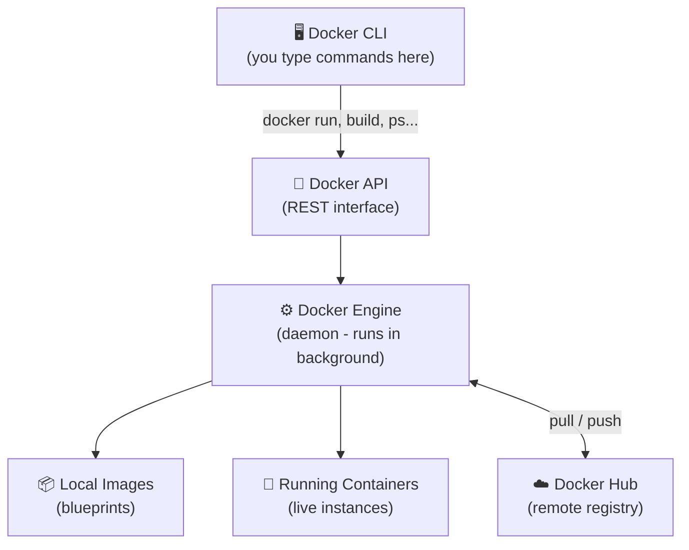

# 00: Introduction to Docker

> **Learning Level:** Absolute Beginner
> **Prerequisites:** None — just a computer and curiosity!
> **Time:** 20–30 minutes
> **Last Updated:** 2026-05-21
> **What You'll Learn:** What Docker is, why it exists, how containers differ from VMs, and how to install Docker

---

## Welcome! 👋

You've probably heard "it works on my machine" — the classic developer nightmare. Docker exists to kill that problem forever.

This guide takes you from **zero** to building and deploying real-world applications using **Docker 2025** — including the newest features like Docker Scout (security scanning), BuildKit (fast builds), Docker Compose Watch (hot-reloading), and AI-ready containers.

No prior experience with containers, Linux, or DevOps is needed. We'll explain every single thing.

---

## What is Docker?

**In Simple Terms:**
Docker is a tool that packages your application and everything it needs to run (code, libraries, settings) into a tidy box called a **container**. You can then ship that box to any computer, and it will run *exactly* the same way.

**Real-World Analogy:**
Think of Docker like a **shipping container** on a cargo ship. Before shipping containers existed, every item was loaded separately — fragile, inconsistent, slow. Shipping containers standardized everything. Docker does the same for software.

**The Problem it Solves:**
```
Without Docker:
  Dev Machine  →  "Works for me!"
  Test Server  →  "Missing library version 2.1!"
  Production   →  "Python version mismatch, app crashes!"

With Docker:
  Dev Machine  →  Packaged container ✅
  Test Server  →  Same container ✅
  Production   →  Same container ✅
```

---

## Container vs Virtual Machine

This is the #1 question beginners have. Let's break it down:

```
Virtual Machine (VM):                    Docker Container:
┌─────────────────────┐                 ┌─────────────────────┐
│  Your App           │                 │  Your App           │
│  Libraries/Deps     │                 │  Libraries/Deps     │
│  FULL Guest OS      │  ← Heavy!       │  (no full OS!)      │  ← Lightweight!
│  Hypervisor         │                 │  Docker Engine      │
│  Host OS            │                 │  Host OS            │
│  Hardware           │                 │  Hardware           │
└─────────────────────┘                 └─────────────────────┘
   Size: GBs                               Size: MBs
   Boot time: Minutes                      Boot time: Seconds
```

| Feature | Virtual Machine | Docker Container |
|---------|----------------|------------------|
| Size | GBs | MBs |
| Startup | Minutes | Milliseconds |
| Isolation | Strong (own OS) | Process-level |
| Performance | Slower | Near-native |
| Portability | Moderate | Excellent |

**Bottom line:** Containers share the host OS kernel, making them much faster and lighter than VMs, while still keeping apps isolated from each other.

---

## Key Terms (Plain English)

| Term | What It Is |
|------|------------|
| **Image** | A blueprint/recipe for a container. Read-only. Like a class in programming. |
| **Container** | A running instance of an image. Like an object created from a class. |
| **Dockerfile** | A text file with instructions to build an image. Like a recipe card. |
| **Docker Hub** | A registry (cloud store) of public images — like an "App Store" for containers. |
| **Docker Compose** | A tool to run multiple containers together as a system. |
| **Volume** | Persistent storage for containers — data survives container restarts. |
| **Network** | How containers talk to each other. |
| **Registry** | Any server that stores Docker images (Docker Hub, AWS ECR, GitHub GHCR). |

---

## Why Learn Docker in 2025?

Docker has evolved far beyond just running apps. In 2025, it powers:

- 🤖 **AI/ML workloads** — Run local LLMs and AI models with Docker Model Runner
- 🔒 **Security scanning** — Docker Scout catches vulnerabilities before production
- ☁️ **Cloud deployments** — Deploy directly to Google Cloud Run, Azure Container Apps
- ⚡ **Fast CI/CD** — Docker Build Cloud cuts build times by up to 39x
- 🔄 **Live development** — Docker Compose Watch syncs code without rebuilds

**Career Impact:**
- Required skill for virtually all backend/DevOps roles
- Used by Netflix, Spotify, Airbnb, and millions of companies
- Gateway to Kubernetes and cloud-native development

---

## Course Map

| Module | Topic | What You'll Build/Learn |
|--------|-------|------------------------|
| **00** | Introduction | What Docker is, install it ← You are here |
| **01** | Core Concepts | Images, containers, Dockerfile basics |
| **02** | Dockerfile Deep Dive | Multi-stage builds, BuildKit, optimization |
| **03** | Networking & Volumes | Container communication, persistent data |
| **04** | Docker Compose | Multi-container apps with one command |
| **05** | Security & Docker Scout | Vulnerability scanning, non-root users, secrets |
| **06** | CI/CD & Production | GitHub Actions, health checks, monitoring |
| **07** | Practical Project | Dockerize a complete Python FastAPI application |

---

## Prerequisites & Installation

### What You Need
1. **A computer** with Windows 10/11, macOS 12+, or Linux (Ubuntu 20.04+)
2. **Internet connection** for pulling images
3. **Terminal/Command Prompt** knowledge (just basic: `cd`, `ls/dir`)
4. **4GB RAM minimum** (8GB recommended for smooth experience)

---

### Install Docker Desktop (Recommended for Beginners)

Docker Desktop gives you a GUI + CLI + all tools in one package.

#### On Linux (Ubuntu/Debian):
```bash
# Step 1: Update package list
sudo apt-get update

# Step 2: Install dependencies needed to add Docker's repo
sudo apt-get install -y ca-certificates curl

# Step 3: Add Docker's official GPG key (proves packages are authentic)
sudo install -m 0755 -d /etc/apt/keyrings
sudo curl -fsSL https://download.docker.com/linux/ubuntu/gpg \
  -o /etc/apt/keyrings/docker.asc

# Step 4: Add Docker's repository to apt sources
echo \
  "deb [arch=$(dpkg --print-architecture) signed-by=/etc/apt/keyrings/docker.asc] \
  https://download.docker.com/linux/ubuntu \
  $(. /etc/os-release && echo "$VERSION_CODENAME") stable" | \
  sudo tee /etc/apt/sources.list.d/docker.list > /dev/null

# Step 5: Update again with Docker's repo now added
sudo apt-get update

# Step 6: Install Docker Engine, CLI, and Compose plugin
sudo apt-get install -y docker-ce docker-ce-cli containerd.io \
  docker-buildx-plugin docker-compose-plugin
```

#### Allow Running Docker Without sudo (Linux only):
```bash
# Add your user to the docker group
sudo usermod -aG docker $USER

# Apply the group change (or log out and back in)
newgrp docker
```

#### On macOS / Windows:
Download **Docker Desktop** from: https://www.docker.com/products/docker-desktop/

---

### Verify Installation

After installing, run these commands to confirm everything works:

```bash
# Check Docker version — should show 25+ or newer
docker --version
# Expected: Docker version 27.x.x, build xxxxxxx

# Check Docker Compose (now built into Docker, no separate install)
docker compose version
# Expected: Docker Compose version v2.x.x

# Run the classic hello-world test
docker run hello-world
```

**What happens when you run `docker run hello-world`:**
```
1. Docker looks for 'hello-world' image locally → not found
2. Docker pulls it from Docker Hub (the public registry)
3. Docker creates a container from that image
4. Container runs, prints a message, and exits
```

**Expected output:**
```
Hello from Docker!
This message shows that your installation appears to be working correctly.
...
```

🎉 If you see that message — Docker is working perfectly!

---

## Your First Real Command

Let's run something more interesting:

```bash
# Run an Nginx web server in a container
# -d = detached (runs in background)
# -p 8080:80 = map port 8080 on your machine to port 80 in container
# --name my-nginx = give it a friendly name
docker run -d -p 8080:80 --name my-nginx nginx
```

Now open your browser and go to: **http://localhost:8080**

You should see the Nginx welcome page! A web server running inside a container.

```bash
# See running containers
docker ps

# Stop the container
docker stop my-nginx

# Remove the container (clean up)
docker rm my-nginx
```

---

## How Docker Architecture Works



**Flow explained:**
1. You type a command like `docker run nginx`
2. CLI sends it to the Docker API
3. Docker Engine checks if `nginx` image exists locally
4. If not → pulls from Docker Hub
5. Engine creates a container from the image and starts it

---

## Next Steps

You now understand what Docker is, why it matters, and have it installed and running!

**What's Next →** Module 01: Core Concepts — Images, Containers, and Your First Dockerfile

**Before moving on, check yourself:**
- [ ] Can you explain the difference between an image and a container?
- [ ] Can you run `docker run hello-world` successfully?
- [ ] Do you understand what Docker Hub is?
- [ ] Can you run Nginx and access it at localhost:8080?

---

## Changelog

| Date | Change |
|------|--------|
| 2026-05-21 | Initial version — covers Docker 27.x, Docker Desktop 4.x |
