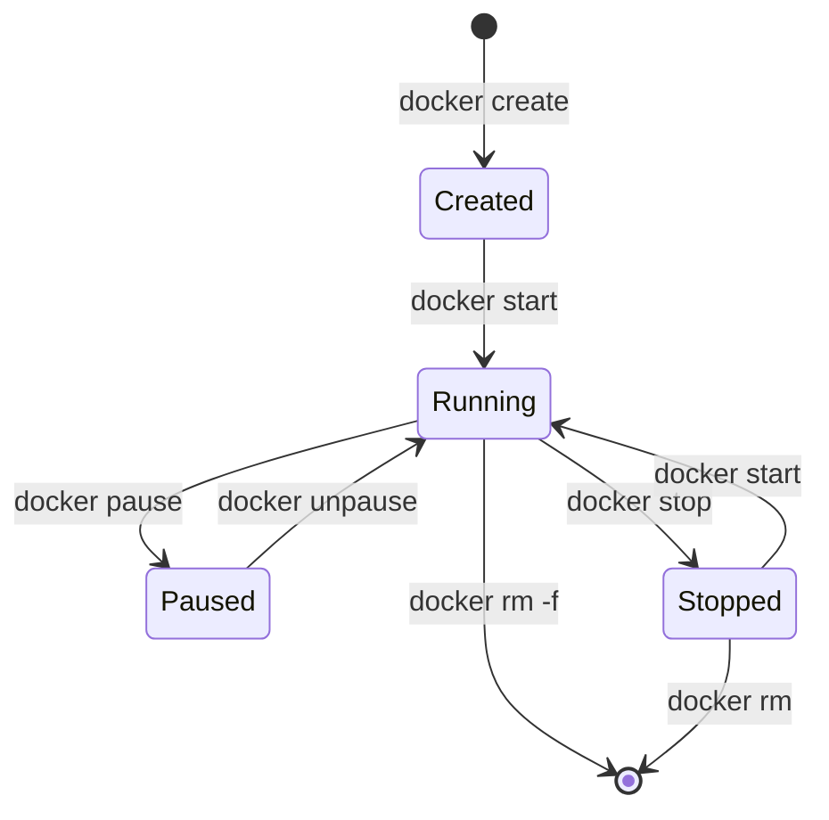

# 01: Core Concepts — Images, Containers & Your First Dockerfile

> **Level:** Absolute Beginner
> **Prerequisites:** Module 00 (Docker installed and running)
> **Time:** 60–90 minutes
> **Last Updated:** 2026-05-21
> **What You'll Learn:** Pull and run images, manage containers, write your first Dockerfile, understand image layers

---

## Introduction

**What:** In this module, you'll learn the three fundamental building blocks of Docker — **Images**, **Containers**, and **Dockerfiles**.

**Why:** These are the foundation of *everything* in Docker. Every advanced feature (Compose, CI/CD, production deployments) builds on exactly these three concepts.

**Analogy:**
- `Dockerfile` = Recipe card 📋
- `Image` = Baked cake 🎂 (read-only, can't eat it)
- `Container` = Slice of cake on a plate 🍰 (running, you can eat/modify it)

---

## Part 1: Working with Images

### What is a Docker Image?

An image is a **read-only** package containing:
- The application code
- Runtime (e.g., Python 3.12, Node 22)
- Libraries and dependencies
- Environment variables and configuration
- Instructions on how to start the app

Images are built from **layers** — each instruction in a Dockerfile adds a new layer. This is critical for performance (layers are cached and reused).

```
Image Layer Structure:
┌────────────────────────────────┐
│  Layer 4: COPY app.py /app/    │  ← Your app code
├────────────────────────────────┤
│  Layer 3: RUN pip install -r   │  ← Your dependencies
├────────────────────────────────┤
│  Layer 2: RUN apt-get update   │  ← System packages
├────────────────────────────────┤
│  Layer 1: FROM python:3.12     │  ← Base OS + Python
└────────────────────────────────┘
```

Each layer is cached. If you only change your app code (Layer 4), Docker reuses Layers 1–3 from cache → **much faster builds!**

---

### Essential Image Commands

```bash
# Pull an image from Docker Hub (like downloading an app)
docker pull python:3.12-slim
# 'python' = image name | '3.12-slim' = tag (version + variant)
# 'slim' = smaller variant with fewer extras

# List all local images
docker images
# Output columns: REPOSITORY, TAG, IMAGE ID, CREATED, SIZE

# Pull a specific version (always use specific tags, never 'latest' in production!)
docker pull nginx:1.27-alpine
# 'alpine' = even smaller Linux base, great for tiny images

# Search Docker Hub for images
docker search fastapi
# Shows public images — always check 'OFFICIAL' or verified publisher

# Remove an image (only when no containers use it)
docker rmi python:3.12-slim

# Remove all unused images (clean up disk space)
docker image prune -a
```

**⚠️ Why avoid `latest` tag?**
```bash
# BAD — "latest" changes over time; your app may break unexpectedly
docker pull node:latest

# GOOD — pinned version; reproducible, predictable
docker pull node:22.3.0-alpine3.20
```

---

## Part 2: Working with Containers

### Container Lifecycle



### Essential Container Commands

```bash
# Run a container (create + start in one step)
docker run nginx
# Problem: this blocks your terminal! Use -d for background

# Run in detached (background) mode
docker run -d nginx
# Returns a long container ID like: a3f45c78d9e1...

# Give the container a name (easier to manage)
docker run -d --name my-web nginx

# Map ports: -p HOST_PORT:CONTAINER_PORT
# This exposes container's port 80 on your machine's port 8080
docker run -d -p 8080:80 --name my-web nginx

# Set environment variables
docker run -d -e APP_ENV=production -e DEBUG=false my-app

# Run interactively (attach a terminal to the container)
# -i = interactive, -t = pseudo-terminal
docker run -it ubuntu bash
# You're now INSIDE the Ubuntu container! Type 'exit' to leave.

# Run a single command and exit
docker run --rm python:3.12-slim python --version
# '--rm' automatically removes the container after it exits
```

### Managing Running Containers

```bash
# List running containers
docker ps

# List ALL containers (including stopped ones)
docker ps -a

# Example output:
# CONTAINER ID   IMAGE    COMMAND         CREATED        STATUS         PORTS          NAMES
# a3f45c78d9e1   nginx    "/docker-en…"   5 minutes ago  Up 5 minutes   0.0.0.0:8080   my-web

# View container logs (stdout/stderr output)
docker logs my-web

# Follow logs in real-time (like 'tail -f')
docker logs -f my-web

# Execute a command INSIDE a running container
docker exec my-web ls /etc/nginx
# Opens a bash shell inside a running container
docker exec -it my-web bash

# See resource usage (CPU, memory, network)
docker stats

# Stop a container gracefully (sends SIGTERM, waits, then SIGKILL)
docker stop my-web

# Kill immediately (send SIGKILL directly)
docker kill my-web

# Start a stopped container
docker start my-web

# Remove a stopped container
docker rm my-web

# Remove a running container forcefully
docker rm -f my-web

# Remove ALL stopped containers
docker container prune
```

---

## Part 3: Your First Dockerfile

### What is a Dockerfile?

A Dockerfile is a plain text file (no extension) with step-by-step instructions to build a Docker image. Think of it as a script that automates environment setup.

### Dockerfile Instructions Reference

| Instruction | Purpose | Example |
|-------------|---------|---------|
| `FROM` | Base image to start from | `FROM python:3.12-slim` |
| `WORKDIR` | Set working directory inside container | `WORKDIR /app` |
| `COPY` | Copy files from host to container | `COPY requirements.txt .` |
| `RUN` | Execute shell command during build | `RUN pip install -r requirements.txt` |
| `ENV` | Set environment variable | `ENV APP_PORT=8000` |
| `EXPOSE` | Document which port the app uses | `EXPOSE 8000` |
| `CMD` | Default command when container starts | `CMD ["python", "app.py"]` |
| `ENTRYPOINT` | Executable that runs on start | `ENTRYPOINT ["uvicorn"]` |
| `ARG` | Build-time variable (not in final image) | `ARG BUILD_DATE` |
| `LABEL` | Add metadata to image | `LABEL version="1.0"` |
| `USER` | Switch to non-root user | `USER appuser` |

---

### Building a Python App — Step by Step

Let's Dockerize a simple Python web app.

**Step 1: Create project files**

```
my-first-app/
├── Dockerfile          ← build instructions
├── requirements.txt    ← Python dependencies
└── app.py              ← our application
```

**app.py:**
```python
# Simple Flask web app to Dockerize
# Install: pip install flask
from flask import Flask

# Create the Flask app object
# What: Flask is a lightweight Python web framework
app = Flask(__name__)

@app.route("/")
def home():
    # What: Handle GET requests to '/'
    # Returns: A simple greeting string
    return "Hello from Docker! 🐳"

@app.route("/health")
def health():
    # What: Health check endpoint
    # Why: Docker and orchestrators call this to verify the app is alive
    return {"status": "healthy"}, 200

if __name__ == "__main__":
    # What: Start the Flask dev server
    # host="0.0.0.0": Accept connections from outside the container
    #   (without this, Docker can't access it from your host machine)
    # port=5000: The port the app listens on inside the container
    app.run(host="0.0.0.0", port=5000)
```

**requirements.txt:**
```
flask==3.1.0
```

**Step 2: Write the Dockerfile**

```dockerfile
# ─────────────────────────────────────────────────────────
# Dockerfile for a Python Flask Application
# ─────────────────────────────────────────────────────────

# FROM: The base image — everything starts here
# 'python:3.12-slim' = Python 3.12 on Debian slim (small, ~45MB)
# Why 'slim'? Removes many extras we don't need, reducing image size
# Why pin to '3.12'? Reproducibility — 'latest' could break your app
FROM python:3.12-slim

# WORKDIR: Set the default directory inside the container
# Why: All following COPY/RUN commands operate from this directory
# If /app doesn't exist, Docker creates it automatically
WORKDIR /app

# COPY requirements first — BEFORE copying app code
# Why: Docker caches layers. If requirements.txt doesn't change,
# this layer (and the pip install below) are reused from cache.
# This makes rebuilds much faster when you only change app.py
COPY requirements.txt .

# RUN: Execute a shell command during the build
# '--no-cache-dir': Don't save pip cache inside the image (saves space)
# Why run as one command? Each RUN creates a layer; combining is efficient
RUN pip install --no-cache-dir -r requirements.txt

# COPY remaining files (code, assets, etc.)
# '. .' means: copy current host directory → /app in container
# Note: .dockerignore prevents sensitive/large files from being copied
COPY . .

# EXPOSE: Document that the app uses port 5000
# Why: Doesn't actually publish the port (that's -p flag at runtime)
# It's documentation + used by docker-compose and orchestrators
EXPOSE 5000

# ENV: Set environment variables available at runtime
# Why: Good practice to set defaults that can be overridden at runtime
ENV FLASK_ENV=production \
    PYTHONDONTWRITEBYTECODE=1 \
    PYTHONUNBUFFERED=1
# PYTHONDONTWRITEBYTECODE: Don't create .pyc files (saves space)
# PYTHONUNBUFFERED: Print output immediately (no buffering) — needed for logs

# CMD: The default command that runs when the container starts
# Why JSON array format ["python", "app.py"] instead of string?
# JSON array = exec form (no shell, signals handled correctly)
# String = shell form (adds /bin/sh -c, signal issues with Docker stop)
CMD ["python", "app.py"]
```

**Step 3: Create .dockerignore**

This file tells Docker what NOT to copy into the image (like `.gitignore`):

```
# .dockerignore — keep the build context small and secure

# Python cache files (auto-generated, not needed in image)
__pycache__/
*.pyc
*.pyo
*.pyd

# Virtual environment (we install deps fresh in container)
.venv/
venv/
env/

# Git history (irrelevant to running the app)
.git/
.gitignore

# Development/IDE files
.idea/
.vscode/
*.swp

# Secrets — CRITICAL: never copy these into images!
.env
*.key
*.pem
secrets/

# Test files (not needed in production image)
tests/
*.test.py
```

**Step 4: Build the image**

```bash
# Build the image
# -t my-flask-app:1.0 = tag it with name and version
# . = build context (current directory, where Dockerfile lives)
docker build -t my-flask-app:1.0 .

# Watch the output — each step is a layer being built:
# Step 1/7: FROM python:3.12-slim
# Step 2/7: WORKDIR /app
# ...

# List images to verify it was created
docker images | grep my-flask-app
```

**Step 5: Run it**

```bash
# Run the container
# -p 5000:5000 = expose container port 5000 on host port 5000
docker run -d -p 5000:5000 --name flask-app my-flask-app:1.0

# Test it
curl http://localhost:5000
# Expected: Hello from Docker! 🐳

curl http://localhost:5000/health
# Expected: {"status": "healthy"}
```

---

## Understanding Image Layers and Cache

```bash
# See layers of an image
docker history my-flask-app:1.0

# Output shows each layer, its size, and the command that created it:
# IMAGE         CREATED       CREATED BY                    SIZE
# a1b2c3d4e5f   2 min ago     CMD ["python" "app.py"]       0B
# f9e8d7c6b5a   2 min ago     COPY . .                      4.2kB
# ...
```

**Layer cache in action:**
```bash
# First build — all layers built fresh
docker build -t my-flask-app:1.0 .
# Step 4/7 : RUN pip install... → takes 30 seconds

# Now change only app.py (not requirements.txt)
# Rebuild
docker build -t my-flask-app:1.1 .
# Step 4/7 : RUN pip install... → CACHED ← instantly reused!
# Only the COPY . . layer and below are rebuilt
```

---

## Common Mistakes

**Mistake 1: Copying all files before installing dependencies**

```dockerfile
# ❌ WRONG — app code changes bust the pip install cache
COPY . .
RUN pip install -r requirements.txt
```

```dockerfile
# ✅ CORRECT — install deps first, then copy app code
COPY requirements.txt .
RUN pip install -r requirements.txt
COPY . .  # Only this layer is invalidated when app.py changes
```

**Mistake 2: Using shell form for CMD**

```dockerfile
# ❌ WRONG — 'docker stop' won't gracefully stop your app
CMD python app.py

# ✅ CORRECT — exec form, signals work properly
CMD ["python", "app.py"]
```

**Mistake 3: Not using .dockerignore**

```dockerfile
# ❌ WRONG — copies everything including node_modules, .git, secrets
COPY . .

# ✅ CORRECT — create a .dockerignore file first!
# Then COPY . . only includes what you want
```

---

## Practice Exercises

**Exercise 1: Dockerize a Node.js App**

Create these files and Dockerize them:

```javascript
// server.js — a simple Node.js HTTP server
const http = require('http');  // Built-in Node.js HTTP module

const server = http.createServer((req, res) => {
    res.writeHead(200, {'Content-Type': 'text/plain'});
    res.end('Hello from Node.js in Docker!\n');
});

server.listen(3000, '0.0.0.0', () => {
    console.log('Server running on port 3000');
});
```

```json
// package.json
{
  "name": "docker-node-app",
  "version": "1.0.0",
  "scripts": {
    "start": "node server.js"
  }
}
```

Requirements:
- Use `node:22-alpine` as base image
- Set `WORKDIR /app`
- Copy `package.json` first, run `npm install`, then copy the rest
- Expose port 3000
- Use CMD to run `npm start`

<details>
<summary>Solution</summary>

```dockerfile
# Use a specific Alpine-based Node.js image — small and secure
FROM node:22-alpine

# Set working directory
WORKDIR /app

# Copy package.json first (dependency layer cache optimization)
COPY package.json .

# Install dependencies — cached if package.json doesn't change
RUN npm install

# Copy the rest of the application code
COPY . .

# Document the port
EXPOSE 3000

# Start the app
CMD ["npm", "start"]
```

Build and run:
```bash
docker build -t node-app:1.0 .
docker run -d -p 3000:3000 --name my-node node-app:1.0
curl http://localhost:3000
```

**Why it works:** Node.js is installed via the base image. We copy `package.json` before `server.js` so that `npm install` is cached on rebuilds when only `server.js` changes.
</details>

**Exercise 2: Inspect and Explore**

```bash
# Inspect a running container's full config
docker inspect my-node

# Look for: "NetworkSettings", "Mounts", "Config.Env"
# This is how tools like Compose and Kubernetes see your container

# Copy a file FROM a container to your host
docker cp my-node:/app/server.js ./server-from-container.js
```

---

## Best Practices

**✅ DO:**
- Always use specific image tags — Why: Reproducible, predictable builds
- Put COPY requirements.txt before COPY . . — Why: Cache optimization
- Use `.dockerignore` — Why: Smaller build context, no secrets leaked
- Use exec form for CMD: `["python", "app.py"]` — Why: Proper signal handling
- Set `WORKDIR` — Why: Avoids path confusion inside container

**❌ DON'T:**
- Use `FROM ubuntu` + manual language install — Why bad: Huge image, slow builds | Fix: Use `FROM python:3.12-slim` directly
- Use `CMD python app.py` (string/shell form) — Why bad: `docker stop` hangs | Fix: Use JSON array form
- Skip `.dockerignore` — Why bad: Copies `.git`, `.env`, secrets | Fix: Always create it
- Combine build and test artifacts in one image — Why bad: Security risk, image bloat | Fix: Multi-stage builds (Module 02)

---

## What's Next

**Learned:** ✅ Image layers, ✅ Container lifecycle, ✅ Dockerfile syntax, ✅ Build optimization, ✅ .dockerignore

**Next:** Module 02: Dockerfile Deep Dive — Multi-stage builds, BuildKit caching, and tiny secure images

**Check:** Can you Dockerize any Python or Node.js app from scratch?

---

## Changelog

| Date | Change |
|------|--------|
| 2026-05-21 | Initial version |
