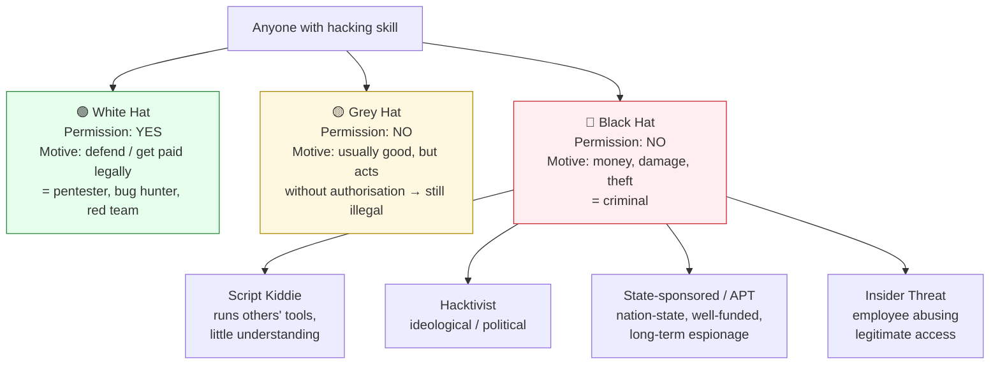
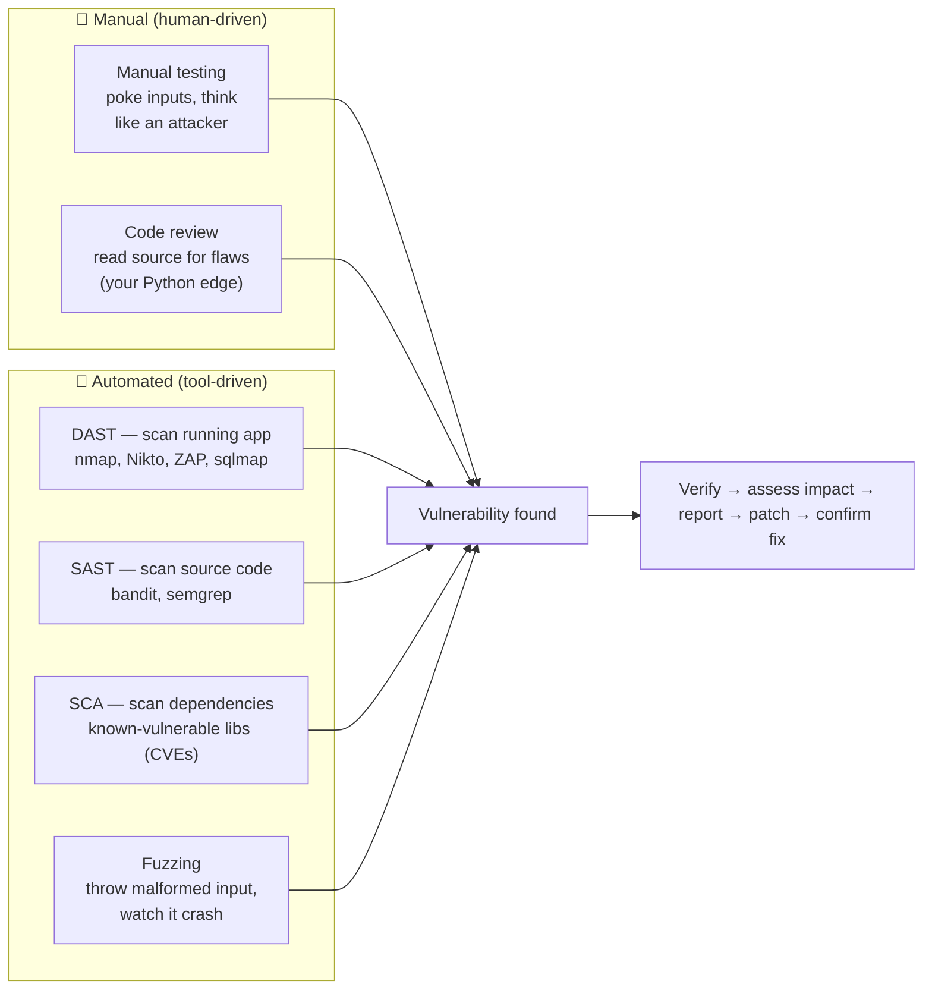

# 00 · Introduction to Ethical Hacking

> **Level:** Beginner · **Prerequisites:** Python basics, comfortable with a terminal
> **Time:** 30 min · **Verified:** 2026-06-25

---

## What is ethical hacking?

A company wants to know if their website can be broken into before a real attacker finds out. They hire you, give you written permission, agree on what you can and cannot touch (the "scope"), and ask you to find every vulnerability you can. You hack it, document what you found, explain how to fix it, and hand them a report. That's ethical hacking — also called **penetration testing** or **pentesting**.

The word "ethical" carries the entire weight of the profession: you only attack systems you have **explicit written permission** to attack. Everything else is illegal, regardless of intent.

---

## The legal line

```
┌─────────────────────────────────┬──────────────────────────────────────┐
│ Legal (with permission)         │ Illegal (without permission)         │
├─────────────────────────────────┼──────────────────────────────────────┤
│ Scanning your own machines      │ Scanning anyone else's machines      │
│ Bug bounty programs (in-scope)  │ Testing outside the stated scope     │
│ Pen test with signed contract   │ "I was just looking" with no auth    │
│ CTF challenges on CTF platforms │ Accessing systems you don't own      │
│ Exploiting the lab in this course│ Exploiting any internet target      │
└─────────────────────────────────┴──────────────────────────────────────┘
```

Laws vary by country, but the core is the same everywhere:
- **Computer Fraud and Abuse Act (US)** — accessing a computer without authorisation is a federal crime
- **Computer Misuse Act (UK)** — same principle
- **IT Act (India)** — Section 43/66 covers unauthorised access

**In this course: every hands-on exercise runs against containers on your laptop (`10.0.0.0/24`). You own them. You have permission.**

---

## The types of hackers

The word "hacker" says nothing about intent. What separates the professions is **permission** and **motive** — not skill. Here's the whole spectrum:



| Hat | Has permission? | Legal? | Typical goal |
|---|---|---|---|
| **White hat** | Yes (contract / bounty scope / own systems) | ✅ Legal | Find bugs so they get fixed |
| **Grey hat** | No | ❌ Illegal | Often "helpful" — finds a bug and reports it uninvited. Good intent doesn't make it legal |
| **Black hat** | No | ❌ Illegal | Profit, sabotage, theft, disruption |

> **The one line that matters:** the *only* thing that puts you on the white-hat side is **explicit, written authorisation for a defined scope.** Skill, curiosity, and good intentions are not a legal defence. This entire course keeps you firmly white-hat by giving you a lab you own.

Inside the white-hat world, roles split by which side of the fight they're on — you'll meet these again in [Section 06 · Career Paths](06_ctf_and_career/03_career_paths.md):

```
  RED TEAM  ⚔️           PURPLE 🟣            BLUE TEAM 🛡️
  attack / break      collaborate & tune     defend / detect
  ───────────────────────────────────────────────────────────
  pentester           purple teamer          SOC analyst
  red teamer          detection engineer     incident responder
  bug bounty hunter                          threat hunter / forensics
```

---

## How vulnerabilities are detected

A "vulnerability" is a weakness an attacker can abuse. As an ethical hacker your whole job is **finding them before the black hats do.** There are five broad ways they get found — you'll use most of them in this course:



| Method | What it is | You'll use it in |
|---|---|---|
| **Manual testing** | A human probes the target by hand, thinking like an attacker | Every section — the core skill |
| **DAST** (dynamic) | Automated tools attack the *running* app from outside | nmap, Burp, sqlmap ([03](03_essential_tools/), [05](05_web_application_security/)) |
| **SAST** (static) | Tools read the *source code* for dangerous patterns | AppSec path — `bandit`, `semgrep` |
| **SCA** (composition) | Check libraries against known-vulnerable versions (CVEs) | Real-world AppSec |
| **Fuzzing** | Bombard inputs with malformed data to trigger crashes | Vulnerability research |

> **The detection lifecycle:** *find → verify it's real → assess impact → report → fix → confirm the fix.* Finding a bug is only step one. The report and the fix are what companies actually pay for — that's why [Section 04 · Reporting](04_ethical_hacking_methodology/06_reporting_and_remediation.md) exists.

---

## What you'll build

By the end of this course you'll have:

1. A local pentest lab with two vulnerable targets you can attack and reset at any time
2. Real experience with the tools every pentester uses: nmap, Burp Suite, sqlmap, hydra, tcpdump
3. A completed pentest report written against your own lab
4. The knowledge to attempt your first CTF room on TryHackMe or HackTheBox
5. A clear picture of the career paths available: red team, blue team, bug bounty, compliance

---

## Why this course starts with networking

Many "hacking" courses start with tools. You run nmap, you see a list of ports, you don't know what you're looking at. This course starts with networking — TCP, DNS, HTTP — because every attack is a protocol-level interaction. Once you understand what a TCP SYN-ACK is, you understand why a port scanner can tell if a port is open from 3 packets. Once you understand HTTP sessions, you understand why cookies can be stolen.

**The order matters:** Networking → Linux → Tools → Methodology → Web Security → CTF.

---

## How to use this course

1. Read each module in order — each one builds on the previous
2. **Run every command yourself.** Reading terminal output is not the same as running it
3. Do the exercises before opening the solutions
4. Keep the capstone lab running while you work through Sections 03–05 — you'll use it constantly
5. When something breaks, read the error. Debugging is a core hacking skill

---

## One more thing

Hacking has a reputation problem. The popular image is a hooded figure breaking into banks. The reality is more like a plumber: you know where the pipes are, you know which joints leak, and companies pay you to find the leaks before water gets in.

If you want a career in this field, the most important thing you can develop is **intellectual curiosity combined with discipline**. Curiosity to go deeper than the obvious answer. Discipline to stay inside scope, document everything, and communicate clearly.

This course gives you the technical foundation. The rest is up to you.

---

**Ready? → [01 Networking Fundamentals: How the Internet Works](01_networking_fundamentals/01_how_the_internet_works.md)**
