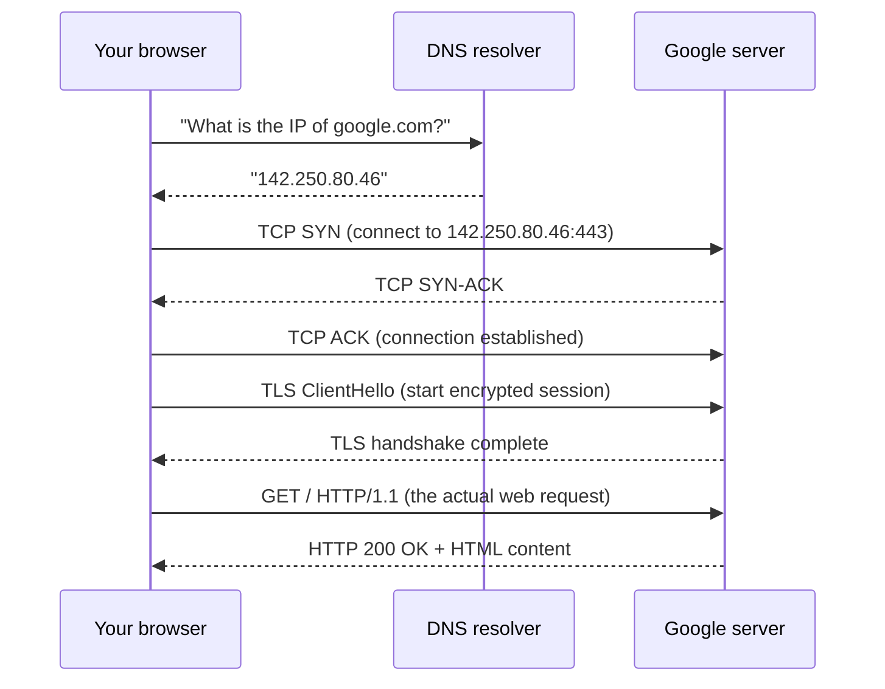
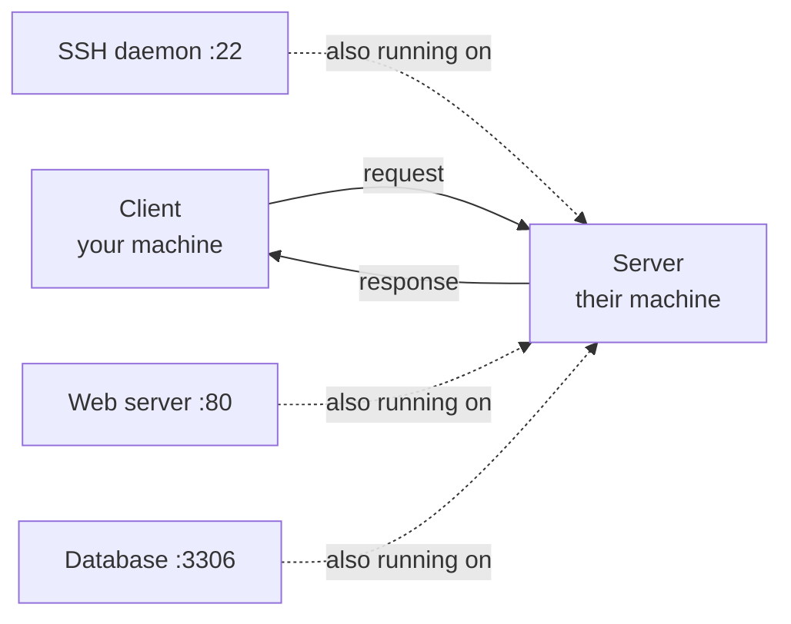

# 01-1 · How the Internet Works

> **Level:** Beginner · **Prerequisites:** [Introduction](../00_introduction.md)
> **Time:** ~1 hour · **Verified:** 2026-06-25

---

## Why this matters

Every attack travels over a network. SQL injection arrives in an HTTP request. Password brute-forcing is a loop of TCP connections. A port scan is a flood of crafted packets. If you don't know how data moves from A to B, you're running tools you don't understand. This module gives you the mental model that makes everything else click.

---

## The core idea: packets

Data on the internet isn't sent as one big stream — it's broken into small chunks called **packets**. Each packet contains:

- A **header** (where it came from, where it's going, what position it is in the sequence)
- A **payload** (the actual data)

A 1 MB file might be split into 700 packets, each traveling independently across the network. Some may take different routes. The receiving end reassembles them in order.

**Why it matters for hacking:** packets can be captured, inspected, and replayed. Every attack is ultimately a packet you crafted to say something the server doesn't expect.

---

## What happens when you load `https://google.com`



Seven steps every time you load a website. By the end of this course you'll understand every arrow in that diagram and know how to attack most of them.

---

## The client-server model

Almost all internet communication follows this pattern:

- **Client** — the machine that initiates: your browser, your phone, your script
- **Server** — the machine that waits and responds: a web server, a database, an SSH daemon

A **service** is a program listening for incoming connections. Each service listens on a specific **port number** (covered in detail in Module 03). Web servers listen on port 80 (HTTP) or 443 (HTTPS). SSH listens on port 22.



**Why it matters:** a port scan (`nmap`) asks "what services are running on this server?" Each open port is a potential entry point.

---

## Routers, switches, and the path a packet takes

Your packet doesn't travel directly from your laptop to Google. It hops through many routers, each one deciding the best next hop toward the destination.

- **Switch** — connects machines on the same local network (Layer 2, MAC addresses)
- **Router** — connects different networks, decides how to forward packets (Layer 3, IP addresses)
- **ISP** — your Internet Service Provider connects your home network to the global internet

```bash
# traceroute shows each hop on the path to a destination
# (run this on your own machine - not inside the lab)
traceroute google.com
```

```
traceroute to google.com (142.250.80.46), 30 hops max
 1  192.168.1.1       1.2ms  ← your home router
 2  10.200.4.1        8.3ms  ← your ISP's first hop
 3  72.14.215.165    12.1ms
 4  142.251.229.14   12.4ms  ← Google's network
 5  142.250.80.46    11.9ms  ← destination
```

---

## IP addresses: the postal addresses of the internet

Every device on a network has an **IP address** — a number that uniquely identifies it on that network.

- **IPv4:** 4 groups of numbers, e.g. `192.168.1.10` — roughly 4 billion possible addresses
- **IPv6:** 8 groups of hex, e.g. `2001:db8::1` — 340 undecillion addresses

Two categories matter for hacking:

| Type | Range | Where used |
|---|---|---|
| Private | `192.168.0.0/16`, `10.0.0.0/8`, `172.16.0.0/12` | Local networks (not reachable from the internet) |
| Public | Everything else | The internet |

The lab in this course uses `10.0.0.0/24` — a private range. Nothing in it is reachable from the internet.

---

## Recap & next

- ✅ Data travels as packets with headers (routing info) and payloads (data)
- ✅ Client-server: client initiates, server responds; each service listens on a port
- ✅ Loading a website involves DNS resolution, TCP connection, TLS, then HTTP
- ✅ Routers forward packets hop-by-hop toward the destination
- ✅ Private IPs (10.x, 192.168.x, 172.16.x) are only reachable on local networks

**Self-check:** You run `nmap 10.0.0.30` inside the lab. What layer of the network does nmap operate at — and why can't you use the same command to scan google.com?

<details>
<summary>Answer</summary>

nmap operates at Layer 3/4 (IP + TCP/UDP). You technically *can* run nmap against google.com — but it would be **illegal without permission**. Google's IP is a public IP reachable from your machine; scanning it without authorisation violates computer fraud laws. The lab's `10.0.0.0/24` is private to your Docker network, so you own it and can scan it freely.

</details>

---

## Exercises

**1. Trace the route.** Open a terminal on your *host machine* (not Docker) and run `traceroute google.com` (Linux/Mac) or `tracert google.com` (Windows). How many hops does your packet take? What IP addresses belong to your ISP vs Google?

<details>
<summary>Hint</summary>

ISP addresses typically appear in the first 2-4 hops and often have PTR records like `10-200-4-1.someISP.net`. Google's hops usually start with `72.14.x.x` or `142.x.x.x` (Google's own AS network). Your home router is always hop 1 (usually `192.168.1.1` or `10.0.0.1`).

</details>

**2. Find your IP.** On your host machine, run `ip addr` (Linux), `ifconfig` (Mac), or `ipconfig` (Windows). What is your local IP? Is it private or public? Why?

<details>
<summary>Answer</summary>

It will be a private IP (`192.168.x.x`, `10.x.x.x`, or `172.16-31.x.x`). Your ISP gives you one public IP that your router shares via NAT (Network Address Translation) with all devices on your home network. Your laptop's private IP is not directly reachable from the internet.

</details>

---

**Next → [02 The OSI model](02_osi_model.md)**
