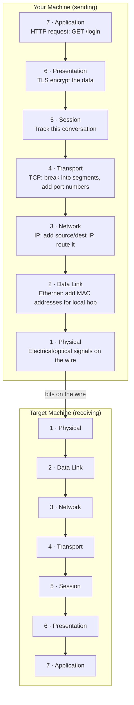
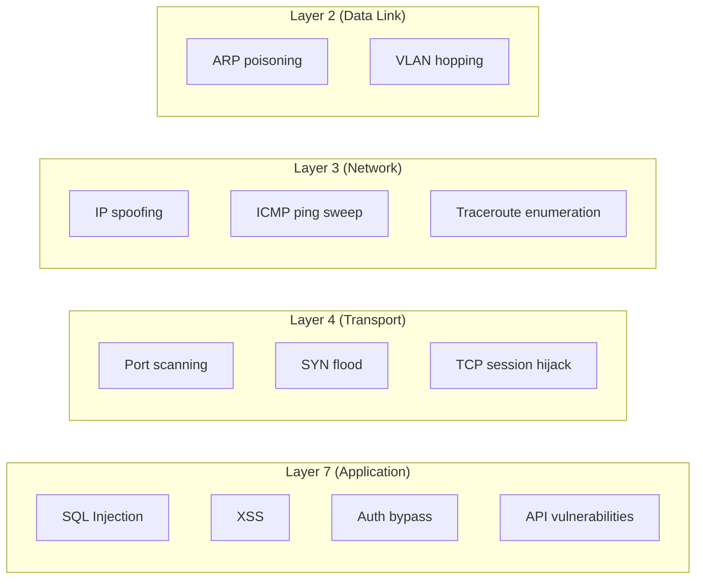

# 01-2 · The OSI Model

> **Level:** Beginner · **Prerequisites:** [01-1 How the internet works](01_how_the_internet_works.md)
> **Time:** ~1.5 hours · **Verified:** 2026-06-25

---

## Why this matters

Every networking conversation uses the OSI model as a shared vocabulary. When a firewall rule blocks traffic at "Layer 4", you need to know what that means. When a pentester says "this attack operates at Layer 7", you need to know where to look. More practically: knowing which layer a vulnerability lives at tells you which tools to use to find it.

---

## The 7 layers (with a real analogy)

Think of sending a letter internationally. You write the letter, put it in an envelope, address it, add a stamp, hand it to the post office. Each step adds a layer of wrapping. When it arrives, each layer is stripped off in reverse order until the recipient reads your words.

Networking works the same way.

---

## Each layer, explained

| Layer | Name | What it does | Hacking relevance |
|---|---|---|---|
| 7 | Application | The actual app protocol: HTTP, DNS, SSH, FTP | SQL injection, XSS, authentication attacks |
| 6 | Presentation | Encryption, encoding, compression (TLS lives here conceptually) | SSL stripping, weak cipher attacks |
| 5 | Session | Maintains conversation state between machines | Session hijacking, session fixation |
| 4 | Transport | TCP/UDP: ports, reliability, segmentation | Port scanning, SYN flood DoS |
| 3 | Network | IP addressing, routing, ICMP | IP spoofing, traceroute, ping sweep |
| 2 | Data Link | MAC addresses, Ethernet frames, switching | ARP spoofing, MAC flooding |
| 1 | Physical | Cables, WiFi signals, hardware | Physical access attacks (out of scope here) |

The easy mnemonic: **"All People Seem To Need Data Processing"** (Application → Physical top-down) or **"Please Do Not Throw Sausage Pizza Away"** (Physical → Application bottom-up).

---

## The TCP/IP model (what networks actually use)

The OSI model is a theoretical framework. Real networks use the **TCP/IP model** (4 layers). OSI is the teaching model; TCP/IP is what's running right now:

| TCP/IP layer | Maps to OSI layers |
|---|---|
| Application | 5, 6, 7 |
| Transport | 4 |
| Internet | 3 |
| Network Access | 1, 2 |

You'll see both models referenced in documentation and job interviews. Know both; use OSI to think, use TCP/IP to describe what's actually happening.

---

## Where attacks live

The most important takeaway for a beginner pentester:

**90% of what you'll do in this course is Layer 7** — web application attacks. Understanding the lower layers tells you why the tools work, but your main target is the application layer.

---

## Recap & next

- ✅ OSI has 7 layers; TCP/IP has 4 — know both models and how they map
- ✅ Data is encapsulated as it travels down the stack; unwrapped going up
- ✅ Each layer adds a header with its own addressing (MAC at L2, IP at L3, port at L4)
- ✅ Most web attacks are Layer 7; scanning is Layer 4/3

**Self-check:** A firewall rule blocks all traffic to port 443. At which OSI layer is that rule operating? What protocol does port 443 carry?

Answer

Layer 4 (Transport) — the firewall is filtering by port number, which is a TCP/UDP concept. Port 443 carries HTTPS (HTTP over TLS). A Layer 7 firewall (application firewall / WAF) would additionally inspect the HTTP request content — it can block a specific URL or SQL injection pattern, not just the port.

---

## Exercises

**1. Layer quiz.** For each attack below, which OSI layer does it primarily operate at?
- a) ARP spoofing
- b) SQL injection
- c) nmap SYN port scan
- d) Stealing a session cookie via XSS

Answers

a) Layer 2 — ARP operates at the Data Link layer (MAC addresses)
b) Layer 7 — SQL injection is an application-layer attack (the HTTP request body)
c) Layer 4 — nmap SYN scans manipulate TCP (Transport layer)
d) Layer 7 — XSS injects JavaScript into a web page (application layer); the cookie theft itself happens in the browser

**2. Encapsulation.** When your browser sends an HTTP POST request, list the headers added at each layer as the data travels down the stack.

Answer

- **Layer 7 (Application):** HTTP headers (`POST /login HTTP/1.1`, `Content-Type: application/json`, etc.) + body
- **Layer 4 (Transport):** TCP header: source port (random, e.g. 54321), dest port (443), sequence number, flags
- **Layer 3 (Network):** IP header: source IP (your machine), dest IP (server), TTL
- **Layer 2 (Data Link):** Ethernet frame: source MAC, dest MAC (your router's MAC for the first hop)
- **Layer 1 (Physical):** Electrical/optical encoding of the bits on the wire/WiFi

---

**Next → [03 TCP, UDP & Ports](03_tcp_udp_and_ports.md)**
