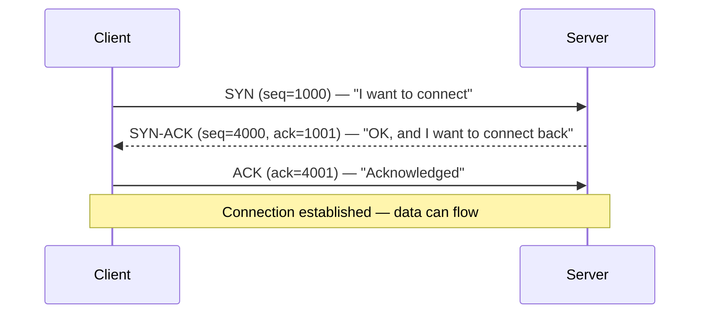
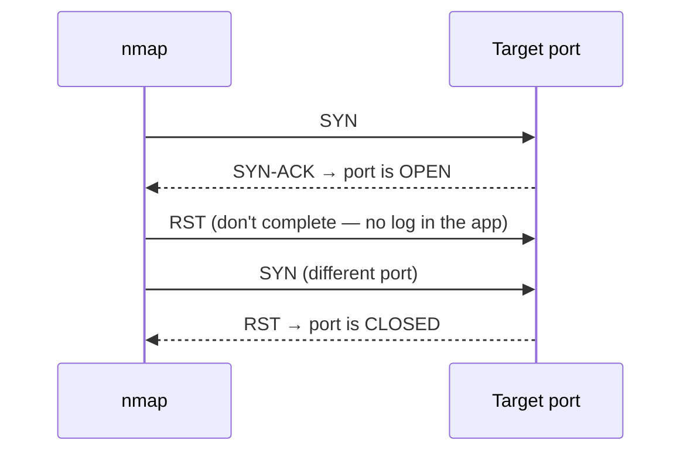

# 01-3 · TCP, UDP & Ports

> **Level:** Beginner · **Prerequisites:** [01-2 The OSI model](02_osi_model.md)
> **Time:** ~1.5 hours · **Verified:** 2026-06-25

---

## Why this matters

Port scanning is the first thing you do on any pentest. Before you can scan, you need to understand what you're looking for: which ports are open, which protocols they carry, and what that tells you about the target. This module is the foundation for the nmap module and everything in the methodology section.

---

## TCP vs UDP

Two transport protocols. Two very different personalities.

| | TCP | UDP |
|---|---|---|
| **Full name** | Transmission Control Protocol | User Datagram Protocol |
| **Connection** | Connection-oriented (3-way handshake) | Connectionless (fire and forget) |
| **Reliability** | Guaranteed delivery, ordered, error-checked | No guarantees |
| **Speed** | Slower (overhead for reliability) | Faster |
| **Use cases** | Web (HTTP/S), SSH, FTP, email | DNS, VoIP, video streaming, gaming |
| **Hacking relevance** | Most attacks; state can be tracked and exploited | DNS hijacking, UDP flood, SNMP enumeration |

---

## The TCP 3-way handshake

Every TCP connection starts with this exchange. Understanding it is essential for understanding port scanning.



**Port scanner trick (TCP SYN scan):**
nmap sends a SYN, waits for SYN-ACK (port is open), then sends RST instead of ACK.
The connection is never completed — stealthier because no application-layer connection is established.



---

## Port numbers

A port is just a number (0–65535) that identifies which service on a machine should receive the packet. Think of the IP address as the building and the port as the apartment number.

### Well-known ports (0–1023) — memorise these

| Port | Protocol | Service |
|---|---|---|
| 21 | TCP | FTP (file transfer) |
| 22 | TCP | SSH (secure shell) |
| 23 | TCP | Telnet (unencrypted shell — old, still found in embedded devices) |
| 25 | TCP | SMTP (email sending) |
| 53 | TCP/UDP | DNS (name resolution) |
| 80 | TCP | HTTP (web, unencrypted) |
| 110 | TCP | POP3 (email retrieval) |
| 443 | TCP | HTTPS (web, encrypted) |
| 445 | TCP | SMB (Windows file sharing) |
| 3306 | TCP | MySQL database |
| 5432 | TCP | PostgreSQL database |
| 8080 | TCP | HTTP alternate (often dev servers, DVWA in our lab) |

### Port states (what nmap reports)

| State | Meaning |
|---|---|
| **open** | A service is listening and will accept connections |
| **closed** | Port is reachable but no service is listening |
| **filtered** | A firewall is dropping or rejecting packets — nmap can't determine state |
| **open\|filtered** | nmap can't distinguish (common with UDP scans) |

**Key insight for pentesters:** a `filtered` port is more interesting than a `closed` port. Something is there — a firewall is hiding it.

---

## Try it: watching a TCP connection

On your host machine, open two terminals:

**Terminal 1 — start a listener:**
```bash
# listen on port 9999, print what you receive
nc -l 9999
```

**Terminal 2 — connect to it:**
```bash
# connect and send a message
echo "hello from the other side" | nc localhost 9999
```

Terminal 1 prints: `hello from the other side`

You just made a TCP connection. netcat (`nc`) is one of the most useful tools in a pentester's kit — covered in depth in Module 03-3.

---

## Recap & next

- ✅ TCP is reliable and connection-oriented (handshake); UDP is fast and connectionless
- ✅ The 3-way handshake: SYN → SYN-ACK → ACK
- ✅ A SYN scan sends SYN, reads SYN-ACK or RST, then sends RST — never completes the connection
- ✅ Port states: open / closed / filtered — filtered is interesting
- ✅ Know the common ports: 21(FTP), 22(SSH), 80(HTTP), 443(HTTPS), 3306(MySQL)

**Self-check:** A port scan shows port 3306 as `filtered`. What does that tell you? What would you try next?

<details>
<summary>Answer</summary>

Port 3306 is MySQL. `filtered` means a firewall is blocking direct access — but the database is probably there. Next steps: enumerate the web application for SQL injection (the database is behind a firewall but the web app talks to it directly); check if the service is reachable from inside the lab network on a different path; try a version-specific MySQL scanner NSE script to get more information about the firewall rule.

</details>

---

## Exercises

**1. Port lookup.** You run nmap on a server and find these ports open: 22, 80, 443, 3306. What services are running? Which one would you investigate first for easy wins, and why?

<details>
<summary>Answer</summary>

- 22: SSH — may accept password auth (try default creds) or have a known CVE for the version
- 80: HTTP web server — always investigate web apps first (most attack surface)
- 443: HTTPS web server — same as above, likely the same app over TLS
- 3306: MySQL — direct DB access from the internet is a major misconfiguration; try connecting with `mysql -h <ip> -u root` with no password

Start with the web app (80/443) — it has the largest attack surface. Then check if MySQL (3306) accepts connections from the internet — that alone is a critical finding.

</details>

**2. UDP vs TCP.** You're trying to find the DNS server on a target. Should you scan with TCP or UDP? What nmap flag do you use for UDP scanning?

<details>
<summary>Answer</summary>

DNS uses port 53 on both TCP and UDP, but UDP is the standard for queries. Use `nmap -sU -p 53 <target>` for a UDP scan. Note: UDP scanning is slower than TCP scanning because there's no SYN-ACK equivalent — nmap has to wait for a timeout to determine if a port is filtered.

</details>

---

**Next → [04 DNS & DHCP](04_dns_and_dhcp.md)**
