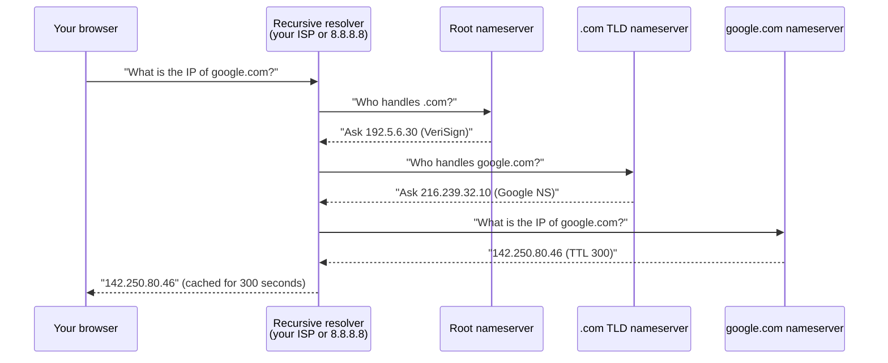

# 01-4 · DNS & DHCP

> **Level:** Beginner · **Prerequisites:** [01-3 TCP, UDP & Ports](03_tcp_udp_and_ports.md)
> **Time:** ~1 hour · **Verified:** 2026-06-25

---

## Why this matters

DNS is often called "the phonebook of the internet" — it translates human-readable names like `google.com` into IP addresses machines can route to. For pentesters, DNS is both a **target** (misconfigured DNS can leak internal hostnames, subdomains, and IP ranges) and a **tool** (DNS enumeration is a core recon technique). DHCP, meanwhile, is relevant in network-level attacks.

---

## How DNS works



This entire chain completes in ~20 milliseconds.

---

## DNS record types (the ones you need)

| Record | Purpose | Hacking use |
|---|---|---|
| **A** | Domain → IPv4 address | Find the server IP for a domain |
| **AAAA** | Domain → IPv6 address | Same, for IPv6 |
| **MX** | Mail server for a domain | Find email infrastructure |
| **NS** | Nameserver for a domain | Find the authoritative DNS server (target for zone transfer) |
| **CNAME** | Alias to another domain | Can reveal internal hostnames |
| **TXT** | Arbitrary text (SPF, DKIM, verification tokens) | Often leaks interesting info |
| **PTR** | IP → domain (reverse DNS) | Find hostnames from IP blocks |

---

## DNS tools (on your host machine)

```bash
# Basic lookup
dig google.com

# Specific record type
dig google.com MX
dig google.com TXT

# Reverse lookup (IP to hostname)
dig -x 8.8.8.8

# Use a specific DNS server (useful in recon)
dig @8.8.8.8 google.com
```

Sample `dig google.com` output:
```
;; ANSWER SECTION:
google.com.     299  IN  A  142.250.80.46

;; AUTHORITY SECTION:
google.com.     170963 IN  NS  ns1.google.com.
```

---

## DNS zone transfer (a classic misconfiguration)

A **zone transfer** copies all DNS records from an authoritative server. Intended for syncing between primary and secondary nameservers — but if misconfigured, anyone can request it and get the full list of subdomains and internal hostnames.

```bash
# Attempt a zone transfer (will fail on properly configured servers)
dig axfr @ns1.example.com example.com
```

If it succeeds: you get every hostname in that zone — `dev.example.com`, `internal.example.com`, `vpn.example.com`, etc. Each is a potential target.

Modern public-facing DNS servers block zone transfers, but internal corporate DNS servers sometimes don't. This is a real finding in pentests.

---

## DHCP: automatic IP assignment

**DHCP** (Dynamic Host Configuration Protocol) automatically assigns IP addresses to devices joining a network. When your laptop connects to WiFi:

1. Your laptop broadcasts: "I need an IP address" (DHCP Discover)
2. DHCP server responds: "Use 192.168.1.50, gateway 192.168.1.1, DNS 8.8.8.8" (DHCP Offer)
3. Laptop accepts (DHCP Request)
4. Server confirms (DHCP Acknowledge)

**DHCP starvation attack (concept):** Flood the DHCP server with requests using fake MAC addresses until all available IPs are exhausted. New legitimate devices can't get IPs. Covered as a concept only — not a lab exercise (requires network-level access not available in the Docker lab).

---

## Subdomain enumeration (practical recon)

In the lab, DNS enumeration looks like this with `dnsrecon` or by simply trying subdomains:

```bash
# On your host — enumerate subdomains of a public domain (educational/your own domain only)
# dnsrecon -d example.com -t brt   # brute-force subdomains
# dig sub.example.com               # check individual subdomains
```

For the pentest lab, the containers have DNS entries on the internal Docker network — useful for practising dig queries once you're inside the attacker container.

---

## Recap & next

- ✅ DNS resolves domain names to IPs through a hierarchy: root → TLD → authoritative
- ✅ Key record types: A (IP), MX (mail), NS (nameserver), TXT (misc), PTR (reverse)
- ✅ Zone transfers are a classic misconfiguration that leaks all hostnames in a domain
- ✅ DHCP automatically assigns IPs, gateway, and DNS to new network devices

**Self-check:** You run `dig TXT target.com` during recon and see a TXT record containing `v=spf1 include:mail.internal.corp.com ~all`. What have you discovered?

<details>
<summary>Answer</summary>

The SPF record reveals `mail.internal.corp.com` — an internal hostname that wasn't publicly documented. This is a subdomain discovery via DNS TXT record leakage. You'd then try to resolve `mail.internal.corp.com` and potentially `internal.corp.com` to see if they're accessible from the internet or if they reveal more about the internal network structure.

</details>

---

## Exercises

**1. DNS recon.** On your host machine, use `dig` to find: (a) the IP addresses of `github.com`, (b) the mail servers for `gmail.com`, (c) the nameservers for `cloudflare.com`.

<details>
<summary>Commands</summary>

```bash
dig github.com A                 # (a) IP address
dig gmail.com MX                 # (b) mail servers
dig cloudflare.com NS            # (c) nameservers
```

</details>

**2. Reverse DNS.** Google's public DNS server is at `8.8.8.8`. Use `dig -x 8.8.8.8` to find its hostname. What does the PTR record say?

<details>
<summary>Answer</summary>

```bash
dig -x 8.8.8.8
# PTR record: dns.google.
```

The hostname is `dns.google`. This confirms it's Google's DNS server. Reverse DNS lookups are useful during recon to identify what organization owns an IP block.

</details>

---

**Next → [05 HTTP, HTTPS & SSH](05_http_https_ssh.md)**
