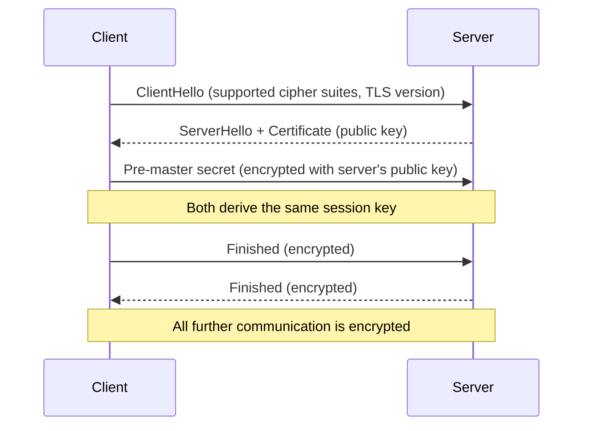

# 01-5 · HTTP, HTTPS & SSH

> **Level:** Beginner · **Prerequisites:** [01-4 DNS & DHCP](04_dns_and_dhcp.md)
> **Time:** ~1.5 hours · **Verified:** 2026-06-25

---

## Why this matters

HTTP is the language of the web — and web applications are the #1 attack surface in modern pentesting. Every SQL injection, XSS, and authentication bypass travels inside an HTTP request. SSH is the protocol you'll use to access remote machines and the service you'll find on almost every Linux server. Understanding both at the packet level is non-negotiable.

---

## HTTP: the anatomy of a request and response

HTTP is a text-based protocol. Every web interaction is an exchange of a **request** (from you) and a **response** (from the server).

### A request

```
POST /login HTTP/1.1
Host: 10.0.0.30:5001
Content-Type: application/json
Content-Length: 42
Cookie: session=abc123

{"username": "admin", "password": "admin123"}
```

Parts:
- **Method** (`POST`) — what you want to do (GET=read, POST=submit, PUT=update, DELETE=delete)
- **Path** (`/login`) — which resource
- **HTTP version** (`HTTP/1.1`)
- **Headers** — metadata: `Host`, `Content-Type`, `Cookie`, `Authorization`, etc.
- **Body** — the data (only on POST/PUT)

### A response

```
HTTP/1.1 200 OK
Content-Type: application/json
Set-Cookie: session=xyz789; HttpOnly; Secure

{"message": "Login successful", "user_id": 1}
```

Parts:
- **Status code** (`200 OK`) — what happened
- **Headers** — metadata from the server
- **Body** — the content

### Important status codes

| Code | Meaning | Hacking relevance |
|---|---|---|
| 200 | OK | Success |
| 301/302 | Redirect | May reveal internal URLs |
| 400 | Bad Request | Your input broke something — interesting |
| 401 | Unauthorized | Auth required — keep trying |
| 403 | Forbidden | Auth failed or blocked — there's something here |
| 404 | Not Found | Resource doesn't exist |
| 500 | Server Error | Your input broke the server — very interesting |
| 503 | Service Unavailable | May indicate a DoS condition |

**Note for pentesters:** A `500` error triggered by your input often means the server is processing your data in an unexpected way — a potential injection point. A `403` on a path means the resource exists — investigate further.

---

## Cookies and sessions

HTTP is stateless — each request is independent. Cookies let the server remember who you are.

```mermaid
sequenceDiagram
    participant B as Browser
    participant S as Server

    B->>S: POST /login (username + password)
    S-->>B: 200 OK + Set-Cookie: session=abc123; HttpOnly
    Note over B: Browser stores cookie
    B->>S: GET /dashboard (Cookie: session=abc123)
    S-->>S: Look up session "abc123" → user is admin
    S-->>B: 200 OK + dashboard content
```

`HttpOnly` cookies can't be read by JavaScript (mitigates XSS cookie theft).
`Secure` cookies are only sent over HTTPS.

**Session hijacking:** if you can steal someone's session cookie (via XSS, network sniffing on HTTP), you can impersonate them by sending requests with their cookie.

---

## HTTPS and TLS

HTTPS is HTTP inside a TLS (Transport Layer Security) tunnel. The content is encrypted — an attacker on the network sees encrypted bytes, not the request/response.

The **TLS handshake** (simplified):



**Why this matters:** HTTPS protects data in transit but does NOT protect against application-layer attacks. SQL injection travels inside an encrypted HTTPS request — TLS protects it from network eavesdroppers but the server still processes the malicious input.

---

## SSH: secure remote shell

SSH (port 22) lets you log into and control remote machines securely. It's the tool you'll use to access compromised servers after exploitation.

### Password-based SSH
```bash
ssh alice@10.0.0.20
# Password: alice2024
```

### Key-based SSH (more secure, more common in production)
```bash
# Generate a key pair (run once)
ssh-keygen -t ed25519 -f ~/.ssh/id_ed25519

# Copy public key to the server
ssh-copy-id alice@10.0.0.20

# Now login without a password
ssh alice@10.0.0.20
```

### SSH for pentesters

- Open port 22 with password auth enabled = password brute-force opportunity (hydra, covered in Section 05)
- SSH keys without passphrase protection = if you find a private key file, you own that server
- SSH version banner reveals the software version → check for known CVEs

```bash
# Read the SSH banner without logging in
nc 10.0.0.20 22
# SSH-2.0-OpenSSH_9.6p1 Ubuntu-3ubuntu13
```

---

## Practical: interact with the lab via HTTP

Make sure the lab is running (`docker compose up -d` in `99_project_pentest_lab/`), then:

```bash
# From your host machine
curl http://localhost:5001/
```

Output:
```json
{
    "app": "Vulnerable Flask Lab",
    "endpoints": ["/login", "/logout", "/user/<id>/profile", "/search", "/admin", "/debug"],
    "hint": "This app is intentionally broken. Happy hacking (in the lab only)."
}
```

```bash
# Login with curl — see the headers
curl -v -X POST http://localhost:5001/login \
  -H "Content-Type: application/json" \
  -d '{"username":"admin","password":"admin123"}'
```

The `-v` flag shows the full request and response headers — this is how Burp Suite works under the hood.

---

## Recap & next

- ✅ HTTP: method + path + headers + body (request); status + headers + body (response)
- ✅ Key methods: GET (read), POST (submit), PUT (update), DELETE (remove)
- ✅ Cookies carry session state; `HttpOnly` and `Secure` flags matter
- ✅ HTTPS encrypts the transport; it doesn't prevent application-layer attacks
- ✅ SSH: port 22, password or key auth, reveals version in banner

**Self-check:** You receive a `403 Forbidden` when accessing `/admin` on a web app. A `404 Not Found` would mean the path doesn't exist. What does `403` tell you instead? What are two ways you might try to bypass it?

<details>
<summary>Answer</summary>

403 means the path EXISTS but you're not authorized to see it. Two bypass approaches: (1) try to manipulate the session/cookie to elevate privileges (the IDOR/auth bypass attacks in Section 05); (2) try path variations like `/Admin`, `/ADMIN`, `/admin/`, or adding headers like `X-Original-URL: /admin` (some reverse proxies are bypassed by header manipulation).

</details>

---

## Exercises

**1. Read headers.** Use `curl -I http://localhost:5001/` (just headers). What `Content-Type` does the Flask app return? What HTTP version is it using?

<details>
<summary>Answer</summary>

```bash
curl -I http://localhost:5001/
# HTTP/1.1 200 OK
# Content-Type: application/json
# ...
```

The `Content-Type: application/json` tells you it's an API — data is JSON, not HTML. This is the pattern for REST APIs (like the vuln-flask app). Web UIs return `text/html`.

</details>

**2. Session cookie.** Login to the vuln-flask app, then use the cookie to access `/user/1/profile`:

```bash
curl -c /tmp/cookies.txt -X POST http://localhost:5001/login \
  -H "Content-Type: application/json" \
  -d '{"username":"alice","password":"alice2024"}'

curl -b /tmp/cookies.txt http://localhost:5001/user/1/profile
```

Does the response include the admin's notes? That's an IDOR vulnerability — you'll exploit it properly in Section 05.

<details>
<summary>What you should see</summary>

You'll see admin's profile and notes including `"Admin secret: deploy key is gh_pat_XXXXXXXXXXXX"` — even though you're logged in as alice. This is because the `/user/<id>/profile` endpoint doesn't check if the requesting user owns the profile. You'll understand and exploit this fully in Module 05-6.

</details>

---

**Next → [06 IP Addressing & CIDR](06_ip_addressing_and_cidr.md)**
