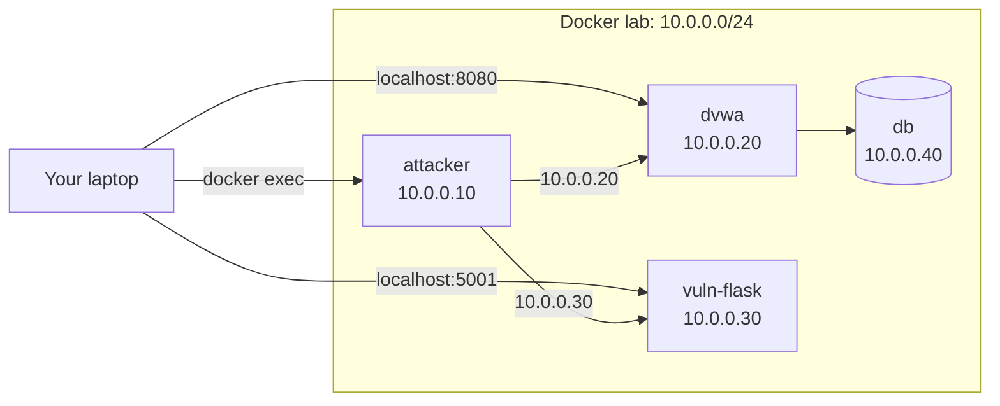

# 01-6 · IP Addressing & CIDR

> **Level:** Beginner · **Prerequisites:** [01-5 HTTP, HTTPS & SSH](05_http_https_ssh.md)
> **Time:** ~1.5 hours · **Verified:** 2026-06-25

---

## Why this matters

When you scan a network with nmap, you need to know what range to scan. When you're enumerating a corporate network, you need to understand which IPs are internal vs external. When you read a pentest report, CIDR notation is everywhere. This is the minimum networking math you need.

---

## IPv4 addresses

An IPv4 address is 32 bits written as four 8-bit groups (octets): `192.168.1.10`

Each octet is 0–255. The full space is ~4.3 billion addresses.

```
192  .  168  .  1   .  10
 ↓        ↓     ↓      ↓
11000000.10101000.00000001.00001010
(binary representation — you don't need to memorise this)
```

---

## Subnet masks and CIDR notation

A subnet mask divides an IP address into two parts:
- **Network part** — identifies the network
- **Host part** — identifies the specific device on that network

`192.168.1.0/24` in CIDR notation means:
- The first 24 bits are the network part (`192.168.1`)
- The last 8 bits (32-24=8) are the host part
- That gives 2^8 = 256 addresses (254 usable — `.0` is network address, `.255` is broadcast)

| CIDR | Subnet Mask | # of hosts | Example use |
|---|---|---|---|
| /8 | 255.0.0.0 | 16,777,214 | Large enterprise (`10.0.0.0/8`) |
| /16 | 255.255.0.0 | 65,534 | Medium network (`172.16.0.0/16`) |
| /24 | 255.255.255.0 | 254 | Small network, home LAN, our lab |
| /30 | 255.255.255.252 | 2 | Point-to-point links |
| /32 | 255.255.255.255 | 1 | Single host (a specific IP) |

---

## Private IP ranges

These ranges are reserved for private networks — not routable on the internet:

| Range | CIDR | Common use |
|---|---|---|
| 10.0.0.0–10.255.255.255 | 10.0.0.0/8 | Large internal networks, our lab |
| 172.16.0.0–172.31.255.255 | 172.16.0.0/12 | Docker default networks |
| 192.168.0.0–192.168.255.255 | 192.168.0.0/16 | Home/small office networks |

**Why it matters for pentesting:**
- Finding an internal IP in a DNS record or web app response means you've discovered network topology that wasn't meant to be public
- During internal pentesting, you need to know which subnets to enumerate
- The lab uses `10.0.0.0/24` — a private /24 with 254 usable addresses

---

## The lab network mapped



The `/24` subnet means:
- Network address: `10.0.0.0`
- Broadcast: `10.0.0.255`
- Usable range: `10.0.0.1` – `10.0.0.254`
- Scanning `nmap 10.0.0.0/24` from inside the attacker container covers the whole lab

---

## Quick CIDR calculations (the ones you'll use)

You don't need to memorise binary. You do need to quickly calculate these:

**"How many hosts in this range?"**
- `/24` → 254 hosts (2^8 - 2)
- `/16` → 65,534 hosts (2^16 - 2)
- The `/` number tells you how many bits are the network. Remaining bits = host bits. Hosts = 2^host_bits - 2.

**"What range does `10.0.0.0/24` cover?"**
- Network: `10.0.0.0`
- First host: `10.0.0.1`
- Last host: `10.0.0.254`
- Broadcast: `10.0.0.255`

**"Does `10.0.0.30` belong to `10.0.0.0/24`?"**
- Yes — last octet 30 is between 1–254

---

## Tools for IP calculations

```bash
# ipcalc — shows full subnet info (install: apt install ipcalc)
ipcalc 10.0.0.0/24
```

Output:
```
Address:   10.0.0.0
Netmask:   255.255.255.0 = 24
Network:   10.0.0.0/24
HostMin:   10.0.0.1
HostMax:   10.0.0.254
Broadcast: 10.0.0.255
Hosts/Net: 254
```

---

## Recap & next

- ✅ IPv4: 32-bit address, four octets, 0–255 each
- ✅ CIDR notation: `/24` = 24 network bits, 8 host bits, 254 usable hosts
- ✅ Private ranges: 10.x.x.x, 172.16-31.x.x, 192.168.x.x — not internet-routable
- ✅ The lab is `10.0.0.0/24` — scan with `nmap 10.0.0.0/24`

**Self-check:** An nmap scan reveals a host at `10.0.0.100` in the lab network (not listed in `compose.yaml`). What should you do?

<details>
<summary>Answer</summary>

Investigate — an unexpected host on your lab network likely means Docker created an additional container or your host machine's Docker networking exposed an interface. In a real pentest, an undiscovered host is a major finding. Use `nmap -sV 10.0.0.100` to fingerprint it and `docker ps` on your host to see if it's a known container.

</details>

---

## Exercises

**1. Calculate ranges.** What is the usable host range for `172.16.0.0/16`? How many hosts does it have?

<details>
<summary>Answer</summary>

`/16` means 16 network bits, 16 host bits. 2^16 = 65,536 total. Minus 2 (network + broadcast) = 65,534 usable.
Range: `172.16.0.1` – `172.16.255.254`

</details>

**2. Scan the lab.** Start the lab (`docker compose up -d`), exec into the attacker container, and scan the entire `/24` network:

```bash
docker compose exec attacker bash
nmap -sn 10.0.0.0/24   # host discovery only (ping sweep)
```

How many hosts respond? What are their IPs? Does this match the compose.yaml topology?

<details>
<summary>Expected output</summary>

```
Nmap scan report for 10.0.0.1    ← Docker gateway
Nmap scan report for 10.0.0.10   ← attacker (yourself)
Nmap scan report for 10.0.0.20   ← dvwa
Nmap scan report for 10.0.0.30   ← vuln-flask
Nmap scan report for 10.0.0.40   ← lab-db
5 hosts up
```

The Docker gateway (10.0.0.1) appears because Docker creates a virtual router for the bridge network. The 4 containers match the compose.yaml topology.

</details>

---

**→ Section complete. Next: [02 Linux for Hackers](../02_linux_for_hackers/README.md)**
