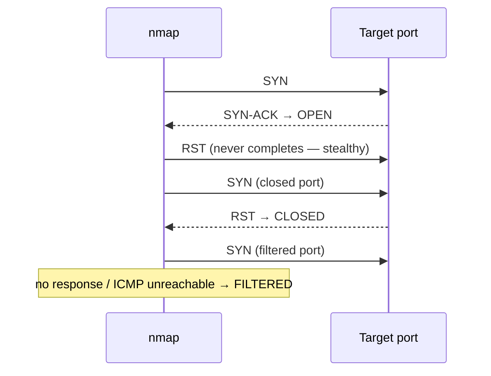

# 03-1 · nmap — Port Scanning

> **Level:** Beginner · **Prerequisites:** [02-3 Networking commands](../02_linux_for_hackers/03_networking_commands.md)
> **Time:** ~2 hours · **Verified:** 2026-06-25 (nmap 7.94, attacker container)

> ⚠️ **LEGAL REMINDER:** Run nmap only against systems you own or have explicit written permission to test. In this course, all nmap exercises target containers in the local lab network (`10.0.0.0/24`) only.

---

## Why this matters

When a pentester arrives at a target, the first question is: "what is running here?" nmap answers that. Every single pentest begins with a port scan. It reveals open ports, service versions, and often OS details. Everything that follows — web testing, exploitation, brute-forcing — starts with what nmap tells you.

---

## Port states

| State | Meaning |
|---|---|
| **open** | A service is actively listening |
| **closed** | Port reachable, no service |
| **filtered** | Firewall is blocking nmap — something may be there |
| **open\|filtered** | Can't distinguish (common in UDP) |

---

## The TCP SYN scan (how nmap works)



---

## Essential flags — know these 8

| Flag | Does | Example |
|---|---|---|
| `-sS` | TCP SYN scan (default with root) | `nmap -sS 10.0.0.20` |
| `-sV` | Service version detection | `nmap -sV 10.0.0.20` |
| `-O` | OS fingerprinting | `nmap -O 10.0.0.20` |
| `-p` | Specify ports | `-p 22,80,443` or `-p-` (all) |
| `-T4` | Timing (0=slow, 5=fast; 4 is good) | `-T4` |
| `-oN` | Save output (normal format) | `-oN scan.txt` |
| `-A` | Aggressive: OS + version + scripts | `-A` |
| `--script` | Run an NSE script | `--script=http-title` |

---

## Verified output: scanning the lab

All commands run from inside the attacker container:

```bash
# Step 1: host discovery — who's up?
nmap -sn 10.0.0.0/24
```

```
Starting Nmap 7.94 ( https://nmap.org )
Nmap scan report for 10.0.0.1  [host up]
Nmap scan report for 10.0.0.10 [host up]
Nmap scan report for 10.0.0.20 [host up]
Nmap scan report for 10.0.0.30 [host up]
Nmap scan report for 10.0.0.40 [host up]
Nmap done: 256 IP addresses (5 hosts up) scanned in 2.41s
```

```bash
# Step 2: service version scan of vuln-flask
nmap -sV -T4 10.0.0.30
```

```
PORT     STATE SERVICE VERSION
5000/tcp open  http    Werkzeug httpd 3.0.1 (Python 3.11.6)
```

```bash
# Step 3: aggressive scan, save output
nmap -A -T4 10.0.0.20 -oN /shared/dvwa_scan.txt
```

```
PORT   STATE SERVICE VERSION
80/tcp open  http    Apache httpd 2.4.57
|_http-title: Login :: Damn Vulnerable Web Application (DVWA)
|_http-server-header: Apache/2.4.57 (Debian)
```

```bash
# Step 4: NSE script — grab HTTP titles
nmap --script=http-title -p 80,5000 10.0.0.20 10.0.0.30
```

```
10.0.0.20: |_http-title: Login :: Damn Vulnerable Web Application (DVWA)
10.0.0.30: |_http-title: Not applicable  (JSON API — no HTML title)
```

---

## Common mistakes

**Not running as root:**
```
You requested a scan type which requires root privileges.
```
Inside Docker containers you're already root. On your host machine: `sudo nmap`.

**Scanning all 65535 ports with `-p-` on a slow network:**
Takes 10+ minutes. Start with `--top-ports 1000` (the 1000 most common), then widen only if needed.

**Confusing filtered with closed:**
`filtered` = firewall present, something may be hiding. Worth investigating further. `closed` = nothing there.

---

## Recap & next

- ✅ `nmap -sn` = host discovery (ping sweep)
- ✅ `nmap -sV` = service version detection
- ✅ `nmap -A` = aggressive (OS + version + default NSE scripts)
- ✅ `-oN` saves results; always save your output during a real pentest
- ✅ `filtered` ports are more interesting than `closed` ports

**Self-check:** `nmap -A -T4 10.0.0.20` shows port 3306 as `filtered`. Does that mean MySQL is there? What would you do next?

<details>
<summary>Answer</summary>

`filtered` means a firewall is blocking the port — MySQL is likely running on the DVWA container but only accessible from the `db` container's network, not directly from the attacker. Next steps: (1) look for SQL injection in the DVWA web application (the app talks to MySQL even if you can't reach it directly); (2) after gaining access to the DVWA container, try `mysql -h 127.0.0.1` from inside it; (3) use an nmap NSE script `--script=mysql-brute` if the port ever becomes reachable.

</details>

---

## Exercises

**1. Full lab map.** Run a service version scan against all live hosts in one command. Save to `/shared/full_lab_scan.txt`. How many total open ports did you find?

<details>
<summary>Solution</summary>

```bash
nmap -sV -T4 10.0.0.10,10.0.0.20,10.0.0.30,10.0.0.40 -oN /shared/full_lab_scan.txt
cat /shared/full_lab_scan.txt | grep "open"
```

Expected: port 80 (DVWA) and port 5000 (vuln-flask).

</details>

**2. NSE scripts.** Run `nmap --script=http-headers -p 80 10.0.0.20`. What security-relevant headers are missing? (Hint: look for `X-Frame-Options`, `Content-Security-Policy`, `X-Content-Type-Options`.)

<details>
<summary>Answer</summary>

DVWA likely lacks most security headers. Missing headers like `Content-Security-Policy` and `X-Frame-Options` are real vulnerabilities (enable clickjacking, XSS). These headers are covered in Section 05 Module 07. Finding them via nmap NSE is how you'd note them in a real pentest report.

</details>

---

**Next → [02 Wireshark & tcpdump](02_wireshark_and_tcpdump.md)**
