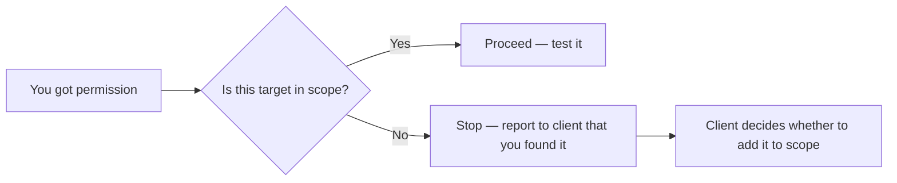

# 04-1 · Legal & Ethical Framework

> **Level:** Beginner · **Prerequisites:** [Section 03 complete](../03_essential_tools/README.md)
> **Time:** ~1 hour · **Verified:** 2026-06-25 (concept module)

---

## Why this matters

Skills without ethics are dangerous. This module isn't a legal disclaimer — it's the foundation of a professional practice. Understanding how permission, scope, and disclosure work is what separates a security professional from a criminal. Both might run the same tools; the difference is entirely about authorisation.

---

## The three pillars: permission, scope, disclosure

### 1. Permission

**Written, explicit, prior authorisation** is the only thing that makes hacking legal. Verbal permission is not enough. "I thought they wouldn't mind" is not permission.

What permission looks like:
- A signed Statement of Work (SOW) for a professional engagement
- A bug bounty program's written policy accepting your participation
- A CTF platform's terms of service
- Owning the system yourself

### 2. Scope

Scope defines what you can and cannot touch. A pentest contract says: "You may test `app.company.com` and `api.company.com`. Do not test `billing.company.com` or any third-party services."

**Out-of-scope testing is a breach of contract** — even if you meant well and found a vulnerability.



### 3. Responsible disclosure

When you find a vulnerability in a real system (bug bounty, authorised pentest), you:
1. Document it clearly
2. Report it **only** to the authorised contact (not Twitter, not Reddit)
3. Give them reasonable time to fix it before public disclosure (typically 90 days — Google Project Zero's standard)
4. Follow up if they don't respond

---

## Key laws (know these)

| Law | Jurisdiction | Key provision |
|---|---|---|
| Computer Fraud and Abuse Act (CFAA) | US | Accessing a computer without authorisation is a federal crime |
| Computer Misuse Act 1990 | UK | Unauthorised access, modification, or impairment |
| IT Act 2000 / Amendments | India | Section 43: damage to computer; Section 66: hacking (up to 3 years) |
| GDPR / Data Protection | EU + worldwide | Unauthorised access to personal data carries massive fines |

**The bottom line:** "I was just testing" is not a legal defence anywhere.

---

## Bug bounty programs: structured permission

Bug bounty programs (HackerOne, Bugcrowd, Intigriti) give you **legal permission to test specific systems** in exchange for responsible disclosure. Each program has a **policy page** that defines:
- In-scope assets (domains, IP ranges, mobile apps)
- Out-of-scope assets (third-party services, infrastructure)
- Allowed test types (no DoS, no physical access, etc.)
- Reward structure

Reading the scope carefully before testing is non-negotiable.

---

## Rules of engagement template

In a professional pentest, you'd agree on:

```
Test window:     2026-07-01 09:00 – 2026-07-05 17:00 UTC
Authorised IPs:  203.0.113.0/24  (client's infrastructure)
Test types:      Web application testing, network scanning
Excluded:        Physical access, social engineering, DDoS
Emergency contact: John Smith +1-555-0100 (halt testing if system goes down)
Data handling:   No client data to be stored on tester's systems
```

---

## Recap & next

- ✅ Permission must be written, explicit, and prior to any testing
- ✅ Scope defines exactly what is and isn't authorised — stay in scope
- ✅ Responsible disclosure: report privately, give fix time, disclose after fix
- ✅ CFAA (US), Computer Misuse Act (UK), IT Act (India) — unauthorised access is a crime

**Self-check:** You're doing a bug bounty and you find a vulnerability on `internal.company.com` — a subdomain not listed in the program's scope. What do you do?

<details>
<summary>Answer</summary>

Stop testing `internal.company.com` immediately. Report to the program that you discovered an out-of-scope subdomain that appears vulnerable. Ask if they want to add it to scope. Do NOT test it, do NOT disclose the vulnerability publicly, and do NOT report it as a valid finding under the current program (doing so may violate the program terms). Most programs have a process for exactly this situation.

</details>

---

**Next → [02 Reconnaissance & OSINT](02_reconnaissance_osint.md)**
