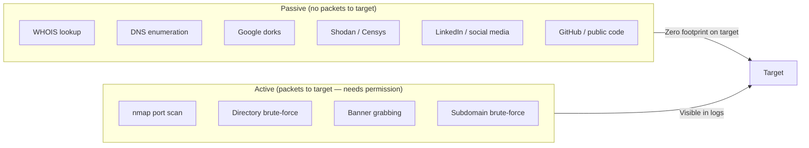

# 04-2 · Reconnaissance & OSINT

> **Level:** Beginner · **Prerequisites:** [04-1 Legal & ethical framework](01_legal_and_ethical_framework.md)
> **Time:** ~1.5 hours · **Verified:** 2026-06-25

> ⚠️ **LEGAL REMINDER:** Passive OSINT (reading public information) is legal. Active recon (probing servers) requires permission. For practice, use your own lab or authorised bug bounty targets only.

---

## Why this matters

The more you know about a target before you touch it, the more targeted and effective your testing will be. Recon often reveals forgotten subdomains, exposed admin panels, and leaked credentials — without sending a single malicious packet.

---

## Passive vs active recon



---

## WHOIS: who owns this domain?

```bash
whois example.com
```

Reveals: registrar, registration date, nameservers, sometimes contact details.

Modern domains often use WHOIS privacy services, but the registrar and nameserver information usually remains visible — nameservers lead you to the DNS infrastructure.

---

## Google dorks: search engine as a recon tool

Google's search operators let you find things the site owner didn't intend to expose:

| Dork | Finds |
|---|---|
| `site:target.com` | All indexed pages on the domain |
| `site:target.com filetype:pdf` | PDF files (may contain internal docs) |
| `site:target.com inurl:admin` | Admin pages |
| `site:target.com intitle:"index of"` | Open directory listings |
| `"target.com" "password"` | Mentions of passwords in public pages |
| `site:github.com "target.com" password` | Leaked credentials in public GitHub repos |

**Always check GitHub for leaked secrets.** Developers accidentally commit API keys, database passwords, and SSH keys. The [truffleHog](https://github.com/trufflesecurity/trufflehog) tool automates this search.

---

## DNS enumeration: finding subdomains

```bash
# theHarvester — passive subdomain/email discovery
# (install: pip3 install theHarvester)
theHarvester -d example.com -b google,bing,crtsh

# crt.sh — certificate transparency logs (free, passive)
curl -s "https://crt.sh/?q=%.example.com&output=json" | \
  python3 -c "import sys,json; [print(e['name_value']) for e in json.load(sys.stdin)]" | \
  sort -u
```

Certificate transparency logs record every TLS certificate issued. They're public, passive, and often reveal subdomains the company didn't publicise.

---

## Shodan: the search engine for internet-connected devices

[shodan.io](https://shodan.io) indexes internet-connected devices and their open ports/banners. It's passive — you're reading Shodan's database, not probing the target.

Example Shodan searches:
- `org:"Company Name"` — all devices registered to this organisation
- `hostname:target.com` — devices with this hostname
- `port:22 "SSH-2.0-OpenSSH_7.4"` — old, potentially vulnerable SSH version

A free Shodan account gives you limited results — enough to learn the tool.

---

## Building a target profile

By the end of recon, you should know:
- All subdomains and IP ranges
- Technologies in use (web framework, CMS, CDN)
- Email addresses and employee names
- Any credentials that have been leaked

For the lab, "recon" means understanding the `compose.yaml` — but in Section 99 (capstone) you'll do a structured recon exercise against the lab as if you didn't know the topology.

---

## Recap & next

- ✅ Passive recon = zero footprint: WHOIS, DNS, Google dorks, crt.sh, Shodan
- ✅ Active recon = visible in logs: nmap, directory brute-force
- ✅ Google dorks: `site:`, `filetype:`, `inurl:`, `intitle:` are your main operators
- ✅ GitHub is a common source of leaked API keys and passwords — always check

**Self-check:** You find `api.target.com` in crt.sh that isn't on the company's public website. Is this a valid finding? What would you do next?

<details>
<summary>Answer</summary>

Yes — this is a subdomain discovery finding. The API subdomain may be an internal or staging endpoint not intended for public access. Next: (1) check if it's in scope; (2) if yes, run nmap against it; (3) visit it in a browser / curl to see what it responds with; (4) check for common API paths (`/api/v1/users`, `/swagger`, `/docs`). An exposed Swagger/OpenAPI spec is a common finding that reveals every endpoint and parameter.

</details>

---

**Next → [03 Scanning & enumeration](03_scanning_and_enumeration.md)**
