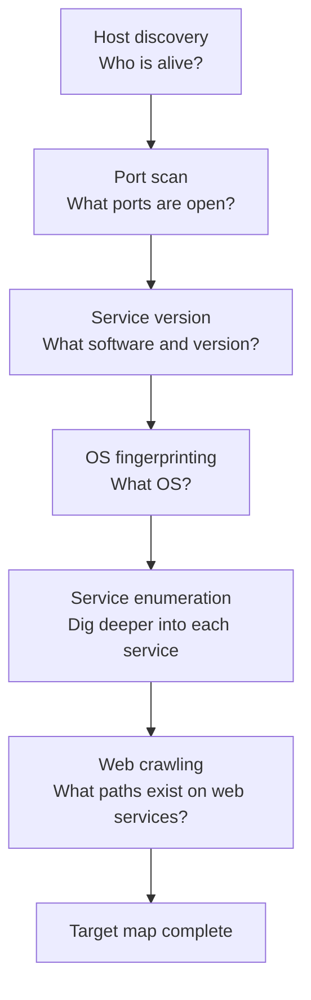

# 04-3 · Scanning & Enumeration

> **Level:** Beginner · **Prerequisites:** [04-2 Reconnaissance & OSINT](02_reconnaissance_osint.md)
> **Time:** ~1.5 hours · **Verified:** 2026-06-25

> ⚠️ **LEGAL REMINDER:** Active scanning requires explicit permission. Run against lab only.

---

## Why this matters

Recon tells you the shape of the target. Scanning fills in the details: exactly which services are running, what versions, what configurations. Enumeration is methodical — you build a complete picture of the attack surface before touching any vulnerability.

---

## The scanning workflow



---

## Step-by-step: scanning the lab

### 1. Host discovery

```bash
nmap -sn 10.0.0.0/24 -oN /shared/01_hosts.txt
```

### 2. Port scan all discovered hosts

```bash
nmap -p- -T4 10.0.0.20 10.0.0.30 -oN /shared/02_ports.txt
```

### 3. Service version + OS

```bash
nmap -sV -O -T4 -p 80,5000 10.0.0.20 10.0.0.30 -oN /shared/03_versions.txt
```

### 4. Web enumeration with nikto

nikto is a web vulnerability scanner — it checks for known misconfigurations, exposed files, and outdated software:

```bash
nikto -h http://10.0.0.20 -output /shared/04_nikto_dvwa.txt
```

Sample output:
```
+ Server: Apache/2.4.57 (Debian)
+ The anti-clickjacking X-Frame-Options header is not present.
+ Cookie PHPSESSID created without the httponly flag
+ /config/: Directory indexing found.
+ /phpinfo.php: Output from the phpinfo() function was found.
```

Every line is a potential finding.

### 5. Directory brute-force

```bash
# gobuster — brute-force web paths
# (install: apt install gobuster inside attacker container)
gobuster dir -u http://10.0.0.20 \
  -w /usr/share/wordlists/dirb/common.txt \
  -o /shared/05_dirs_dvwa.txt
```

Or use `dirb`:
```bash
dirb http://10.0.0.20 /usr/share/wordlists/dirb/common.txt
```

---

## Building the target map

After scanning, document what you found:

```
Host: 10.0.0.20 (dvwa)
OS: Debian Linux
Open ports:
  80/tcp  Apache 2.4.57  — DVWA login page
Notable findings:
  - No X-Frame-Options header
  - /phpinfo.php exposed (reveals PHP version, config)
  - /config/ directory listable
  - Cookie without HttpOnly flag
```

This becomes Section 1 of your pentest report.

---

## Recap & next

- ✅ Scanning phases: host discovery → port scan → service version → enumeration
- ✅ nikto: web misconfiguration scanner
- ✅ gobuster/dirb: find hidden paths via brute-force
- ✅ Document every finding — it's not a pentest if it's not written down

**Self-check:** nikto reports `/phpinfo.php` on a target. Why is this a security finding?

<details>
<summary>Answer</summary>

`phpinfo()` outputs the PHP version, compilation flags, loaded modules, server path, environment variables, and configuration settings. This includes file paths, OS version, and sometimes database connection strings. An attacker uses this to identify the exact PHP version (check CVEs), the file system layout (path traversal attacks), and any misconfigured settings. Fix: remove `/phpinfo.php` from production.

</details>

---

**Next → [04 Exploitation basics](04_exploitation_basics.md)**
