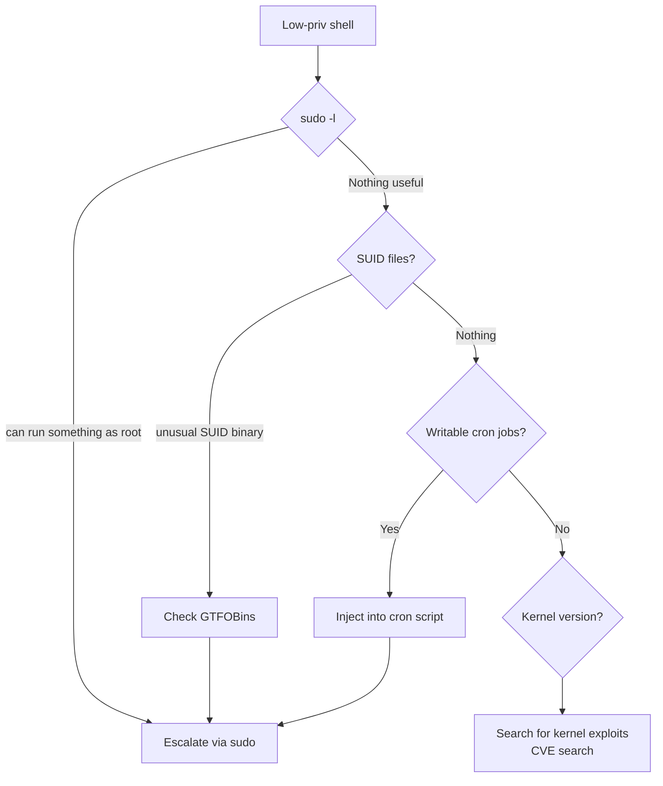

# 04-5 · Post-Exploitation & Pivoting

> **Level:** Beginner · **Prerequisites:** [04-4 Exploitation basics](04_exploitation_basics.md)
> **Time:** ~1 hour · **Verified:** 2026-06-25 (concept + lab demo)

> ⚠️ **LEGAL REMINDER:** Post-exploitation techniques can cause data loss and system instability. Only practice in the lab.

---

## Why this matters

Getting a shell is step one. Knowing what to do next is what separates a CTF participant from a professional pentester. Post-exploitation proves impact — you show the client exactly what an attacker could access, not just that you got in.

---

## Immediate actions after getting a shell

```bash
# Who am I?
whoami && id

# What machine am I on?
hostname && uname -a

# What network interfaces exist? (are there other networks to pivot into?)
ip addr

# What other users are on this system?
cat /etc/passwd | grep -v "nologin\|false"

# What can I read?
ls -la /home/ /root/ /etc/

# Are there any interesting files?
find / -name "*.conf" -o -name "*.env" -o -name ".ssh" 2>/dev/null | head -20

# What's running?
ps aux | grep -v "\[" | head -20
```

---

## Privilege escalation checklist

Got a low-privilege shell? Work through this list:



```bash
# Check what sudo you can run
sudo -l

# Check SUID binaries
find / -perm -4000 -type f 2>/dev/null

# Kernel version (look for local privilege escalation CVEs)
uname -r
```

---

## Pivoting: reaching other networks

If the compromised machine has two network interfaces (e.g., connected to both the internet and an internal network), you can **pivot** — use that machine as a relay to reach systems you couldn't access directly.

In the lab: if you compromise the DVWA container, it can reach the `db` container (10.0.0.40) directly — even though the attacker can't reach it directly from outside.

```bash
# From inside DVWA container (after getting a shell there):
mysql -h 10.0.0.40 -u dvwa -p p@ssw0rd dvwa
# You now have direct database access
```

This is why database servers should NEVER be on the same network as internet-facing servers — network segmentation prevents this.

---

## Covering tracks (the defender's perspective)

Attackers try to cover tracks. Defenders look for evidence they couldn't hide:

| Attacker action | Evidence left behind |
|---|---|
| Delete bash history | Missing `.bash_history` or cleared timestamps (suspicious) |
| Delete log files | Gaps in log timestamps — exactly when attacker was active |
| Use `touch` to reset file timestamps | `stat` shows changed `Modify` but not `Change` (inode change time) |
| Reverse shell | Connection in firewall/network logs |

**For defenders:** logs on a SIEM (centralised log server) can't be deleted by a compromised host. This is why centralised logging is a core security control.

---

## Recap & next

- ✅ First shell actions: who/where/what-interfaces — build situational awareness
- ✅ Privilege escalation: sudo → SUID → writable cron → kernel CVE
- ✅ Pivoting: compromised host as relay into inaccessible networks
- ✅ Covering tracks: attackers try, defenders look for the residue

**Self-check:** You compromise a web server and find `/home/deploy/.ssh/id_rsa` (an unprotected SSH private key). What can you do with it?

<details>
<summary>Answer</summary>

Copy the private key, then use it to SSH into any other server that has the corresponding public key in its `~/.ssh/authorized_keys`. If the deploy user uses this key across multiple servers (common in DevOps setups), you may be able to pivot to the entire deployment infrastructure. This is why private keys need passphrase protection and should never be stored on internet-facing servers.

</details>

---

**Next → [06 Reporting & remediation](06_reporting_and_remediation.md)**
