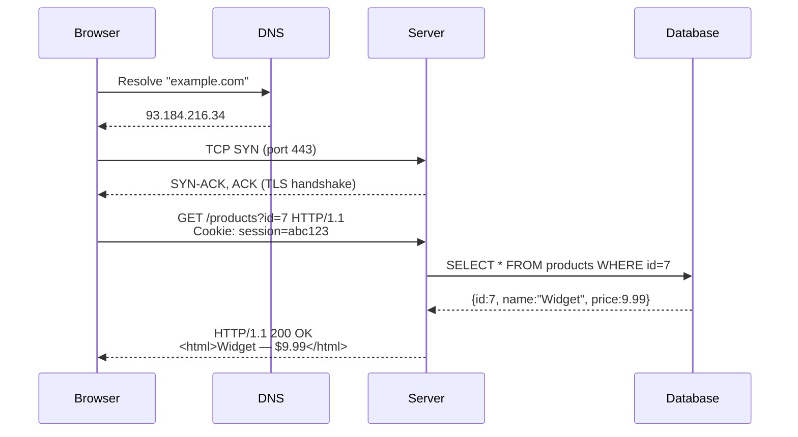

# 05-1 · How Web Applications Work

> **Level:** Beginner · **Prerequisites:** [01-5 HTTP/HTTPS/SSH](../01_networking_fundamentals/05_http_https_ssh.md)
> **Time:** ~1 hour · **Verified:** 2026-06-25

---

## Why this matters

Before you can find vulnerabilities in a web application, you need to understand exactly what happens between the browser click and the server response. Every attack in this section exploits a specific step in that flow. Knowing the flow lets you ask: *what happens if I send unexpected input here?*

---

## The full request–response cycle



The attack surface is every arrow in that diagram.

---

## Front-end vs back-end

| Layer | Where it runs | Controls |
|---|---|---|
| **Front-end** | User's browser | Rendering, validation hints, UI |
| **Back-end** | Server | Business logic, database queries, authentication |
| **Database** | Server (often separate) | Persistent data storage |

**Critical insight:** front-end validation (JavaScript input checks, disabled buttons) is *cosmetic*. An attacker sends HTTP requests directly with curl/Burp Suite — bypassing the browser entirely. All security must be enforced on the back-end.

---

## Cookies and sessions

HTTP is stateless — each request is independent. Sessions solve this:

1. You log in → server creates a session record in its database, generates a random token
2. Server sends: `Set-Cookie: session=eyJhbGci...` in the response
3. Browser stores the cookie and sends it with every subsequent request
4. Server looks up the token in its session store → knows who you are

**Cookie flags that matter:**

| Flag | What it does | Why it matters |
|---|---|---|
| `HttpOnly` | JS cannot read this cookie | Prevents XSS cookie theft |
| `Secure` | Only sent over HTTPS | Prevents interception on HTTP |
| `SameSite=Strict` | Not sent with cross-site requests | Prevents CSRF attacks |

---

## Same-origin policy (SOP)

A browser security rule: JavaScript from `https://evil.com` cannot read responses from `https://bank.com`, even if the user is logged in to the bank.

**Why it matters for security:** SOP is the line between XSS-as-defacement and XSS-as-data-theft. If a site sets `HttpOnly` on its session cookie AND the browser enforces SOP correctly, stealing the cookie from JS becomes impossible.

---

## How the vuln-flask app handles sessions

Look at `vuln_flask/app.py`:

```python
# VULN: session tokens are predictable — MD5 of username
token = hashlib.md5(username.encode()).hexdigest()
session["token"] = token
```

This is broken. The "session token" for user `admin` is always `MD5("admin")` = `21232f297a57a5a743894a0e4a801fc3`.

An attacker who knows the username can predict the session token without ever logging in:

```bash
python3 -c "import hashlib; print(hashlib.md5(b'admin').hexdigest())"
# 21232f297a57a5a743894a0e4a801fc3
```

Then craft a request with that cookie and access any authenticated endpoint.

---

## Hands-on: intercept with curl

Start the lab:

```bash
docker compose up -d
```

Watch the raw HTTP conversation:

```bash
# See the response headers
curl -v http://localhost:5001/login \
  -X POST \
  -H "Content-Type: application/json" \
  -d '{"username":"admin","password":"admin123"}' 2>&1 | head -50
```

Output includes:
```
< HTTP/1.1 200 OK
< Content-Type: application/json
< Set-Cookie: session=...
```

```bash
# Try accessing a protected route without a session
curl -v http://localhost:5001/dashboard
# → 302 redirect to /login

# Now access with a valid cookie
TOKEN=$(curl -s -c /tmp/cookies.txt http://localhost:5001/login \
  -X POST -H "Content-Type: application/json" \
  -d '{"username":"admin","password":"admin123"}' | python3 -c "import sys,json; d=json.load(sys.stdin); print('session ok')")

curl -b /tmp/cookies.txt http://localhost:5001/dashboard
```

---

## Exercises

1. **Predict alice's session token.** If the vuln-flask app generates session tokens as `MD5(username)`, what token does alice get? Verify by logging in as alice and checking the Set-Cookie header.

<details>
<summary>Solution</summary>

```bash
python3 -c "import hashlib; print(hashlib.md5(b'alice').hexdigest())"
# 6384e2b2184bcbf58eccf10ca7a6563c

curl -v -X POST http://localhost:5001/login \
  -H "Content-Type: application/json" \
  -d '{"username":"alice","password":"alice2024"}' 2>&1 | grep "Set-Cookie"
# The MD5 value will match
```

</details>

2. **Find the debug endpoint.** Browse to `http://localhost:5001/debug`. What sensitive information is exposed? Why is this dangerous?

<details>
<summary>Solution</summary>

`/debug` returns the Flask secret key, database path, and environment variables. An attacker who knows the Flask secret key can forge session cookies using a tool like `flask-unsign`. They can create a valid session cookie for any username without knowing the password.

</details>

3. **Bypass front-end only.** The DVWA login page has JavaScript validation that rejects empty usernames. Open the browser Network tab (F12), send the login form, then resend the request from the Network tab with an empty username. Does the server-side code also reject it?

<details>
<summary>Solution</summary>

Right-click the request in the Network tab → Copy as cURL → paste and modify the username field to be empty. DVWA's back-end often does not re-validate, proving that client-side controls can be bypassed trivially.

</details>

---

## Recap & next

- ✅ Request–response cycle: DNS → TCP → TLS → HTTP → server → DB → response
- ✅ Front-end validation is cosmetic — attackers bypass it with curl/Burp
- ✅ Cookies carry session tokens; `HttpOnly` + `Secure` + `SameSite` are the key flags
- ✅ Same-origin policy isolates JavaScript across origins
- ✅ vuln-flask uses predictable MD5-based session tokens (exploitable)

**→ Next: [02 OWASP Top 10 overview](02_owasp_top_10_overview.md)**
