# 05-2 · OWASP Top 10 Overview

> **Level:** Beginner · **Prerequisites:** [05-1 How web apps work](01_how_web_apps_work.md)
> **Time:** ~1.5 hours · **Verified:** 2026-06-25 (concept module)

---

## Why this matters

The OWASP Top 10 is the industry's authoritative list of the most critical web application security risks, updated every 3-4 years. Every web security certification, bug bounty program, and penetration testing methodology references it. Knowing these 10 categories puts a name and structure to the vulnerabilities you'll find in real applications — including the vuln-flask lab.

---

## OWASP Top 10 (2021)

```mermaid
graph TD
    A01["A01 Broken Access Control<br/>🔑 #1 risk — 94% of apps tested"]
    A02["A02 Cryptographic Failures<br/>🔓 Exposed data: passwords, PII"]
    A03["A03 Injection<br/>💉 SQLi, command injection, LDAP injection"]
    A04["A04 Insecure Design<br/>📐 Architecture-level flaws"]
    A05["A05 Security Misconfiguration<br/>⚙️ Default creds, verbose errors, /debug"]
    A06["A06 Vulnerable & Outdated Components<br/>📦 Log4Shell, unpatched libraries"]
    A07["A07 Identification & Authentication Failures<br/>🔐 Brute force, weak passwords"]
    A08["A08 Software & Data Integrity Failures<br/>📦 CI/CD poisoning, deserialization"]
    A09["A09 Security Logging & Monitoring Failures<br/>📋 No alerts, no audit trail"]
    A10["A10 Server-Side Request Forgery<br/>🌐 App fetches attacker-controlled URL"]
```



---

## Each category explained

### A01 · Broken Access Control

The most common finding in modern apps. Occurs when a user can access data or functionality they shouldn't. Subtypes:

- **IDOR** (Insecure Direct Object Reference): `/user/1/profile`, `/user/2/profile` — guessing the ID gives someone else's data
- **Privilege escalation**: normal user accessing `/admin/` routes
- **Forced browsing**: `curl http://app/admin/delete?id=5` — no login required

**In the lab:** vuln-flask `/user/<id>/profile` — no ownership check.

---

### A02 · Cryptographic Failures

Failures in protecting data in transit (plaintext HTTP) or at rest (weak password hashing).

- Passwords stored as MD5 or SHA1 without salt (rainbow-table attackable)
- HTTP instead of HTTPS in production
- Weak TLS configuration (TLS 1.0, RC4 cipher)

**In the lab:** vuln-flask stores passwords as `MD5(password)` — no salt, fast hash.

---

### A03 · Injection

User-supplied data is interpreted as code. The classic: SQL injection.

```python
# Vulnerable: user input inside the SQL string
query = f"SELECT * FROM users WHERE username='{username}'"

# Secure: parameterised query
query = "SELECT * FROM users WHERE username=?"
conn.execute(query, (username,))
```

Also includes command injection, LDAP injection, XPath injection.

**In the lab:** vuln-flask `/login` and `/search` — both SQL injectable.

---

### A04 · Insecure Design

Architectural decisions that make security impossible to retrofit. Example: a password reset flow that uses a guessable reset token (`MD5(username + timestamp)`). You can't patch this — you have to redesign.

Distinguished from misconfiguration: design flaws exist in the specification, not the deployment.

---

### A05 · Security Misconfiguration

The app works correctly, but is deployed insecurely:

- Default credentials (admin/admin, admin/password)
- Stack traces / debug pages exposed in production
- Directory listing enabled (`/uploads/` shows all files)
- Unnecessary services running (phpinfo.php, /actuator/env)

**In the lab:** vuln-flask `/debug` endpoint exposes the secret key and environment. DVWA's `/phpinfo.php` is accessible.

---

### A06 · Vulnerable & Outdated Components

Running known-vulnerable versions of libraries, frameworks, or OS packages.

Real examples:
- **CVE-2021-44228** (Log4Shell): logging library executes arbitrary code from log messages — CVSS 10.0
- **CVE-2021-41773** (Apache path traversal): one-line request reads `/etc/passwd`
- **Struts2 RCE** (2017): used to breach Equifax, exposing 147 million records

**Defence:** automate dependency scanning (`pip audit`, `npm audit`, Dependabot).

---

### A07 · Identification & Authentication Failures

- No account lockout → brute-force possible
- Weak password policy
- Predictable session tokens
- Missing multi-factor authentication on sensitive functions
- Password reset that leaks whether an email exists

**In the lab:** vuln-flask has no rate limiting, no lockout — hydra can brute-force it freely.

---

### A08 · Software & Data Integrity Failures

Trust is placed in code or data without verification:

- Downloading a library over HTTP (no checksum)
- Deserialising untrusted Python pickle data (arbitrary code execution)
- CI/CD pipeline that pulls from an unverified external dependency

The 2020 SolarWinds supply chain attack is the canonical example at scale.

---

### A09 · Security Logging & Monitoring Failures

If you can't detect an attack, you can't respond:

- No login failure logging → brute-force runs silently for days
- Logs not centralised → attacker deletes them from compromised host
- No alerting on 500 error spikes → SQLi exfiltration runs unnoticed

The average breach takes **207 days** to detect (IBM Cost of Data Breach 2023). Most of that time is spent undetected because logging is inadequate.

---

### A10 · Server-Side Request Forgery (SSRF)

The server fetches a URL supplied by the user. Attacker supplies an internal URL:

```
POST /api/fetch-url
{"url": "http://169.254.169.254/latest/meta-data/iam/security-credentials/"}
```

On AWS, this returns the EC2 instance's IAM credentials. The 2019 Capital One breach was SSRF against the AWS metadata endpoint.

---

## Which ones appear in the lab

| OWASP | Present in lab | Where |
|---|---|---|
| A01 Broken Access Control | ✅ | vuln-flask `/user/<id>/profile` IDOR |
| A02 Cryptographic Failures | ✅ | vuln-flask MD5 unsalted passwords |
| A03 Injection | ✅ | vuln-flask `/login`, `/search`; DVWA SQLi |
| A05 Misconfiguration | ✅ | vuln-flask `/debug`; DVWA `/phpinfo.php` |
| A07 Auth Failures | ✅ | No brute-force protection on vuln-flask |

Modules 03–06 cover each of these hands-on.

---

## Exercises

1. **Map the lab to OWASP.** Start the lab and browse to `http://localhost:5001/debug`. Which OWASP category (A01–A10) does this endpoint represent? Why?

<details>
<summary>Solution</summary>

A05 Security Misconfiguration — a debug endpoint that exposes the Flask secret key and environment should never exist in production. It reveals: the secret key (allowing session forgery), the database path, and any environment variables (which might include API keys). The fix is to remove the endpoint entirely from non-development builds using a `DEBUG=False` environment variable check.

</details>

2. **Spot the A02.** Read `vuln_flask/app.py` (lines around the `login` route). Find where passwords are hashed. Explain why this is an A02 Cryptographic Failure.

<details>
<summary>Solution</summary>

The app uses `hashlib.md5(password.encode()).hexdigest()` — MD5 with no salt. Problems: (1) MD5 is fast, so brute-force is cheap — billions of attempts per second on a GPU; (2) no salt means identical passwords produce identical hashes, enabling rainbow table attacks; (3) if two users have the same password, their stored hash is identical — revealing that fact. Fix: use `bcrypt`, `argon2`, or `PBKDF2` with a per-user salt.

</details>

---

## Recap & next

- ✅ OWASP Top 10 (2021): A01 Access Control → A02 Crypto → A03 Injection → ... → A10 SSRF
- ✅ A01 (Broken Access Control) is the most prevalent — found in 94% of apps tested
- ✅ The lab contains A01, A02, A03, A05, A07 — you'll exploit all of them
- ✅ A06 (outdated components) and A09 (no logging) are invisible but ubiquitous in real apps

**→ Next: [03 SQL injection](03_sql_injection.md)**
