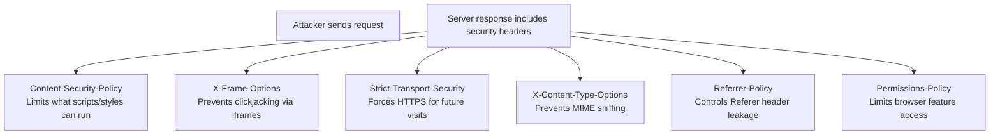

# 05-7 · Security Headers & TLS

> **Level:** Beginner · **Prerequisites:** [05-6 IDOR & access control](06_idor_and_access_control.md)
> **Time:** ~1.5 hours · **Verified:** 2026-06-25 (lab + concept module)

---

## Why this matters

Security headers are free. They take 5 minutes to add to any web server or framework. Yet most applications are missing them — nikto will flag every absent header as a finding in every pentest report. Understanding them makes you a better tester (you spot missing controls) and a better developer (you know what to add before the pentest).

---

## The complete security header set



---

## Header by header

### Content-Security-Policy (CSP)

Tells the browser which sources of content are trusted:

```http
Content-Security-Policy: default-src 'self'; script-src 'self' 'nonce-abc123'; img-src *; style-src 'self' https://fonts.googleapis.com
```

- `default-src 'self'` — only load resources from same origin by default
- `script-src 'self' 'nonce-abc123'` — only run scripts from same origin OR with the nonce
- `'unsafe-inline'` — disables the inline script protection (avoid it)
- `report-uri /csp-report` — sends violation reports to your endpoint

**Effect on XSS:** an injected `<script>` tag has no nonce → browser refuses to execute it.

---

### Strict-Transport-Security (HSTS)

```http
Strict-Transport-Security: max-age=31536000; includeSubDomains; preload
```

After a browser receives this header over HTTPS, it will **never** use HTTP for this domain again (for the next year). Prevents SSL stripping attacks.

**Preload:** submit to [hstspreload.org](https://hstspreload.org) to be hardcoded into browsers before even the first visit.

---

### X-Frame-Options

```http
X-Frame-Options: DENY
```

Prevents your page from being loaded in an `<iframe>`. This blocks clickjacking — an attacker overlays your site in a transparent iframe and tricks the user into clicking "invisible" buttons.

Modern replacement: `Content-Security-Policy: frame-ancestors 'none'`

---

### X-Content-Type-Options

```http
X-Content-Type-Options: nosniff
```

Stops the browser from guessing ("sniffing") content types. Without this, a browser might execute a `.txt` file as JavaScript if it looks like JS. Required for all responses.

---

### Referrer-Policy

```http
Referrer-Policy: strict-origin-when-cross-origin
```

Controls how much of the URL is sent in the `Referer` header to other sites. Without this, navigating from `https://app.com/user/12345/secret-page` to any external link sends the full URL — leaking internal paths and user IDs.

---

## TLS configuration issues

Even if TLS is enabled, misconfigured TLS is a finding:

| Issue | Risk | Detection |
|---|---|---|
| TLS 1.0 / 1.1 enabled | POODLE, BEAST attacks possible | `nmap --script ssl-enum-ciphers -p 443 target` |
| Weak ciphers (RC4, DES, 3DES) | Data decryptable | Same nmap script |
| Self-signed cert | User gets warning; susceptible to MITM | `curl -v https://target` |
| Cert expired | Trust failure | `openssl s_client -connect target:443` |
| No HSTS | SSL stripping possible | Check response header |

Testing TLS in the lab:

```bash
# The lab uses HTTP (not HTTPS) — TLS findings are conceptual here
# For a real HTTPS target:
openssl s_client -connect target.com:443 </dev/null 2>/dev/null | grep -A2 "Protocol\|Cipher"

# nmap TLS scan
nmap --script ssl-enum-ciphers -p 443 target.com
```

---

## Lab: check headers with nikto and curl

### Scan vuln-flask

```bash
# nikto flags missing headers automatically
nikto -h http://localhost:5001 -output /shared/nikto_flask.txt
cat /shared/nikto_flask.txt | grep -i "header\|x-frame\|csp\|hsts\|content-type"
```

Expected output:
```
+ The anti-clickjacking X-Frame-Options header is not present.
+ The X-Content-Type-Options header is not set.
+ No CGI Directories found
```

### Manual header check with curl

```bash
# Check all response headers
curl -I http://localhost:5001/

# Parse for security headers
curl -I http://localhost:5001/ 2>/dev/null | grep -iE "security|csp|frame|content-type-options|hsts|referrer"
```

Output for vuln-flask (missing everything):
```
HTTP/1.1 200 OK
Content-Type: text/html; charset=utf-8
Content-Length: 1234
Server: Werkzeug/3.0.1 Python/3.11.7
```

Zero security headers. Every missing header is a low/informational finding in the report.

---

## Adding security headers in Flask

```python
from flask import Flask

app = Flask(__name__)

@app.after_request
def add_security_headers(response):
    response.headers["X-Content-Type-Options"] = "nosniff"
    response.headers["X-Frame-Options"] = "DENY"
    response.headers["Referrer-Policy"] = "strict-origin-when-cross-origin"
    response.headers["Content-Security-Policy"] = (
        "default-src 'self'; "
        "script-src 'self'; "
        "style-src 'self' 'unsafe-inline'"  # unsafe-inline ok for styles in many cases
    )
    # Only add HSTS if actually serving HTTPS
    # response.headers["Strict-Transport-Security"] = "max-age=31536000; includeSubDomains"
    return response
```

---

## Reporting missing headers

In a pentest report, missing headers are typically Low or Informational severity — they're not directly exploitable on their own, but they remove defence-in-depth layers.

Template:

```
Title: Missing Security Headers (5 headers absent)
Severity: Low / Informational
Affected: vuln-flask (10.0.0.30:5000) — all responses

Missing headers:
- X-Content-Type-Options: nosniff
- X-Frame-Options: DENY  
- Content-Security-Policy (no CSP set)
- Referrer-Policy
- Strict-Transport-Security (would require HTTPS first)

Impact: Defence-in-depth controls absent. CSP absence increases XSS risk (see finding #2). 
X-Frame-Options absence permits clickjacking.

Remediation: Add headers via Flask's after_request hook (1 hour effort). 
HSTS requires migrating to HTTPS first.

References: OWASP A05:2021, securityheaders.com
```

---

## Exercises

1. **Baseline all headers.** Run `curl -I` against both vuln-flask (port 5001) and DVWA (port 8080). List every security header that is present and every one that is missing. Score each missing header as Critical / High / Medium / Low.

<details>
<summary>Solution</summary>

```bash
echo "=== vuln-flask ===" && curl -I http://localhost:5001/ 2>/dev/null
echo "=== DVWA ===" && curl -I http://localhost:8080/ 2>/dev/null
```

Both will be missing most headers. Severity mapping:
- Missing CSP: Medium (enables XSS escalation)
- Missing X-Frame-Options: Low (clickjacking possible)
- Missing X-Content-Type-Options: Low
- Missing HSTS: Medium if HTTPS is available; Informational if site is HTTP-only
- Missing Referrer-Policy: Informational

</details>

2. **Verify nikto findings.** Run `nikto -h http://localhost:8080` and identify 3 findings from the output. For each, classify by OWASP category.

<details>
<summary>Solution</summary>

Typical nikto output on DVWA:
1. `No X-Frame-Options header` → A05 Security Misconfiguration
2. `Cookie PHPSESSID created without the httponly flag` → A02 Cryptographic Failure (session token exposed to JS)
3. `/phpinfo.php: PHP configuration information found` → A05 Security Misconfiguration

</details>

3. **Add headers to vuln-flask.** Modify `vuln_flask/app.py` to add the `@app.after_request` hook that sets `X-Content-Type-Options`, `X-Frame-Options`, and `Referrer-Policy`. Rebuild the container and verify with curl.

<details>
<summary>Solution</summary>

In `vuln_flask/app.py`, after the app is created:

```python
@app.after_request
def security_headers(response):
    response.headers["X-Content-Type-Options"] = "nosniff"
    response.headers["X-Frame-Options"] = "DENY"
    response.headers["Referrer-Policy"] = "strict-origin-when-cross-origin"
    return response
```

Then rebuild and verify:
```bash
docker compose build vuln-flask && docker compose up -d vuln-flask
curl -I http://localhost:5001/ | grep -i "x-content\|x-frame\|referrer"
```

</details>

---

## Recap & next

- ✅ Security headers are free and easy — their absence is always a finding
- ✅ CSP is the most powerful: prevents XSS from executing inline scripts
- ✅ HSTS: once seen over HTTPS, browser refuses HTTP forever
- ✅ X-Frame-Options / CSP frame-ancestors: blocks clickjacking
- ✅ nikto automatically checks for missing headers — use it on every target
- ✅ Missing headers = Low/Info finding; they combine with other bugs to raise severity

**→ Section complete! Next: [06 CTF & Career](../06_ctf_and_career/README.md)**
