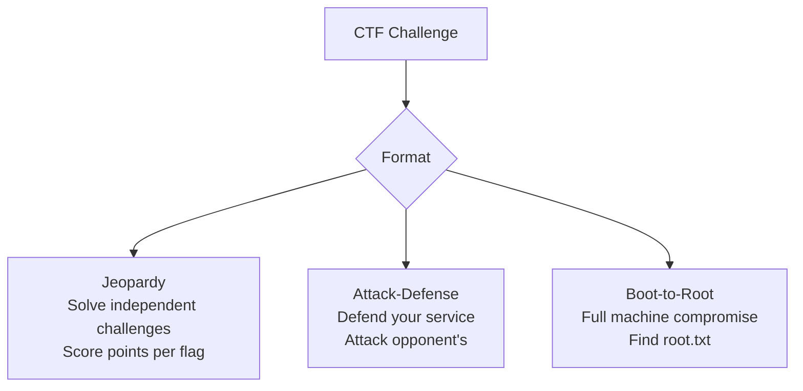

# 06-1 · What Are CTFs?

> **Level:** Beginner · **Prerequisites:** [05-7 Security headers & TLS](../05_web_application_security/07_security_headers_and_tls.md)
> **Time:** ~30 min · **Verified:** 2026-06-25 (concept module)

---

## Why this matters

CTF (Capture the Flag) competitions are how most security professionals practice skills, get recognised, and meet their community. Top CTF players are hired directly by companies. A public CTF profile is the security equivalent of a GitHub profile — concrete evidence of your skills.

---

## What is a CTF?

A CTF is a security competition where teams or individuals solve security challenges to find a text string called a "flag" — usually formatted as `FLAG{something_here}` or `picoCTF{...}`.



---

## CTF challenge categories

| Category | What you do | Skills practiced |
|---|---|---|
| **Web** | Find flags in vulnerable web apps | SQLi, XSS, IDOR, auth bypass |
| **Pwn / Binary** | Exploit memory-safety bugs | Buffer overflow, ROP chains |
| **Reversing** | Analyse compiled binaries | IDA Pro, Ghidra, assembly |
| **Crypto** | Break weak cryptographic schemes | RSA, XOR, padding oracles |
| **Forensics** | Extract hidden data from files | Steganography, file carving, PCAP analysis |
| **OSINT** | Find information using public sources | Google dorks, WHOIS, geolocation |
| **Misc** | Everything else | Puzzles, esoteric languages |

As a Python programmer starting out: **Web** and **OSINT** categories map directly to this course. Start there.

---

## How Jeopardy scoring works

```
Board of 20+ challenges
Each challenge: 100 / 200 / 300 / 400 / 500 points (or dynamic, decreasing as more teams solve it)
First Blood: bonus points for being first to solve a challenge
Final score: sum of all solved challenges
```

Teams collaborate using Discord/Slack. Most CTFs are 24–72 hours. You don't have to solve everything — solving 3-4 medium-difficulty challenges in your category is a great first result.

---

## CTF culture norms

**Do:**
- Work with a team — divide challenge categories by skill
- Share write-ups after the CTF ends (most allow this; some require a delay)
- Ask for hints in the competition Discord — it's encouraged

**Don't:**
- Share solutions during an ongoing competition
- Use automated scanners against the infrastructure (often against rules)
- Ask for flags — ask for hints instead

---

## CTF write-ups: the learning tool

After a CTF, top teams publish "write-ups" — detailed explanations of how they solved each challenge. These are one of the best learning resources in security:

- **CTFtime.org** — lists all upcoming CTFs and links to write-ups after they end
- **GitHub** — search `ctf writeup 2024 web`
- **Medium/HackMD** — many teams blog their solutions

Read write-ups for challenges you *couldn't* solve. Understanding the intended solution is often where the real learning happens.

---

## Exercises

1. **Find a web CTF write-up.** Go to ctftime.org and find a recent CTF. Click through to the write-ups for the Web category. Read one and identify which OWASP category the challenge involved.

2. **Identify your first target category.** Based on the course you've just completed, which CTF category plays to your current strongest skills? Make a one-paragraph plan for your first CTF.

<details>
<summary>Guidance</summary>

After this course, your strongest starting categories are:
- **Web** — you can exploit SQLi, XSS, IDOR, broken auth
- **OSINT** — you know WHOIS, crt.sh, Google dorks, Shodan

Pick one upcoming CTF from ctftime.org (beginner-friendly: PicoCTF is always open; picoCTF 2024 archive is excellent). Plan: register, join their Discord, and attempt the first 2-3 Web challenges.

</details>

---

## Recap & next

- ✅ CTF = security competition — find "flags" by exploiting or analysing challenges
- ✅ Jeopardy format: points per challenge; Web/OSINT are great starting categories
- ✅ Write-ups: read them after each CTF — they're the best free learning material
- ✅ CTFtime.org: the central calendar and write-up archive

**→ Next: [02 CTF platforms & first challenge](02_ctf_platforms_and_first_challenge.md)**
