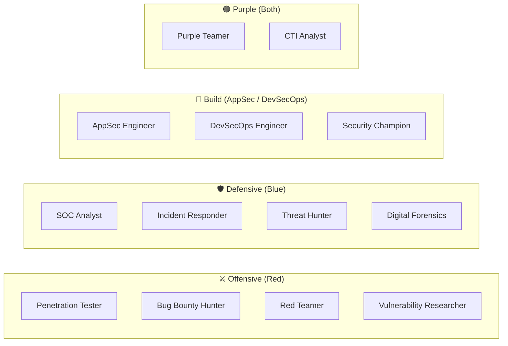

# 06-3 · Career Paths in Security

> **Level:** Beginner · **Prerequisites:** [06-2 CTF platforms](02_ctf_platforms_and_first_challenge.md)
> **Time:** ~30 min · **Verified:** 2026-06-25 (concept module)

---

## Why this matters

Security is a wide field and "ethical hacker" is not a single job title. Understanding the distinct roles helps you aim your learning — the skills for a web penetration tester are different from those for a malware analyst. Pick a direction early; you can always pivot.

---

## The security role landscape

---

## Offensive roles

### Penetration Tester (Pentester)

**What you do:** Clients hire you to attack their systems — web apps, networks, mobile apps — and report what you find. Work is time-boxed (1-5 days per engagement), scoped, and ends with a written report.

**Day-to-day:** reconnaissance, enumeration, exploitation, reporting. Repeat for 5-10 clients per month at a consulting firm.

**Entry path:** this course → OSCP/eJPT → junior role at a consultancy

**Salary range (UK 2024):** £35k–£75k; £80k–£130k senior/lead

---

### Bug Bounty Hunter

**What you do:** Find vulnerabilities in real company products and report them through platforms (HackerOne, Bugcrowd, Intigriti). Paid per valid finding; some Critical bugs pay $10k–$100k+.

**Day-to-day:** your own hours, your own scope choices. Highly competitive. Many hunters focus on a specific vulnerability class they've mastered.

**Reality check:** median hunter earns less than $1000/year. Top 1% earns significant income. It's a side hustle until you're very good.

**Entry path:** this course → PortSwigger Web Academy → H1 private programs → public programs

---

### Red Teamer

**What you do:** Full adversary simulation — extended engagements (2-6 weeks), operating covertly like a real threat actor. Goes beyond finding bugs: persistence, lateral movement, credential harvesting, social engineering.

**Entry path:** 3-5 years as pentester first. Not an entry-level role.

---

### Vulnerability Researcher

**What you do:** Find new (zero-day) vulnerabilities in software, typically through fuzzing, binary analysis, and reverse engineering. Work at a security vendor (Zerodium, Google Project Zero, CrowdStrike).

**Entry path:** deep binary skills (C/C++, assembly, gdb). Very different from web pentesting.

---

## Defensive roles

### SOC Analyst (Tier 1–3)

**What you do:** Monitor SIEM alerts, triage incidents, escalate to Tier 2/3. High volume, fast-paced.

**Entry path:** CompTIA Security+ → TryHackMe SOC path → junior SOC role

**Good choice if:** you want stable employment fast (plenty of entry-level openings), or want to learn the defender's perspective before going offensive.

---

### Application Security (AppSec) Engineer

**What you do:** Embedded in a development team. Code review, threat modelling, running SAST/DAST tools, building a secure SDLC. The security expert for the developers.

**Entry path:** as a Python developer, you're already half-way here. Add: OWASP knowledge (this course), SAST tools (`bandit`, `semgrep`), secure code review skills.

**This is probably your fastest path to paid security work** given your Python background.

---

## Your Python background is a genuine advantage

Most security beginners come from networking or IT support. As a Python developer:

| Skill | How it helps in security |
|---|---|
| Python scripting | Write custom exploit scripts, automation, tooling |
| Understanding web frameworks | Read Flask/Django source for vulnerabilities |
| Understanding SQL | Instantly understand SQLi at a code level |
| Reading code | Code review, source-assisted pentesting |
| APIs / HTTP | Web testing, Burp Suite scripting |

Start in AppSec (review Python code for security issues) → branch into web pentesting → bug bounty.

---

## The realistic 12-month plan

| Month | Activity | Goal |
|---|---|---|
| 1–2 | Complete TryHackMe Jr Pentester path | Consolidate skills |
| 2–3 | Complete PortSwigger Web Academy (Apprentice level) | Deep web security |
| 3–4 | Attempt eJPT certification | First credential |
| 4–6 | HackerOne — join 3 private programs, report 10 bugs | First bounty |
| 6–9 | Study for OSCP | Major credential |
| 9–12 | Apply to junior roles OR continue bounty | Career entry |

---

## Exercises

1. **Profile the target role.** Spend 15 minutes reading 3 current job postings for a role that interests you (LinkedIn, Indeed). List the 5 most commonly required skills/certifications. How many can you tick after this course?

2. **Find an AppSec audit to read.** Search GitHub for "`security audit report`" or "`pentest report`". Read one for a project written in Python. Identify which findings map to vulnerabilities covered in this course.

---

## Recap & next

- ✅ Offensive: pentester (scoped attacks), bug bounty (independent), red team (advanced)
- ✅ Defensive: SOC analyst, AppSec engineer, incident responder
- ✅ Your Python skills are an asset — AppSec is the fastest on-ramp
- ✅ Realistic first year: TryHackMe → PortSwigger → eJPT → first bounty or junior role

**→ Next: [04 Certifications & next steps](04_certifications_and_next_steps.md)**
