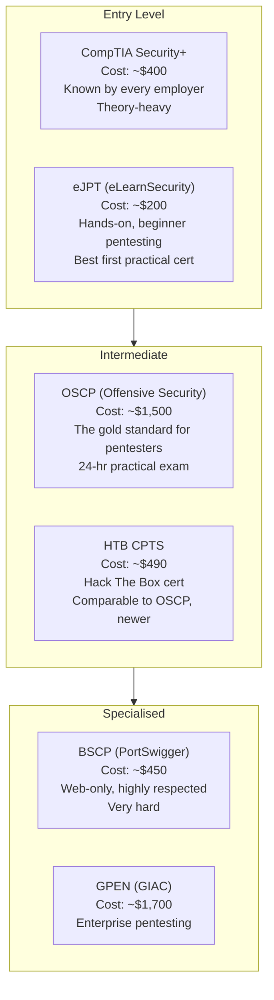
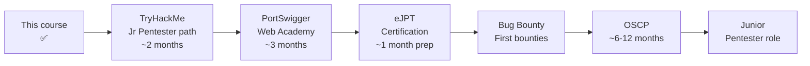

# 06-4 · Certifications & Next Steps

> **Level:** Beginner · **Prerequisites:** [06-3 Career paths](03_career_paths.md)
> **Time:** ~30 min · **Verified:** 2026-06-25 (concept module)

---

## Why this matters

Security certifications are the field's shorthand. Hiring managers use them to filter resumes and set salary bands. Knowing which certs signal what — and in what order to pursue them — prevents wasted time and money.

---

## The certification landscape

---

## Cert-by-cert breakdown

### CompTIA Security+ (SY0-701)

**Who it's for:** anyone entering security — doesn't require hands-on skill  
**Format:** 90 multiple-choice + performance-based questions, 90 minutes  
**What it proves:** you know security concepts broadly (CIA triad, threats, network security, crypto)  
**Value:** required by many US government contracts (DoD 8570), recognised everywhere  
**Verdict:** Get it if you're going into defensive/SOC roles. Less relevant for offensive work.

---

### eJPT — Junior Penetration Tester

**Who it's for:** this course → eJPT is the natural next step  
**Format:** 72-hour practical exam — you hack a lab network and answer questions about what you found  
**What it proves:** you can actually run nmap, exploit basic vulnerabilities, pivot through networks  
**Cost:** ~$200 (includes 24 hours of lab access)  
**Verdict:** The best first cert for someone coming from this course. Hands-on, achievable in 3–4 months of study, respected by small/mid-size consultancies.

---

### OSCP — Offensive Security Certified Professional

**Who it's for:** those with 1-2 years of pentesting experience (or serious self-study)  
**Format:** 24-hour practical exam — compromise 3+ machines, write a report, submit within 24h  
**What it proves:** you can independently identify and exploit vulnerabilities without hand-holding  
**Cost:** ~$1,500 (includes 90 days of lab access)  
**Verdict:** The most respected pentesting cert globally. Demands: buffer overflows (x86), privilege escalation, Active Directory attacks, lateral movement. Not a beginner cert. Plan 6-12 months after eJPT.

---

### HTB CPTS — Certified Penetration Testing Specialist

**Who it's for:** alternative to OSCP, same level  
**Format:** 10-day practical exam, report required  
**Cost:** ~$490 (includes prerequisite HTB Academy path)  
**Verdict:** Newer (2023), cheaper than OSCP, some argue it's harder. Growing recognition. Good if budget is a constraint.

---

### BSCP — Burp Suite Certified Practitioner (PortSwigger)

**Who it's for:** web-focused pentesters after solid OSCP-level experience  
**Format:** 4-hour practical exam with two labs  
**Cost:** ~$450  
**Verdict:** Extremely hard — pass rate ~30%. Highly respected in web security. Not for beginners.

---

## Which cert lands which job (the short version)

If you only remember one table, remember this — cert → the job it actually opens:

| You want this job | Get this cert first | Why |
|---|---|---|
| **SOC analyst / blue team** (fastest hire) | CompTIA Security+ | The universal filter; required for many gov/defence roles |
| **Junior pentester** (your target) | **eJPT** | Practical, achievable in 3–4 months, respected by consultancies |
| **Pentester at a serious firm** | **OSCP** | The global gold standard; unlocks most senior offensive roles |
| **Web app pentester / bug bounty** | BSCP (PortSwigger) | Web-specialised, elite signal — but do OSCP-level work first |
| **AppSec engineer** (your Python edge) | *No cert needed to start* | A portfolio of secure-code reviews beats a cert here |

> **Reality:** for AppSec and bug bounty, a **public portfolio** (write-ups, GitHub, real reports) opens more doors than any certificate. Certs matter most for pentest consultancies and HR filters. Spend money on eJPT/OSCP; spend time on projects.

---

## Your recommended path after this course

---

## Free resources after this course

| Resource | What it is | Cost |
|---|---|---|
| [TryHackMe](https://tryhackme.com) | Guided learning rooms and CTFs | Free / $14/mo |
| [PortSwigger Web Academy](https://portswigger.net/web-security) | 250+ web security labs | Free |
| [PicoCTF](https://play.picoctf.org) | Beginner CTF archive | Free |
| [Hack The Box Academy](https://academy.hackthebox.com) | Structured modules | Free tier available |
| [0xdf CTF write-ups](https://0xdf.gitlab.io) | Detailed HTB machine write-ups | Free |
| [ippsec YouTube](https://youtube.com/@ippsec) | HTB machine video walkthroughs | Free |
| [OWASP Testing Guide](https://owasp.org/www-project-web-security-testing-guide/) | Comprehensive web testing methodology | Free |

---

## The one thing that matters most

Certificates open doors. Skills keep you employed.

Build a portfolio of CTF write-ups (GitHub is fine), document your TryHackMe/HTB progress, and if possible document your bug bounty reports (even $0 informational findings show you're active).

The security community respects people who share knowledge — write up every CTF challenge you solve, even the ones that took you 3 days.

---

## Exercises

1. **Plan your next 3 months.** Write a 3-month study plan (week by week) starting from completing this course. Include: platform, content, hours per week, milestone.

2. **Create a CTFtime account.** Register at ctftime.org. Find one upcoming beginner-friendly CTF (look for ones marked "beginner" or from university teams). Add it to your calendar.

3. **Start TryHackMe today.** Register and complete the "Introduction to Cybersecurity" pathway (free, ~6 hours). Note which rooms cover topics new to you from this course.

---

## Recap — full course

- ✅ eJPT: your next certification target — practical, achievable, respected
- ✅ OSCP: the 12-month goal — the field's gold standard for pentesters
- ✅ PortSwigger Web Academy: best free resource for deepening web skills
- ✅ Portfolio over certificates: write-ups + GitHub activity + bounty reports
- ✅ Python background → AppSec → web pentesting → bug bounty: your fastest path

**→ Next: [05 Home test — prove you've got it](05_home_test.md)**
