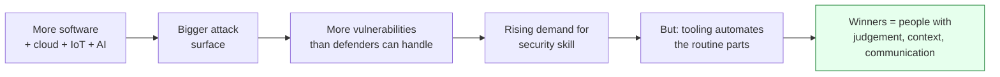

# 06-6 · The Future of Ethical Hacking

> **Level:** Beginner · **Prerequisites:** [06-5 Home test](05_home_test.md)
> **Time:** ~20 min · **Verified:** 2026-07-02 (concept module)

---

## Why this matters

You're not learning this to pass one exam — you're betting a career on it. So the real question is: **is this field growing, shrinking, or being automated away?** Short answer: growing fast, and the *nature* of the work is shifting. Knowing which way the wind blows tells you what to double down on.

---

## The one-line forecast

> Attack surface grows every year (more apps, more cloud, more devices, more AI) and defenders stay understaffed. Demand for people who can *think like an attacker* has never been higher — but the routine, button-pushing parts of the job are being automated. **Aim for judgement, not for running scanners.**



---

## Where the field is heading (2026 →)

### 1. AI cuts both ways

- **Attackers use AI** for phishing at scale, faster exploit development, and finding bugs in code.
- **Defenders use AI** for triage, log analysis, and auto-generating detection rules.
- **New attack surface: AI itself.** Prompt injection, model jailbreaks, data poisoning, and insecure LLM integrations are a fast-growing vulnerability class (see the **OWASP Top 10 for LLM Applications**). If you build with LLMs, you already have a head start here.

**What it means for you:** learn to *use* AI tooling to go faster, and learn to *attack* AI systems — that specialty barely existed three years ago and is hiring now.

### 2. Cloud & identity are the new perimeter

The network firewall matters less every year. Misconfigured S3 buckets, over-permissive IAM roles, exposed API keys, and Kubernetes mistakes are where breaches happen now. **Cloud security (AWS/Azure/GCP) is one of the highest-paid, most in-demand niches.**

### 3. AppSec and "shift left" keep growing

Security is moving *into* the development pipeline — SAST/DAST in CI, dependency scanning, threat modelling at design time. **This is the door your Python background opens.** Developers who understand security are rarer than security people who can't code.

### 4. Automation raises the floor, not the ceiling

Scanners and automated pentest tools now do the boring 60% (port scans, known-CVE checks, credential stuffing). This **removes junior grunt work** — which means entry-level roles increasingly expect you to bring the *other* 40%: chaining bugs, business-logic flaws, and clear reporting that a tool can't produce.

### 5. Regulation makes security non-optional

GDPR, DORA, the EU Cyber Resilience Act, SEC breach-disclosure rules — governments now *require* security testing. That's a structural, recession-resistant tailwind for the whole profession.

---

## What to bet on

```
  DOUBLE DOWN ON                    LEAN AWAY FROM (as a sole skill)
  ─────────────────────────────    ────────────────────────────────
  Cloud security (AWS/Azure/GCP)    "I can run nmap and Nessus"
  AppSec + secure code review       Memorising tool flags
  Attacking & securing AI/LLMs      Point-and-click scanning
  Clear writing & communication     Chasing certs without projects
  Business-logic & bug chaining     Reliance on any single tool
```

The durable skills are the human ones: **understanding a system deeply enough to see how it breaks, and explaining it clearly enough that someone fixes it.** No tool automates that.

---

## Job-market snapshot

- Global unfilled cybersecurity roles are counted in the **millions** — the talent gap is the industry's defining problem, not a hype line.
- Fastest-growing niches: **cloud security, AppSec/DevSecOps, AI security, and detection engineering.**
- The field is **remote-friendly** and **globally hireable** — a strong public portfolio (write-ups, CVEs, bug bounty stats) travels across borders better than almost any other career.

> **The honest caveat:** "unfilled roles" are mostly *mid-to-senior*. Truly entry-level security jobs are competitive. The gap you cross is from "completed a course" to "has demonstrable, documented skill" — which is exactly what the [home test](05_home_test.md) and a public write-up portfolio are for.

---

## Exercises

1. **Spot the trend in the wild.** Find one job posting each for (a) cloud security and (b) AppSec/AI security. Note which skills from this course appear, and which new ones you'd need to add.
2. **Attack an AI.** Try one prompt-injection challenge (e.g. Lakera *Gandalf* — free, in-browser). Note how it maps to injection concepts you learned in Section 05.

---

## Recap & full course close

- ✅ The field is **growing** — attack surface and regulation both expand faster than the workforce
- ✅ Automation removes grunt work; **judgement, communication, and depth** are what stay valuable
- ✅ Highest-growth bets: **cloud security, AppSec, AI security** — your Python background points straight at AppSec
- ✅ Portfolio + demonstrable skill beats certs-alone for crossing into your first role

**→ Back to [Section 06 overview](README.md) · or the [Capstone Lab](../99_project_pentest_lab/README.md)**
