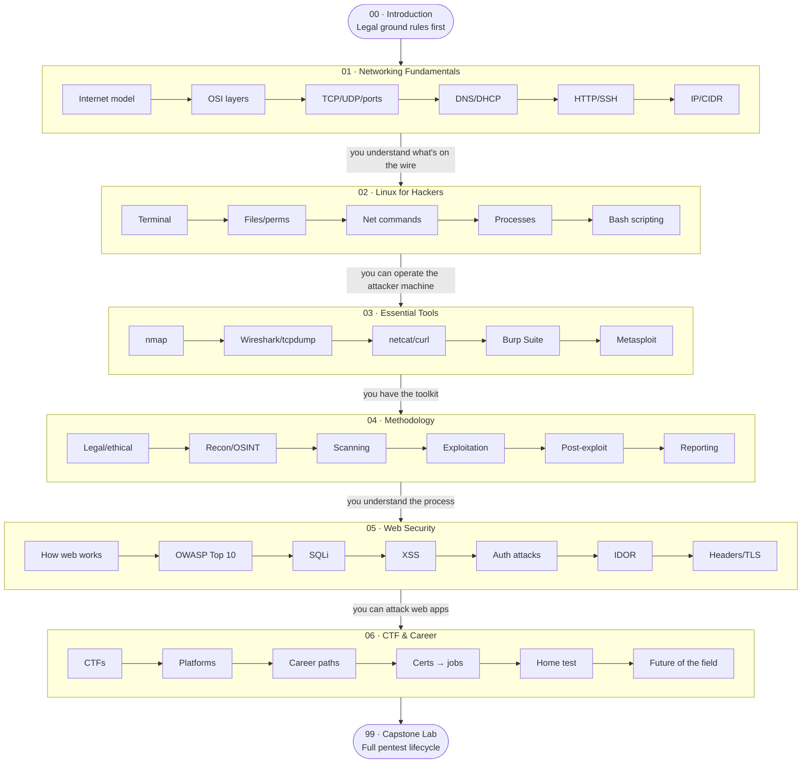

# Networking & Ethical Hacking for Beginners

> **Verified:** 2026-06-25 · nmap 7.94 · Docker 27.x · Python 3.11 · Kali Linux rolling
> **Who this is for:** Python programmers with terminal comfort and zero networking/security background
> **What you'll be able to do:** Run your first CTF room, find your first bug bounty vulnerability, or walk into a junior pentester interview prepared

---

## What you'll build

A **fully isolated local pentest lab** — four Docker containers, an attacker machine stocked with real tools, and two deliberately vulnerable targets (DVWA + a custom Python Flask service). You'll work through the entire pentest lifecycle: reconnaissance → scanning → exploitation → reporting.

```
docker compose up -d
docker compose exec attacker bash
# now you're inside a Kali-lite attacker machine on your own private network
nmap -sV 10.0.0.0/24
```

---

## The learning path



---

## Sections at a glance

| # | Section | What you'll learn | Time |
|---|---|---|---|
| 00 | [Introduction](00_introduction.md) | Ethical hacking defined, legal line, types of hackers, how vulns are detected | 40 min |
| 01 | [Networking Fundamentals](01_networking_fundamentals/) | IP, TCP/UDP, DNS, HTTP, SSH, subnetting | ~8 h |
| 02 | [Linux for Hackers](02_linux_for_hackers/) | Terminal, permissions, networking commands, bash scripting | ~7 h |
| 03 | [Essential Tools](03_essential_tools/) | nmap, Wireshark, netcat, Burp Suite, Metasploit | ~8 h |
| 04 | [Ethical Hacking Methodology](04_ethical_hacking_methodology/) | Recon → scan → exploit → report | ~7 h |
| 05 | [Web Application Security](05_web_application_security/) | OWASP Top 10, SQLi, XSS, auth attacks, IDOR | ~10 h |
| 06 | [CTF & Career](06_ctf_and_career/) | CTF platforms, career paths, certs → jobs, **home test**, future of the field | ~6 h |
| 99 | [Capstone: Pentest Lab](99_project_pentest_lab/) | Full pentest against the local lab, write a real report | ~6 h |

**Total: ~52 hours** — ~5 weeks at 2 hours/day

---

## Stack we use (and why)

| Tool | Why |
|---|---|
| **Docker Compose** | Fully isolated lab — no real targets ever touched; one command to reset everything |
| **DVWA** | The industry-standard vulnerable web app; used in every beginner security course |
| **Custom vuln-flask** | A Python service *you can read* — bridges your Python knowledge to security |
| **Kali Linux (containerised)** | The industry-standard attack platform, all tools pre-installed |
| **nmap** | The universal port scanner — every pentest starts here |
| **Burp Suite Community** | Free HTTP interception proxy — the web pentester's main tool |
| **sqlmap / hydra** | Industry-standard automation for SQLi and brute-forcing |

> **Why build a local lab and not just use TryHackMe?**
> Because you need to understand WHY the tools work, not just how to run them. When
> you build the lab yourself, you read the vulnerable code, you see the fix, and you
> control every variable. TryHackMe is great for practice after this course.

---

## ⚠️ Legal ground rule

Every module in this course that involves active scanning, exploitation, or password
attacks carries this reminder:

> **Only run attack tools against systems you own or have explicit written permission
> to test. In this course, all tools target containers in the local lab network
> (10.0.0.0/24) only. Running these tools against any other system is illegal.**

Ethical hacking is about permission, scope, and responsible disclosure. That framing
runs through every section of this course.

---

## Quick start

```bash
# 1. Prerequisites: Docker + Docker Compose installed
#    https://docs.docker.com/engine/install/

cd 99_project_pentest_lab

# 2. Start the lab (first run pulls images + builds containers — ~5 min)
docker compose up -d

# 3. Verify services are up
curl http://localhost:8080/login.php   # DVWA login page
curl http://localhost:5001/            # vuln-flask API

# 4. Open your attacker shell
docker compose exec attacker bash
# You are now 10.0.0.10 on the lab network

# 5. Confirm you can reach your targets
ping -c 2 10.0.0.20   # DVWA
ping -c 2 10.0.0.30   # vuln-flask
```

**→ Start the course: [00 · Introduction](00_introduction.md)**

---

## Course rating — how far does this take you in the real world?

An honest self-assessment of what this course delivers against what the job actually demands. Rated out of 5 for **real-world applicability**.

| Dimension | Rating | Verdict |
|---|---|---|
| **Networking & Linux foundations** | ★★★★★ | Genuinely strong. Most beginners skip this and hit a wall later; you won't. |
| **Hands-on tool fluency** (nmap, Burp, sqlmap, hydra) | ★★★★☆ | You'll be comfortable with the daily toolkit. Depth comes with reps on CTFs. |
| **Web app security** (OWASP Top 10) | ★★★★☆ | Excellent coverage of the vulns that pay the bills — SQLi, XSS, IDOR, auth. |
| **Methodology & reporting** | ★★★★★ | The report writing is the most job-relevant, most-skipped-elsewhere skill here. |
| **Realistic pentest environment** | ★★★★☆ | A safe, resettable lab you *own* and can read the source of. Real targets are messier. |
| **Career & cert guidance** | ★★★★☆ | Clear, honest path (eJPT → OSCP), no cert-mill hype. |
| **Cloud / AD / mobile / AI security** | ★★☆☆☆ | Out of scope by design — these are where the *next* course begins. |

### Overall: **4.3 / 5 for real-world application**

**What this course makes you:** job-ready for a **junior AppSec or entry pentest** conversation, and fully prepared to attempt **eJPT** and real CTFs. You'll understand *why* attacks work, not just how to run tools — which is the difference that survives a technical interview.

**What it does not make you (yet):** a cloud-security or Active-Directory specialist, or a bug-bounty earner. Those need the follow-on work this course points you to — [TryHackMe, PortSwigger, HTB](06_ctf_and_career/04_certifications_and_next_steps.md#free-resources-after-this-course), and a public write-up portfolio.

> **Bottom line:** as a *foundation*, this is close to the best shape a self-taught start can take — it front-loads the fundamentals everyone else skips and ends with the reporting skill everyone else undervalues. The gap between here and a paid role is **reps and a portfolio**, not more theory. The [home test](06_ctf_and_career/05_home_test.md) is where you find out if it stuck.
